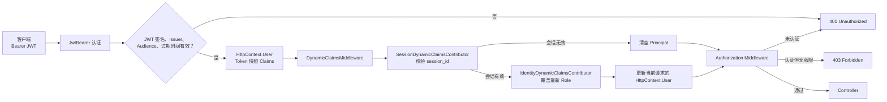

# DynamicClaims：JWT 会话撤销与动态角色刷新

> 目录：`Authentication_jwt_cookie/DynamicClaims`  
> Demo 模式：`AuthDemoMode.DynamicSession`  
> 日期：2026-07-28

## 一、这个 Demo 解决什么问题

普通 JWT 一旦签发，在过期之前通常仍然有效。即使服务端已经修改了用户角色、删除了用户会话，JWT 自身携带的旧 Claim 也不会自动变化。

这会产生两个常见问题：

1. **角色修改不及时**：用户登录时拥有 `Admin`，管理员后来收回该角色；旧 JWT 仍可能通过 `[Authorize(Roles = "Admin")]`，直到 Token 过期或用户重新登录。
2. **无法立即踢下线**：用户登出、密码泄露、设备丢失后，已签发 JWT 仍可继续调用接口，直到过期。

本目录实现的是一个简化版的 ABP Dynamic Claims 思路：

```text
JWT 负责初始认证与签名校验
        +
session_id 负责服务端会话有效性
        +
动态 Contributor 负责在每次请求中覆盖旧 Claim
```

最终效果：

- Token 字符串不变，角色修改后下一请求立即按新角色授权。
- Token 尚未过期，但会话被撤销后下一请求返回 `401`。
- Token 有效、会话有效，但权限不足时返回 `403`。

## 二、整体架构



这个设计中，JWT 内的角色只是**签发快照**；真正用于当前请求授权的角色，由 `DemoUserClaimStore` 中的权威值覆盖。

## 三、目录与职责

| 文件 | 职责 | 对应 ABP 概念 |
| --- | --- | --- |
| `AppClaimTypes.cs` | 定义 `session_id` Claim 类型 | `AbpClaimTypes.SessionId` |
| `DynamicClaimsOptions.cs` | 动态 Claims 开关 | `IsDynamicClaimsEnabled` |
| `IClaimsPrincipalContributor.cs` | 登录时向 Principal 增加 Claim 的扩展点 | `IAbpClaimsPrincipalContributor` |
| `IDynamicClaimsPrincipalContributor.cs` | 每请求刷新 Principal 的扩展点 | `IAbpDynamicClaimsPrincipalContributor` |
| `LoginClaimsPrincipalFactory.cs` | 登录时组装初始 Principal | Claims Principal Factory |
| `SessionClaimsPrincipalContributor.cs` | 登录时生成并写入 `session_id` | Session Claims Contributor |
| `SessionJwtTokenService.cs` | 根据 Principal 签发 JWT | Token 生成逻辑 |
| `UserSessionStore.cs` | 服务端有效会话白名单 | `IdentitySession` / Session Manager |
| `DemoUserClaimStore.cs` | 用户角色权威源（内存模拟） | Identity 用户 / 角色数据与动态 Claim 缓存 |
| `SessionDynamicClaimsContributor.cs` | 每请求校验会话是否有效 | Session Dynamic Claims Contributor |
| `IdentityDynamicClaimsContributor.cs` | 每请求覆盖旧角色为最新角色 | Identity Dynamic Claims Contributor |
| `DynamicClaimsMiddleware.cs` | 调度所有动态 Contributor，回写 `HttpContext.User` | `AbpDynamicClaimsMiddleware` |
| `DynamicClaimsExtensions.cs` | DI、JWT 认证和中间件扩展注册 | 模块配置 |
| `DynamicSessionController.cs` | 登录、角色热更新、会话撤销等演示接口 | Demo API |

## 四、启动方式和中间件顺序

在 `Program.cs` 中，当前默认选择：

```csharp
var demo = AuthDemoMode.DynamicSession;
```

认证管道顺序为：

```csharp
app.UseAuthentication();
app.UseDynamicClaims();
app.UseAuthorization();
```

顺序不能颠倒：

1. `UseAuthentication()` 先验证 JWT，建立携带 Token 快照 Claim 的 `HttpContext.User`。
2. `UseDynamicClaims()` 再根据服务端状态校验会话、刷新角色。
3. `UseAuthorization()` 最后使用刷新后的 `HttpContext.User` 执行 `[Authorize]`、角色和策略校验。

如果将 `UseDynamicClaims()` 放在 `UseAuthorization()` 后面，授权阶段看到的仍是 JWT 中的旧角色，动态刷新不会影响当前请求。

## 五、登录与签发 Token 流程

调用：

```http
POST /dynamic-claims/login
Content-Type: application/json

{
  "username": "admin",
  "password": "123456"
}
```

Demo 仅接受账号 `admin`、密码 `123456`。

### 1. 创建登录时 Principal

`LoginClaimsPrincipalFactory.CreateAsync("admin")` 先构造：

```text
Name = admin
Role = Admin
Role = User
AuthenticationType = Bearer
```

这里的 `Admin`、`User` 只是 Token 中的初始快照，后续请求不直接信任它。

### 2. 登录 Contributor 写入 session_id

`SessionClaimsPrincipalContributor` 实现的是**登录时** Contributor：

```csharp
identity.AddClaim(new Claim(
    AppClaimTypes.SessionId,
    Guid.NewGuid().ToString("N")));
```

生成的 `session_id` 写入 Principal，随后被放入 JWT。

### 3. 服务端保存会话

控制器从 Principal 取出 `session_id`：

```csharp
var sessionId = principal.FindFirst(AppClaimTypes.SessionId)!.Value;
_sessions.Save(sessionId, request.Username);
```

`UserSessionStore` 用 `ConcurrentDictionary<string, UserSession>` 保存：

```text
session_id
  ├─ Username
  ├─ CreatedAt
  └─ LastAccessed
```

这是有效会话白名单。只有 Token 中的 `session_id` 仍然存在于服务端白名单内，后续请求才继续有效。

### 4. 签发 JWT

`SessionJwtTokenService` 读取配置中的：

- `ValidIssuer`
- `ValidAudience`
- Base64 签名密钥
- `Jwt:ExpireHours`，当前默认 8 小时

然后将 Principal 的所有 Claim 写入 JWT：

```csharp
claims: principal.Claims
```

签发后的 Token 主要包含：

```text
name = admin
role = Admin
role = User
session_id = <随机值>
exp = <8 小时后的 UTC 时间>
```

## 六、每次请求的动态刷新流程

以请求 `GET /dynamic-claims/admin-only` 为例。

### 第一步：JwtBearer 验证 Token

`AddJwtBearer` 负责验证：

- 签名是否正确；
- `Issuer` 是否匹配；
- `Audience` 是否匹配；
- Token 是否过期。

验证成功后，ASP.NET Core 从 Token 创建 `HttpContext.User`。

此时的角色仍来自 Token 快照，例如：

```text
Admin
User
```

### 第二步：DynamicClaimsMiddleware 判断是否应处理

中间件仅在以下条件都满足时处理：

1. `DynamicClaimsOptions.IsEnabled == true`；
2. 当前用户已认证；
3. 当前身份包含 `session_id` Claim。

因此，普通 JWT 即使通过 Bearer 认证，但没有 `session_id`，不会被这套动态会话逻辑处理。

### 第三步：按注册顺序执行动态 Contributor

`AddDynamicSessionDemoAuthentication()` 中注册顺序是：

```csharp
services.AddSingleton<IDynamicClaimsPrincipalContributor, SessionDynamicClaimsContributor>();
services.AddSingleton<IDynamicClaimsPrincipalContributor, IdentityDynamicClaimsContributor>();
```

因此执行顺序也是：

```text
先校验会话 → 再刷新角色
```

这个顺序有意义：会话已经无效时，`SessionDynamicClaimsContributor` 会清空 Principal，后续角色刷新自然跳过。

### 第四步：SessionDynamicClaimsContributor 校验会话

它从当前身份读取 `session_id`：

```csharp
var sessionId = identity.FindFirst(AppClaimTypes.SessionId)?.Value;
```

再调用：

```csharp
_sessions.IsValid(sessionId)
```

结果分两类：

| 会话状态 | 动作 | 最终效果 |
| --- | --- | --- |
| `session_id` 存在且有效 | 更新 `LastAccessed`，继续下一 Contributor | 保持认证状态 |
| `session_id` 不存在、被撤销或为空 | 使用空 `ClaimsIdentity` 替换 Principal | 当前请求变为未认证 |

失效时的关键代码：

```csharp
context.Principal = new ClaimsPrincipal(new ClaimsIdentity());
```

中间件会把失败写回 `IAuthenticateResultFeature`：

```csharp
feature.AuthenticateResult = AuthenticateResult.Fail(
    "Session expired or revoked.");
```

后续遇到 `[Authorize]` 会走认证 Challenge，并返回自定义 JSON `401` 响应。

### 第五步：IdentityDynamicClaimsContributor 覆盖角色

若会话仍有效，`IdentityDynamicClaimsContributor` 从 `DemoUserClaimStore` 读取用户名最新角色：

```csharp
var roles = _store.GetRoles(username);
```

随后：

1. 移除当前身份中 `ClaimTypes.Role` 类型的旧角色；
2. 移除 JWT 常用的 `"role"` 类型旧角色；
3. 将权威源中的最新角色逐条添加进当前请求内存中的 `ClaimsIdentity`。

核心逻辑：

```csharp
RemoveAll(identity, ClaimTypes.Role);
RemoveAll(identity, "role");

foreach (var role in roles)
{
    identity.AddClaim(new Claim(ClaimTypes.Role, role));
}
```

注意：这一步**不修改 JWT 字符串**，只修改当前 HTTP 请求内存中的 `HttpContext.User`。

所以：

```text
Token 内仍可能写着 Role=Admin
当前请求 User 内已经只有 Role=User
```

授权中间件使用的是当前请求的 `HttpContext.User`，因此会以最新角色做判断。

### 第六步：回写认证结果并授权

`DynamicClaimsMiddleware` 将刷新后的 Principal 回写：

```csharp
context.User = contributeContext.Principal;
```

并同步更新 `IAuthenticateResultFeature` 中的 `AuthenticationTicket`。

之后 `UseAuthorization()` 运行：

- Principal 未认证：`401 Unauthorized`
- Principal 已认证但无 `Admin` 角色：`403 Forbidden`
- Principal 有 `Admin` 角色：调用控制器

## 七、演示接口与预期结果

| 接口 | 是否匿名 | 用途 | 预期 |
| --- | --- | --- | --- |
| `POST /dynamic-claims/login` | 是 | 登录、创建服务端会话、签发带 `session_id` 的 JWT | 返回 Token、会话 ID、当前角色 |
| `GET /dynamic-claims/me` | 否 | 查看经过动态刷新后的当前身份 | 返回最新角色和 Claims |
| `GET /dynamic-claims/admin-only` | 否，且要求 Admin | 验证角色热更新 | 有 Admin 返回 200；移除后返回 403 |
| `PUT /dynamic-claims/users/{username}/roles` | 是，仅 Demo | 修改角色权威源 | 下一请求立即使用新角色 |
| `POST /dynamic-claims/logout` | 否 | 撤销当前 `session_id` | 当前请求成功；后续请求 401 |
| `POST /dynamic-claims/sessions/{sessionId}/revoke` | 是，仅 Demo | 吊销指定会话 | 该会话后续请求 401 |
| `POST /dynamic-claims/users/{username}/revoke-all` | 是，仅 Demo | 吊销某用户全部会话 | 该用户所有已发 Token 后续 401 |
| `GET /dynamic-claims/users/{username}/sessions` | 是，仅 Demo | 查看用户活跃会话 | 返回会话列表和最后访问时间 |

## 八、完整业务流程示例

### 场景 A：角色被回收，旧 Token 立即失去管理员能力

1. `admin` 登录，Token 内记录 `Admin + User + session_id`。
2. 调用 `GET /dynamic-claims/admin-only`。
3. 会话校验通过，角色权威源仍为 `Admin + User`，返回 `200`。
4. 调用 `PUT /dynamic-claims/users/admin/roles`，请求体为：

```json
["User"]
```

5. Token 没有变化。
6. 再调用 `GET /dynamic-claims/me`：
   - JWT 认证仍成功；
   - `session_id` 仍有效；
   - 动态角色 Contributor 移除旧 `Admin`，只添加 `User`；
   - 响应中 `roles` 只剩 `User`。
7. 再调用 `GET /dynamic-claims/admin-only`：
   - 用户已认证；
   - 但当前请求不再有 `Admin`；
   - 返回 `403 Forbidden`。

这是“身份有效但权限不足”的典型情形。

### 场景 B：撤销会话，未过期 Token 立即失效

1. 使用有效 Token 调用 `POST /dynamic-claims/logout`。
2. 控制器读取当前 Token 的 `session_id`。
3. `UserSessionStore.Revoke(sessionId)` 从服务端白名单删除会话。
4. 再用同一个 Token 调用 `GET /dynamic-claims/me`。
5. JWT 本身仍然签名正确且未过期。
6. 但 `SessionDynamicClaimsContributor` 找不到 `session_id`：
   - 清空 Principal；
   - 中间件将认证结果标为失败；
   - `[Authorize]` 发起 Challenge。
7. 返回 `401 Unauthorized`。

这是“认证状态已失效”的典型情形。

## 九、与 ABP vNext 的对应关系

本 Demo 刻意把 ABP 的概念缩小为可观察、可调试的最小实现。

| Demo | ABP vNext 概念 | 差异 |
| --- | --- | --- |
| `IClaimsPrincipalContributor` | `IAbpClaimsPrincipalContributor` | 都用于登录 / 创建身份时追加 Claim |
| `IDynamicClaimsPrincipalContributor` | `IAbpDynamicClaimsPrincipalContributor` | 都用于每请求动态覆盖 Claim |
| `DynamicClaimsMiddleware` | `AbpDynamicClaimsMiddleware` | Demo 只实现本例所需调度逻辑 |
| `SessionClaimsPrincipalContributor` | `IdentitySessionClaimsPrincipalContributor` | Demo 用内存会话表 |
| `SessionDynamicClaimsContributor` | `IdentitySessionDynamicClaimsPrincipalContributor` | Demo 只按 `session_id` 白名单判断 |
| `IdentityDynamicClaimsContributor` | `IdentityDynamicClaimsPrincipalContributor` | Demo 每请求读内存角色字典 |
| `UserSessionStore` | `IdentitySession` / Session Manager | 生产应存数据库或分布式持久化存储 |
| `DemoUserClaimStore` | Identity 用户、角色、Claim 数据 + 动态 Claims 缓存 | 生产不应直接每请求查业务库 |

ABP 生产实现通常将动态 Claim 快照存入 `IDistributedCache<AbpDynamicClaimCacheItem>`，例如 Redis：

```text
Key: {tenantId}-{userId}
Value:
  Claims:
    - { Type: role, Value: Admin }
    - { Type: role, Value: User }
    - { Type: email, Value: admin@example.com }
```

变更用户、角色、权限后，清理该用户动态 Claim 缓存；下一次请求缓存未命中时才从权威数据源重新生成 Claim。

因此，Demo 的：

```csharp
_store.GetRoles(username)
```

在生产环境更接近：

```text
请求 → 读取 Redis 动态 Claims 快照
     → 命中则直接覆盖当前 Principal
     → 未命中时由 Identity 服务查询权威数据并回填缓存
```

## 十、如何使用 HTTP 文件验证

`Authentication_jwt_cookie.http` 已提供标准演练顺序：

1. 登录，复制返回的 Token 到 `{{token}}`。
2. 请求 `/dynamic-claims/me`，确认初始角色。
3. 请求 `/dynamic-claims/admin-only`，确认返回 200。
4. 修改 `admin` 角色，仅保留 `User`。
5. 使用同一 Token 再请求 `/dynamic-claims/me` 和 `/dynamic-claims/admin-only`，确认角色变化、接口返回 403。
6. 登录获取新的初始状态，调用 `/dynamic-claims/logout`。
7. 使用同一 Token 请求 `/dynamic-claims/me`，确认返回 401。

## 十一、Demo 的安全边界与生产改造项

当前代码是为了便于演示，不能直接用于生产。

### 1. 多个管理接口允许匿名访问

以下接口使用了 `[AllowAnonymous]`：

```text
PUT  /dynamic-claims/users/{username}/roles
POST /dynamic-claims/sessions/{sessionId}/revoke
POST /dynamic-claims/users/{username}/revoke-all
GET  /dynamic-claims/users/{username}/sessions
```

这意味着任何人都可以改角色、踢用户下线、枚举会话。生产中必须改为管理员权限，例如：

```csharp
[Authorize(Roles = "Admin")]
```

更严谨的做法是定义独立权限，如：

```text
Identity.Users.ManageRoles
Identity.Sessions.Revoke
Identity.Sessions.View
```

### 2. 内存存储不支持多实例和重启恢复

`UserSessionStore`、`DemoUserClaimStore` 都是 Singleton 内存对象：

- 应用重启后，全部会话丢失；
- 多实例部署时，各实例会话与角色状态不一致；
- 负载均衡到不同实例可能得到错误的 401 / 403。

生产应替换为：

| Demo 存储 | 生产替代 |
| --- | --- |
| `UserSessionStore` 内存字典 | 数据库会话表、Redis 或 Identity Session 服务 |
| `DemoUserClaimStore` 内存字典 | Identity 用户 / 角色数据源 |
| 每请求读取角色字典 | Redis 动态 Claims 快照，未命中再读取身份库 |

### 3. JWT 仍需短期有效和完整验证

服务端会话撤销是 JWT 的额外控制层，不应替代：

- 签名校验；
- `Issuer`、`Audience` 校验；
- 过期时间校验；
- HTTPS；
- 密钥轮换；
- Refresh Token 的安全管理。

### 4. 角色不是全部授权模型

本 Demo 用 `Admin` 角色演示动态覆盖，实际业务通常应使用细粒度权限：

```text
Orders.Create
Orders.Cancel
Contracts.Approve
Reports.Export
```

角色是权限集合的分配载体；接口最终更适合按 Permission 校验，并对订单、合同等具体资源额外执行租户、归属和数据范围授权。

## 十二、扩展示例：增加一个动态部门 Claim

如需将“部门”也做成动态 Claim，可以新增 Contributor：

```csharp
public class DepartmentDynamicClaimsContributor
    : IDynamicClaimsPrincipalContributor
{
    public Task ContributeAsync(DynamicClaimsContributeContext context)
    {
        var identity = context.Principal.Identities.FirstOrDefault();
        if (identity is null)
        {
            return Task.CompletedTask;
        }

        foreach (var claim in identity.FindAll("department").ToList())
        {
            identity.RemoveClaim(claim);
        }

        identity.AddClaim(new Claim("department", "finance"));
        return Task.CompletedTask;
    }
}
```

并在 `AddDynamicSessionDemoAuthentication()` 注册：

```csharp
services.AddSingleton<IDynamicClaimsPrincipalContributor,
    DepartmentDynamicClaimsContributor>();
```

生产环境中，部门应从权威数据源或动态 Claims 缓存读取；变更部门时清理对应用户缓存，确保下一请求生效。

## 十三、总结

本目录的关键不是“JWT 里多加一个 `session_id`”，而是建立两层身份判断：

```text
第一层：JWT 自身是否可信、未过期？
第二层：服务端是否仍认可这个会话？当前用户的角色是否已变化？
```

通过“认证后、授权前”刷新 `HttpContext.User`：

- 会话撤销可以即时返回 401；
- 角色回收可以即时返回 403；
- Token 不需要重新签发；
- 生产环境可进一步替换为 Identity + Redis 动态 Claims 缓存，支持多实例和微服务。
