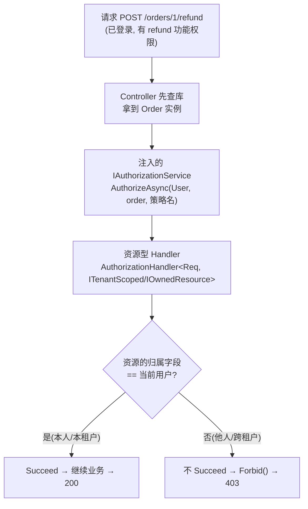
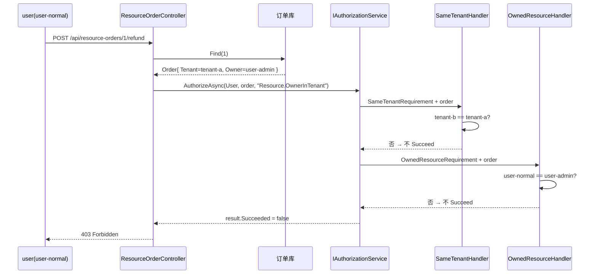

# DOTNET 鉴权系列 - 基于资源的动态授权

前面几篇我们把「功能权限」聊透了：不管是原生 AddPolicy、极简 PolicyCode，还是仿 ABP 的动态权限，回答的都是同一个问题——**你能不能干这件事**。张三能不能删用户、李四能不能退款，判断依据是这个人有没有这个权限编码/角色，和具体操作的是哪一条数据没有半毛钱关系。

这一篇要补上最容易被忽略、又最容易出安全事故的一环：**你能不能干这件事，落到「这一条」数据上，还成立吗？**

---

## 先说说痛点

设想一个再常见不过的场景：订单系统，运营给客服开了 `orders.refund`（退款）权限。功能权限校验妥妥地过了——客服确实能退款。可问题是：

- 客服 A 拿着退款接口，把客户 B 的订单给退了。
- SaaS 平台里，A 门店的店员登录后，调接口退了 B 门店的订单。

功能权限一点没错，A 确实「有退款权限」。但他退的是**不属于他的那一条订单**。这就是典型的**越权漏洞（Broken Object Level Authorization）**，常年稳居 OWASP API 安全风险榜首。

根子在于：功能权限是「粗粒度」的，它只管「能不能退款」这个动作，管不到「能不能退这张订单」。要堵住这个洞，就得引入**基于资源的授权**——校验时不光看用户有什么权限，还要把**具体的资源对象**拿出来，比一比这条数据到底归不归他管。

**一句话概括：功能权限回答「能不能退款」，资源权限回答「能不能退『这张』订单」。**

---

## 适用场景

| 场景 | 说明 |
|------|------|
| **多租户系统** | 用户只能操作所属租户的数据（如 SaaS 平台中门店员工仅能管理本门店订单） |
| **数据所有权控制** | 用户仅能操作自己创建的内容（如内容平台中作者只能编辑自己的文章） |
| **租户 + 归属双重约束** | 退款、合同编辑等敏感操作：既要同租户，又必须是本人（本方案用组合策略一次搞定） |

### 解决的核心问题

避免「功能权限有，资源权限无」的越权漏洞（如用户有 `orders.refund` 权限，却能退他人订单或跨租户操作）。

---

## 核心思路

.NET 的授权系统其实早就为这种场景留好了口子。回忆一下前几篇的 Requirement + Handler 套路，Handler 有一个我们一直没用到的泛型重载：

```cs
// 普通 Handler：只拿到 Requirement
AuthorizationHandler<TRequirement>

// 资源型 Handler：还能额外拿到「资源对象」！
AuthorizationHandler<TRequirement, TResource>
```

第二个泛型参数 `TResource` 就是钥匙。只要 Handler 声明成 `AuthorizationHandler<OwnedResourceRequirement, IOwnedResource>`，框架就会把你手动传进来的那个实现了 `IOwnedResource` 的实例送到 Handler 手里，你就能拿资源的归属字段和当前用户比对了。

### 资源对象怎么「传进去」？

靠的是**主动调用** `IAuthorizationService.AuthorizeAsync`：

```cs
var result = await _authorizationService.AuthorizeAsync(
    User,      // 当前登录用户（Claims 在这）
    order,     // ★ 具体资源对象——这就是「基于资源」的精髓
    ResourceAuthorizationPolicyNames.OwnerInTenant);

if (!result.Succeeded) return Forbid();
```

和前几篇 `[Authorize(Policy = "...")]` 那种声明式、进方法前自动拦截不同，资源授权几乎都是**命令式**的——因为「哪条资源」这个信息，往往要先查库拿到实体才知道，没法在进方法前就判断。所以标准姿势是：**先把资源查出来，再拿着资源去问授权系统**。

### 整套流程



---

## 集成思路

所有代码都放在独立的 `ResourceBasedAuthorization` 文件夹里，**自成一体**，不和别的鉴权方案共用任何类型。

与旧版「每个业务表写一个 Handler」不同，本版做了**接口抽象 + 通用 Handler**：订单、合同、工单……只要实现对应接口，就能共用同一套裁判，新增实体**不必再写 Handler**。

---

## 第一步：定义资源契约（接口）

先有「资源」的**共同特征**，授权才有的可比，也才有 Handler 复用的基础。

### IOwnedResource —— 有明确归属人

```cs
/// <summary>
/// 标记「有明确归属人」的业务资源。订单、合同、工单等实体实现此接口后，
/// 即可共用 OwnedResourceAuthorizationHandler，无需每表写一个 Handler。
/// </summary>
public interface IOwnedResource
{
    /// <summary>资源归属用户 ID（通常对应创建者 / 负责人）。</summary>
    string OwnerUserId { get; }
}
```

### ITenantScoped —— 属于某个租户

```cs
/// <summary>
/// 标记「属于某个租户」的业务资源。实现后共用 SameTenantAuthorizationHandler。
/// </summary>
public interface ITenantScoped
{
    string TenantId { get; }
}
```

### ITenantOwnedResource —— 同时带租户与归属人

```cs
/// <summary>
/// 同时带租户与归属人的资源。需要「同租户 + 本人」双重校验的实体实现此接口即可，
/// 调用 ResourceAuthorizationPolicyNames.OwnerInTenant 策略，无需新 Handler。
/// </summary>
public interface ITenantOwnedResource : ITenantScoped, IOwnedResource
{
}
```

三个接口各司其职：`ITenantScoped` 管多租户隔离，`IOwnedResource` 管数据所有权，`ITenantOwnedResource` 是两者的组合标记，供需要双重校验的实体（订单、合同）实现。

---

## 第二步：定义资源对象

### Order —— 订单

```cs
/// <summary>
/// 演示用「资源」对象：订单。
/// 基于资源的授权，判断的不是「你能不能退款」这种功能权限，
/// 而是「你能不能退『这一张』订单」——所以必须把具体资源实例交给 Handler 去比对。
/// </summary>
public class Order : ITenantOwnedResource
{
    public int Id { get; init; }

    /// <summary>所属租户（门店）ID。多租户隔离：用户只能操作自己租户的订单。</summary>
    public string TenantId { get; init; } = string.Empty;

    /// <summary>创建者用户 ID。数据所有权：用户只能操作自己创建的订单。</summary>
    public string OwnerUserId { get; init; } = string.Empty;

    public decimal Amount { get; init; }
    public string Description { get; init; } = string.Empty;
}
```

### Contract —— 合同（演示 Handler 复用）

```cs
/// <summary>
/// 演示：合同与订单共用同一套 OwnedResourceAuthorizationHandler，
/// 新实体只需实现 IOwnedResource，不必再写 Handler。
/// </summary>
public class Contract : ITenantOwnedResource
{
    public int Id { get; init; }
    public string TenantId { get; init; } = string.Empty;
    public string OwnerUserId { get; init; } = string.Empty;
    public string Title { get; init; } = string.Empty;
}
```

**关键点**：`Contract` 和 `Order` 是完全不同的业务表，但因为都实现了 `ITenantOwnedResource`，传给 `AuthorizeAsync` 后会自动路由到**同一对** Handler，不用为合同再写 `ContractOwnerAuthorizationHandler`。

---

## 第三步：配数据源（模拟查库）

真实项目里就是 EF Core / Dapper 查库，这里用内存模拟。预置几条数据**专门用来演示越权拦截**：

### 订单数据

配合 `AuthController` 的登录身份：

- `admin` → `userId = user-admin`，`tenant_id = tenant-a`
- `user`  → `userId = user-normal`，`tenant_id = tenant-b`

```cs
public class InMemoryOrderStore : IOrderStore
{
    private readonly List<Order> _orders =
    [
        new Order { Id = 1, TenantId = "tenant-a", OwnerUserId = "user-admin",  Amount = 100m, Description = "A 租户-admin 的订单" },
        new Order { Id = 2, TenantId = "tenant-b", OwnerUserId = "user-normal", Amount = 200m, Description = "B 租户-user 的订单" },
        new Order { Id = 3, TenantId = "tenant-a", OwnerUserId = "user-normal", Amount = 300m, Description = "A 租户里、但归属 user 的订单" }
    ];

    public Order? Find(int id) => _orders.FirstOrDefault(o => o.Id == id);
    public IReadOnlyList<Order> All() => _orders;
}
```

**订单 3 是故意设计的边界数据**：它归属 `user-normal`，但租户是 `tenant-a`。用来验证「只看所有权、不看租户」或「只看租户、不看所有权」都不够——敏感操作必须**同时**满足同租户 + 本人。

### 合同数据

```cs
public class InMemoryContractStore : IContractStore
{
    private readonly List<Contract> _contracts =
    [
        new Contract { Id = 1, TenantId = "tenant-a", OwnerUserId = "user-admin", Title = "A 租户-admin 的合同" },
        new Contract { Id = 2, TenantId = "tenant-b", OwnerUserId = "user-normal", Title = "B 租户-user 的合同" }
    ];

    public Contract? Find(int id) => _contracts.FirstOrDefault(c => c.Id == id);
}
```

---

## 第四步：定义 Requirement（诉求单）

和前几篇一样，Requirement 只是个空标记，负责让框架路由到对应 Handler。这里两个场景两张诉求单：

```cs
// 场景一：多租户隔离
public class SameTenantRequirement : IAuthorizationRequirement { }

// 场景二：数据所有权（适用于所有 IOwnedResource，不再绑死在 Order 上）
public class OwnedResourceRequirement : IAuthorizationRequirement { }
```

对比旧版 `OrderOwnerRequirement`：新版把 Requirement 也**泛化**了，名字从「订单归属人」改成「资源归属人」，语义上覆盖订单、合同及未来所有实现了 `IOwnedResource` 的实体。

---

## 第五步：写资源型 Handler（真正干活的裁判）

这是全篇的核心。注意 Handler 的泛型签名——**第二个泛型参数是接口，不是具体实体类**：

### SameTenantAuthorizationHandler —— 多租户隔离

```cs
/// <summary>
/// 场景一「多租户隔离」的裁判。
/// 注意泛型第二个参数是 ITenantScoped 接口而非 Order：
/// 任何实现了该接口的实体（订单、合同…）都会路由到这里，一个 Handler 覆盖全业务。
/// </summary>
public class SameTenantAuthorizationHandler : AuthorizationHandler<SameTenantRequirement, ITenantScoped>
{
    protected override Task HandleRequirementAsync(
        AuthorizationHandlerContext context,
        SameTenantRequirement requirement,
        ITenantScoped resource)  // ★ 这个 resource 就是 AuthorizeAsync 时传进来的实例
    {
        // 从认证阶段写入的 Claim 取当前用户所属租户
        var tenantId = context.User.FindFirst(ResourceClaimTypes.TenantId)?.Value;

        // 资源的租户 == 用户的租户，才放行；否则就是跨租户越权
        if (!string.IsNullOrEmpty(tenantId) &&
            string.Equals(tenantId, resource.TenantId, StringComparison.OrdinalIgnoreCase))
        {
            context.Succeed(requirement);
        }

        return Task.CompletedTask;
    }
}
```

### OwnedResourceAuthorizationHandler —— 数据所有权（通用）

```cs
/// <summary>
/// 通用「数据所有权」裁判：资源归属人 ≠ 当前用户 → 不 Succeed → 403。
/// 泛型第二参数是 IOwnedResource 接口，因此 Order、Contract、工单等
/// 只要实现该接口并传给 AuthorizeAsync，都会路由到这里，不用每加一个业务表就写 Handler。
/// </summary>
public class OwnedResourceAuthorizationHandler : AuthorizationHandler<OwnedResourceRequirement, IOwnedResource>
{
    protected override Task HandleRequirementAsync(
        AuthorizationHandlerContext context,
        OwnedResourceRequirement requirement,
        IOwnedResource resource)
    {
        var userId = context.User.FindFirst(ClaimTypes.NameIdentifier)?.Value;

        if (!string.IsNullOrEmpty(userId) &&
            string.Equals(userId, resource.OwnerUserId, StringComparison.OrdinalIgnoreCase))
        {
            context.Succeed(requirement);
        }

        return Task.CompletedTask;
    }
}
```

老规矩，`context.Succeed()` **只在通过时调用**，不 Succeed 就等于拒绝，框架最终返回 403。所有判断都建立在认证阶段已经把 `userId`、`tenant_id` 写进 Claim 的前提上。

### Claim 类型常量

为避免魔法字符串散落各处，租户 Claim 抽成常量：

```cs
public static class ResourceClaimTypes
{
    public const string TenantId = "tenant_id";
}
```

登录时（`AuthController`）写入：

```cs
var tenantId = isAdmin ? "tenant-a" : "tenant-b";
// ...
claims.Add(new Claim("tenant_id", tenantId));
// 等价于 new Claim(ResourceClaimTypes.TenantId, tenantId)
```

---

## 第六步：注册到容器

把数据源、两个通用 Handler、**三条**命名策略一起注册。

```cs
public static class ResourceBasedAuthorizationExtensions
{
    public static IServiceCollection AddResourceBasedAuthorization(this IServiceCollection services)
    {
        services.AddSingleton<IOrderStore, InMemoryOrderStore>();
        services.AddSingleton<IContractStore, InMemoryContractStore>();

        // 资源型 Handler：AuthorizationHandler<TRequirement, TResource>，框架按类型自动路由
        services.AddSingleton<IAuthorizationHandler, SameTenantAuthorizationHandler>();
        services.AddSingleton<IAuthorizationHandler, OwnedResourceAuthorizationHandler>();

        // 用原生 AddPolicy 登记策略。一条策略可挂多个 Requirement（AND 关系），
        // 框架会分别路由到 SameTenantAuthorizationHandler / OwnedResourceAuthorizationHandler，无需再写组合 Handler。
        services.AddAuthorization(options =>
        {
            options.AddPolicy(ResourceAuthorizationPolicyNames.SameTenant, policy =>
                policy.Requirements.Add(new SameTenantRequirement()));

            options.AddPolicy(ResourceAuthorizationPolicyNames.Owner, policy =>
                policy.Requirements.Add(new OwnedResourceRequirement()));

            // 同时校验租户 + 归属人：两个 Requirement 都要 Succeed 才算通过
            options.AddPolicy(ResourceAuthorizationPolicyNames.OwnerInTenant, policy =>
            {
                policy.Requirements.Add(new SameTenantRequirement());
                policy.Requirements.Add(new OwnedResourceRequirement());
            });
        });

        return services;
    }
}
```

### 三条策略对照

| 策略常量 | 策略名 | 挂的 Requirement | 适用场景 |
|----------|--------|------------------|----------|
| `SameTenant` | `Resource.SameTenant` | `SameTenantRequirement` | 查看详情：同租户即可看 |
| `Owner` | `Resource.Owner` | `OwnedResourceRequirement` | 仅校验归属人（跨租户场景慎用） |
| `OwnerInTenant` | `Resource.OwnerInTenant` | `SameTenantRequirement` + `OwnedResourceRequirement` | 退款、编辑合同：必须同租户且本人 |

**组合策略的 AND 语义**：`OwnerInTenant` 一条策略里挂了**两个** Requirement，框架会分别调 `SameTenantAuthorizationHandler` 和 `OwnedResourceAuthorizationHandler`，**两个都要 Succeed** 才算通过。不需要再写一个「组合 Handler」——这是 .NET 授权框架的内置能力。

### 划重点：与另外两套动态权限的关系

本方案**不去 Replace `IAuthorizationPolicyProvider`**，只是老老实实用 `AddPolicy` 注册命名策略。这一点很关键——前两篇的极简 PolicyCode 和仿 ABP 都替换了默认 Provider，且二者互斥。而本篇走的是命令式 `AuthorizeAsync`，压根不碰 Provider，所以它和那两套**井水不犯河水，可以同时启用**。（而且那两套的 Provider 都会「优先返回 AddPolicy 注册过的策略」，所以这里注册的策略在任何配置下都能被正确解析到。）

### Program 里一行接入

```cs
builder.Services.AddAppCookieAuthentication();     // 认证

builder.Services.AddResourceBasedAuthorization();  // 本篇：基于资源的授权（可与其它方案共存）

builder.Services.AddControllers();
var app = builder.Build();
app.UseAuthentication();
app.UseAuthorization();
app.MapControllers();
app.Run();
```

---

## 在控制器里用起来

资源授权是**命令式**的，所以逻辑都写在 Action 里：先查库拿资源，再拿资源去问授权系统。

### ResourceOrderController —— 订单

```cs
[ApiController]
[Route("api/resource-orders")]
[Authorize(AuthenticationSchemes = CookieAuthenticationDefaults.AuthenticationScheme)] // 先保证是登录用户
public class ResourceOrderController : ControllerBase
{
    private readonly IOrderStore _orderStore;
    private readonly IAuthorizationService _authorizationService; // ★ 注入授权服务

    public ResourceOrderController(IOrderStore orderStore, IAuthorizationService authorizationService)
    {
        _orderStore = orderStore;
        _authorizationService = authorizationService;
    }

    /// <summary>列出全部订单（仅用于对照观察数据，不做资源校验）。</summary>
    [HttpGet]
    public IActionResult GetAll() => Ok(new { approach = "resource-based", data = _orderStore.All() });

    /// <summary>
    /// 退款：必须「同租户」且「本人创建」才能退。一条策略挂两个 Requirement，不用写第三个 Handler。
    /// </summary>
    [HttpPost("{id:int}/refund")]
    public async Task<IActionResult> Refund(int id)
    {
        var order = _orderStore.Find(id);          // 1. 先把资源查出来
        if (order is null) return NotFound(new { message = $"订单 {id} 不存在" });

        // OwnerInTenant = SameTenantRequirement + OwnedResourceRequirement（AND）
        var result = await _authorizationService   // 2. 拿着资源去问授权系统
            .AuthorizeAsync(User, order, ResourceAuthorizationPolicyNames.OwnerInTenant);

        if (!result.Succeeded) return Forbid();    // 3. 不通过 → 403

        return Ok(new { approach = "resource-based", message = $"已为订单 {id} 退款 {order.Amount:C}" });
    }

    /// <summary>
    /// 查看订单详情：必须是「同租户」才能看。演示多租户数据隔离。
    /// </summary>
    [HttpGet("{id:int}")]
    public async Task<IActionResult> GetDetail(int id)
    {
        var order = _orderStore.Find(id);
        if (order is null) return NotFound(new { message = $"订单 {id} 不存在" });

        var result = await _authorizationService
            .AuthorizeAsync(User, order, ResourceAuthorizationPolicyNames.SameTenant);

        if (!result.Succeeded) return Forbid();

        return Ok(new { approach = "resource-based", data = order });
    }
}
```

### ResourceContractController —— 合同（证明 Handler 复用）

```cs
[ApiController]
[Route("api/resource-contracts")]
[Authorize(AuthenticationSchemes = CookieAuthenticationDefaults.AuthenticationScheme)]
public class ResourceContractController : ControllerBase
{
    private readonly IContractStore _contractStore;
    private readonly IAuthorizationService _authorizationService;

    public ResourceContractController(IContractStore contractStore, IAuthorizationService authorizationService)
    {
        _contractStore = contractStore;
        _authorizationService = authorizationService;
    }

    [HttpPut("{id:int}")]
    public async Task<IActionResult> Update(int id, [FromBody] string title)
    {
        var contract = _contractStore.Find(id);
        if (contract is null) return NotFound(new { message = $"合同 {id} 不存在" });

        // 与订单退款相同：一条组合策略同时校验租户 + 归属人
        var result = await _authorizationService.AuthorizeAsync(
            User,
            contract,
            ResourceAuthorizationPolicyNames.OwnerInTenant);

        if (!result.Succeeded) return Forbid();

        return Ok(new { approach = "resource-based", message = $"已更新合同 {id} 标题为 {title}" });
    }
}
```

控制器上的 `[Authorize(...)]` 是**认证**，保证进来的是登录用户；方法内的 `AuthorizeAsync(User, resource, ...)` 才是**资源授权**，判断这个登录用户能不能碰这条具体资源。**两层各司其职**。

---

## 走一遍完整流程

### 场景 A：跨租户退款被拦截

拿 `user`（`user-normal`，租户 `tenant-b`）去退订单 1（租户 `tenant-a`，归属 `user-admin`）举例：

1. `user` 登录，认证阶段往 Cookie 里写了 `NameIdentifier = user-normal`、`tenant_id = tenant-b`。
2. 请求 `POST /api/resource-orders/1/refund`，带着 Cookie。
3. 认证中间件解开 Cookie，确认是登录用户（功能层面他也「能退款」）。
4. Controller 先 `Find(1)` 查出订单 1，`TenantId = tenant-a`，`OwnerUserId = user-admin`。
5. 调 `AuthorizeAsync(User, order1, "Resource.OwnerInTenant")`，框架把订单 1 分别送进两个 Handler。
6. `SameTenantAuthorizationHandler`：`tenant-b` ≠ `tenant-a`，**不 Succeed**。
7. `OwnedResourceAuthorizationHandler`：`user-normal` ≠ `user-admin`，**不 Succeed**。
8. 两个 Requirement 都没通过 → `result.Succeeded == false` → Controller 返回 **403 Forbidden**。

越权被干净利落地挡在了门外。

### 场景 B：同租户退款成功

`user` 退订单 2（租户 `tenant-b`，归属 `user-normal`）：

1. `SameTenantAuthorizationHandler`：`tenant-b` == `tenant-b` → **Succeed**。
2. `OwnedResourceAuthorizationHandler`：`user-normal` == `user-normal` → **Succeed**。
3. 两个 Requirement 都通过 → 继续退款 → **200**。

### 场景 C：订单 3 —— 为什么退款必须「租户 + 归属」双校验

订单 3：`TenantId = tenant-a`，`OwnerUserId = user-normal`。

| 操作者 | 策略 | 结果 | 原因 |
|--------|------|------|------|
| `user`（tenant-b）退订单 3 | `OwnerInTenant` | **403** | 同租户不过（tenant-b ≠ tenant-a） |
| `admin`（tenant-a）退订单 3 | `OwnerInTenant` | **403** | 同租户过，但归属人不过（user-admin ≠ user-normal） |
| `user`（tenant-b）看订单 3 详情 | `SameTenant` | **403** | 跨租户，不能看 |
| `admin`（tenant-a）看订单 3 详情 | `SameTenant` | **200** | 同租户即可看（不要求本人） |

这说明：**查看**和**敏感操作**可以选不同策略——看详情只要 `SameTenant`；退款/编辑必须 `OwnerInTenant`。

### 场景 D：合同编辑 —— 不同实体，同一 Handler

`user` 编辑合同 2（归属自己）→ **200**；`user` 编辑合同 1（归属 admin）→ **403**。走的完全是订单退款同一套 `OwnedResourceAuthorizationHandler`，没有为合同写任何新 Handler。

### 时序图



---

## 用 .http 或 Postman 实测

预置数据下的效果（先登录再调接口，Cookie 会自动带上）：

```http
### 登录 admin(tenant-a) / user(tenant-b)
POST /Auth/login
Content-Type: application/json

{ "username": "admin", "password": "123456" }

###
POST /Auth/login
Content-Type: application/json

{ "username": "user", "password": "123456" }

### 列出全部订单（不做资源校验，对照观察）
GET /api/resource-orders

### 退款(OwnerInTenant)：订单 2 归属 user、属 tenant-b → user 可退
POST /api/resource-orders/2/refund

### 退款：订单 1 属 tenant-a、归属 admin → user 退 403
POST /api/resource-orders/1/refund

### 退款：订单 3 属 tenant-a 但归属 user → user(tenant-b) 退 403（跨租户）
POST /api/resource-orders/3/refund

### 查看详情(SameTenant)：订单 1 属 tenant-a → admin 可看，user(tenant-b) 403
GET /api/resource-orders/1

### 编辑合同(OwnerInTenant)：合同 2 归属 user → user 可编辑
PUT /api/resource-contracts/2
Content-Type: application/json

"新标题"

### 编辑合同：合同 1 归属 admin → user 编辑 403
PUT /api/resource-contracts/1
Content-Type: application/json

"越权修改"
```

可以看到，同一个退款接口，能不能成，取决于操作的是**哪一条**订单，而不再只看「有没有退款权限」。合同编辑同理——不同业务表，同一套 Handler。

---

## 总结

基于资源的授权，抓住的是 .NET 授权系统里 `AuthorizationHandler<TRequirement, TResource>` 这个泛型重载：它允许 Handler 拿到**具体的资源对象**，从而把校验从「你能不能干这件事」升级到「你能不能对『这条数据』干这件事」。用法上和前几篇最大的不同是**命令式**——先查库拿到资源，再用注入的 `IAuthorizationService.AuthorizeAsync(User, resource, policy)` 去判断。

### 本版相对旧实现的演进

| 维度 | 旧版 | 本版 |
|------|------|------|
| Handler 泛型第二参数 | 具体类 `Order` | 接口 `IOwnedResource` / `ITenantScoped` |
| 新增实体 | 每表写一个 Handler | 实现接口即可，零 Handler |
| Requirement | `OrderOwnerRequirement`（绑 Order） | `OwnedResourceRequirement`（通用） |
| 策略数量 | 2 条 | 3 条（新增 `OwnerInTenant` 组合策略） |
| 演示实体 | 仅 Order | Order + Contract（证明复用） |
| 退款校验 | 仅归属人 | 同租户 **且** 归属人（`OwnerInTenant`） |

### 核心构件对照

| 文件 | 角色 | 一句话职责 |
|------|------|------------|
| `IOwnedResource` / `ITenantScoped` / `ITenantOwnedResource` | 资源契约 | 抽象归属字段，让 Handler 可复用 |
| `Order` / `Contract` | 资源对象 | 实现契约，带上 `TenantId` / `OwnerUserId` |
| `IOrderStore` / `IContractStore` + 内存实现 | 数据源 | 先查出资源，才有的可授权 |
| `SameTenantRequirement` / `OwnedResourceRequirement` | 诉求单 | 空标记，路由到对应资源 Handler |
| `SameTenantAuthorizationHandler` / `OwnedResourceAuthorizationHandler` | 资源裁判 | 泛型第二参数为接口，一个 Handler 覆盖全业务 |
| `ResourceClaimTypes` | Claim 常量 | 避免 `tenant_id` 魔法字符串 |
| `ResourceAuthorizationPolicyNames` | 策略名常量 | 三条策略：同租户 / 归属人 / 组合 |
| `ResourceBasedAuthorizationExtensions` | 注册 | 挂 Handler + AddPolicy 登记命名策略 |
| `ResourceOrderController` / `ResourceContractController` | 用法 | 注入 `IAuthorizationService`，查库后传资源校验 |

### 适用边界和实践要点

1. **它是功能权限的补充，不是替代。** 正确的姿势是「功能权限（能不能退款）」+「资源权限（能不能退这张）」两层叠加：先用前几篇的方案卡住功能入口，再用本篇卡住数据归属。

2. **判断依据（`tenant_id`、`ownerId`）最好在认证阶段就写进 Claim**，授权阶段直接取，别在 Handler 里再查一次库。

3. **资源授权几乎都是命令式的**，因为「哪条资源」通常要先查库才知道，没法在进方法前用 `[Authorize]` 声明式拦截。

4. **一条策略可挂多个 Requirement（AND）**，如 `OwnerInTenant` 同时校验租户和归属人，不需要写组合 Handler。

5. **一个 Requirement 也可被多个 Handler 处理**（比如「本人 or 管理员」都放行）：框架里针对同一 Requirement，只要有任意一个 Handler `Succeed` 即算通过；多个 Requirement 之间则是 AND 关系，组合起来很灵活。

6. **Handler 泛型第二参数用接口而非具体类**，是新实体接入成本从「写 Handler」降到「实现接口」的关键设计。

7. **本方案不替换 `IAuthorizationPolicyProvider`**，因此和极简 PolicyCode、仿 ABP 那两套动态权限互不冲突，可同时启用。

最后照例强调那句贯穿整个系列的话：**认证和授权是两码事**。资源授权比对用的 `userId`、`tenant_id`，全是认证阶段塞进 Claim 的。认证解决「你是谁」，功能授权解决「你能干嘛」，资源授权再进一步解决「你能不能动这条数据」——三层配合，才是一套真正堵得住越权的鉴权体系。
