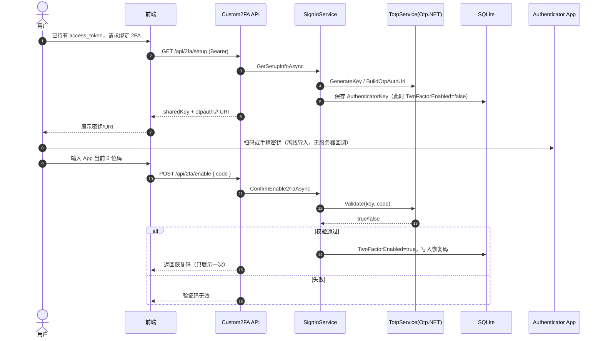
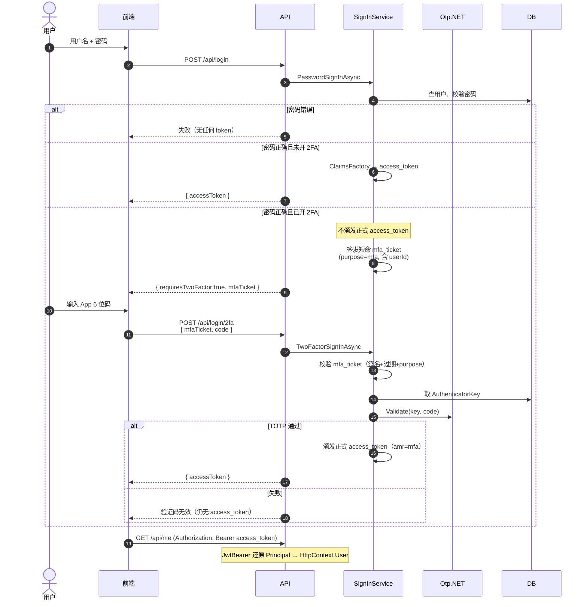
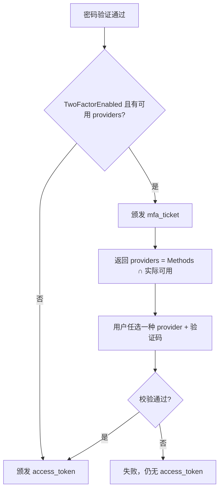

# Custom2FA_Demo

**不使用** ASP.NET Core Identity，但按同一思路自建：用户存储、密码哈希、Claims 工厂、两段式 2FA、正式 JWT。

## 运行

```bash
cd Custom2FA_Demo
dotnet run
```

打开 https://localhost:5201

### 前端页面（均调用后端 Controller）

| 页面 | 调用的接口 |
|------|------------|
| `/` `index.html` | 入口导航 |
| `/register.html` | `POST /api/register` |
| `/login.html` | `POST /api/login` |
| `/mfa.html` | `POST /api/login/2fa`、`/api/login/recovery` |
| `/manage.html` | `GET /api/me`、`/api/2fa/*`、`POST /api/profile/contact`；绑定支持 **扫码 / 手动输密钥** 自选 |

静态资源：`wwwroot/css/site.css`、`wwwroot/js/api.js`（统一 `fetch` + localStorage 存 access_token）。
---

## 1. 用什么做二次认证？验证码原理是什么？

### 1.1 我们用的方案

| 项目 | 说明 |
|------|------|
| 标准 | **TOTP**（Time-based One-Time Password，RFC 6238） |
| 库 | **[Otp.NET](https://www.nuget.org/packages/Otp.NET)** |
| 用户侧 App | Microsoft Authenticator / Google Authenticator 等（任意兼容 TOTP 的 App） |
| 是否联网调 App | **否**。服务器与 App **从不通信**，只共享一把密钥后各自算码 |

对应代码：`Infrastructure/TotpService.cs`（封装 Otp.NET）。

### 1.2 那个「6 位码」是怎么来的？

```
共享密钥 Secret（绑定 2FA 时生成，只传给 App 一次）
        +
当前时间按 30 秒切成时间窗（timestep）
        ↓
HMAC-SHA1(Secret, timestep) → 截取成 6 位数字
```

- App 每约 **30 秒**换一个码（所以你会感觉「会过期」）。
- 服务器用**同一把密钥 + 同一时间算法**算「当前应是多少」，和用户输入比对。
- 不发短信、不调外部 Authenticator API。

绑定阶段服务器给出的：

```text
otpauth://totp/Issuer:user?secret=BASE32KEY&issuer=Issuer&digits=6
```

只是让 App **导入密钥**（扫码/手输），不是网络回调。

### 1.3 Otp.NET 怎么校验？会过期吗？

本项目校验逻辑：

```csharp
var totp = new Totp(Base32Encoding.ToBytes(key));
return totp.VerifyTotp(
    code,
    out _,
    new VerificationWindow(previous: 2, future: 2));
```

含义：

1. 用库里保存的 `AuthenticatorKey` 构造 `Totp`。
2. `VerifyTotp` 按当前 UTC 时间算期望码，和用户输入比较。
3. `VerificationWindow(previous: 2, future: 2)`：允许 **前后各 2 个 30 秒窗**（约 ±60 秒），减轻手机时钟偏差（Identity 的 `AuthenticatorTokenProvider` 也是类似窗口思想）。

**会不会过期？**

| 东西 | 会不会过期 | 说明 |
|------|------------|------|
| App 上显示的 6 位码 | **会** | 默认约 30 秒一变；过期后旧码校验失败 |
| 用户表里的 `AuthenticatorKey` | **不会** | 长期密钥，直到用户重置/关闭 2FA |
| `mfa_ticket`（见下文） | **会** | 默认约 5 分钟，只证明「密码已过、等待第二步」 |
| `access_token` | **会** | 正式访问令牌，默认约 60 分钟 |

所以：「验证码过期」指的是 **TOTP 动态码**；密钥本身不过期。

---

## 2. 二次认证的架构思路（含时序图）

### 2.1 分层（刻意对齐 Identity 的职责切分）

```text
┌─────────────────────────────────────────────────────────┐
│  API / 页面（Program.cs + wwwroot）                       │
│  注册、登录、/login/2fa、绑定 2FA、/api/me                   │
└──────────────────────────┬──────────────────────────────┘
                           │
┌──────────────────────────▼──────────────────────────────┐
│  SignInService（≈ SignInManager）                         │
│  编排：密码校验 → 要不要 2FA → 发 mfa_ticket 或 access_token │
└───────┬─────────────┬─────────────┬───────────┬─────────┘
        │             │             │           │
        ▼             ▼             ▼           ▼
   IUserStore   IPasswordHasher  ITotpService  IMfaTicketService
   (SQLite)     (PBKDF2)         (Otp.NET)     (短命 JWT)
        │                                       │
        │              IUserClaimsPrincipalFactory
        │              IAccessTokenService（正式 JWT）
        ▼
   AppUser 表：TwoFactorEnabled + AuthenticatorKey + RecoveryCodes
```

| 本项目抽象 | 对应 Identity | 职责 |
|------------|---------------|------|
| `AppUser` | `IdentityUser` | 用户 + 2FA 开关/密钥 |
| `IPasswordHasher` | `IPasswordHasher` | 密码哈希 |
| `IUserClaimsPrincipalFactory` | 同名接口 | 用户 → Principal |
| `ITotpService` | `AuthenticatorTokenProvider` | 生成/校验 TOTP |
| `IMfaTicketService` | Cookie `TwoFactorUserId` | 第一段临时态 |
| `IAccessTokenService` | Cookie `SignInAsync` | 正式登录态 |
| `SignInService` | `SignInManager` | 两段式编排 |

### 2.2 绑定 2FA 时序（尚未登录第二步，只是「打开开关」）



要点：绑定成功前必须先用 App 码「证明用户已经导入密钥」，避免只存密钥却从未验证。

### 2.3 登录 + 需要 2FA 时序（核心）



---

## 3. 登录检测到需要 2FA 后怎么做？发不发 token？

### 3.1 策略结论（本项目）

**不颁发正式 `access_token`，改发短命 `mfa_ticket`。**

| 阶段 | 返回什么 | 能干什么 |
|------|----------|----------|
| 密码 OK，需要 2FA | `requiresTwoFactor=true` + **`mfaTicket`** | 只能拿去调 `/api/login/2fa`（或恢复码接口） |
| 2FA OK | **`accessToken`** | 调 `/api/me` 等受保护接口 |
| 密码失败 / 2FA 失败 | 错误信息 | 什么令牌都不给正式权限 |

对应代码：`SignInService.PasswordSignInAsync`：

```csharp
if (user.TwoFactorEnabled && !string.IsNullOrEmpty(user.AuthenticatorKey))
{
    var ticket = mfaTickets.CreateTicket(user.Id);
    return new AuthResult(true, RequiresTwoFactor: true, MfaTicket: ticket);
    // 注意：这里没有 CreateAccessToken
}
```

### 3.2 为什么要 `mfa_ticket`，而不是「什么都不发」？

第二步接口需要知道「是哪个用户刚通过了密码」。可选策略：

| 策略 | 做法 | 本项目 |
|------|------|--------|
| A. 临时 Cookie | Identity：`TwoFactorUserIdScheme` Cookie 记住 userId | Cookie 站点常用 |
| B. 短命票据 JWT | `mfa_ticket`：签名 + 短过期 + `purpose=mfa` | **本项目采用（适合 API）** |
| C. 服务端 Session | Redis 存 `pendingMfa:userId`，返回 sessionId | 也可 |
| D. 第二步再传一次账密 | 无状态但体验差、密码多跑一次 | 不推荐 |

`mfa_ticket` 设计要点：

- 内含 `NameIdentifier=userId`、`purpose=mfa`
- 默认约 **5 分钟**过期（`Jwt:MfaTicketMinutes`）
- **不能**当 access_token 用：JwtBearer 的 `OnTokenValidated` 若发现 `purpose=mfa` 会直接 Fail

这对应 Identity 里「先临时 Cookie，再正式 SignIn」；我们只是把临时态换成了 JWT。

### 3.3 和 Identity 对照

```text
Identity（Cookie）:
  PasswordSignIn → RequiresTwoFactor
       → 写临时 Cookie（TwoFactorUserId）
       → 还不写应用登录 Cookie
  TwoFactorAuthenticatorSignIn → 正式 SignIn Cookie

Custom2FA（JWT）:
  PasswordSignIn → RequiresTwoFactor
       → 发 mfa_ticket
       → 不发 access_token
  TwoFactorSignIn → 发 access_token
```

---

## 对照 Identity 的抽象速查

| Identity | 本项目 | 作用 |
|----------|--------|------|
| `IdentityUser` + `TwoFactorEnabled` | `Users.TwoFactorEnabled` | 2FA 总开关 |
| （自建扩展）方式位标志 | `Users.TwoFactorMethods` | 1/2/4 位运算，登录弹出可选方式 |
| `AspNetUserTokens` | **`UserTokens` 表** | AuthenticatorKey / RecoveryCodes |
| `Email` + `EmailConfirmed` | `Users.Email*` | 邮箱通道前提 |
| `PhoneNumber` + `PhoneNumberConfirmed` | `Users.Phone*` | 短信通道前提 |
| `IPasswordHasher` | `Pbkdf2PasswordHasher` | 密码哈希 |
| `IUserClaimsPrincipalFactory` | 同名 | 用户 → Principal |
| `AuthenticatorTokenProvider` | `TotpService` + Otp.NET | 校验 TOTP |
| Cookie `TwoFactorUserId` | `mfa_ticket` | 第一段临时态 |
| `TwoFactorSignInAsync(provider, code)` | `TwoFactorSignInAsync(ticket, provider, code)` | 第二段正式登录 |

---

## 建议阅读顺序

1. 本文 §1～§3（原理 + 策略）  
2. **§5 表结构设计**（Users + UserTokens + 位运算）  
3. `Domain/TwoFactorMethods.cs`、`Infrastructure/SqliteUserStore.cs`  
4. `Services/SignInService.cs` — 两段式 + providers 列表  
5. `Infrastructure/TotpService.cs` / `JwtServices.cs`  
6. 对照 `Identity2FA_Demo`

数据库：`custom2fa.db`（启动时 `EnsureMigratedAsync` 自动建表/升级）。

---

## 4. 扩展：短信 / 邮箱等可选 2FA（Provider 思路）

本 Demo **已支持**：

- 表字段：`TwoFactorMethods` 位标志 + 邮箱/手机确认字段  
- 登录返回 `providers[]`，第二步必须带 `provider`  
- Authenticator 真实 TOTP；Sms/Email 在 Demo 里仅演示通道选择（校验放宽，未接真实短信网关）

Identity / ABP 的 Provider 模型详见下文；自建扩展时继续加 `ITwoFactorProvider` 实现发码即可。

### 4.1 ASP.NET Core Identity

统一接口 `IUserTwoFactorTokenProvider<TUser>`：`GenerateAsync` / `ValidateAsync` / `CanGenerateTwoFactorTokenAsync`。

| Provider | 何时可用 | 说明 |
|----------|----------|------|
| Authenticator | 有 AuthenticatorKey | TOTP |
| Phone | 手机已确认 | 造码；发短信自管 |
| Email | 邮箱已确认 | 造码；发邮件自管 |

`GetValidTwoFactorProvidersAsync` → 前端选择 → `TwoFactorSignInAsync(provider, code)`。

### 4.2 ABP vNext

建立在 Identity 之上：Authenticator / Email / SMS；`IEmailSender` / `ISmsSender`；OpenIddict 两段换票。详见 [ABP 2FA 文档](https://abp.io/docs/latest/modules/identity/two-factor-authentication)。

### 4.3 本项目登录时如何弹出可选方式

```text
TwoFactorMethods（用户勾选，位运算）
    ∩
实际可用前提（有密钥 / 手机已确认 / 邮箱已确认）
    = providers[] 返回给前端
```

例：`TwoFactorMethods = 7`（1|2|4），但未绑 Authenticator、手机未确认 → 登录只返回 `["Email"]`。

---

## 5. 表结构设计（SQLite）

**不必**照搬 Identity 全套 `AspNet*` 表，但建议：

1. **Users**：账户 + 2FA 开关 + **方式位标志** + 邮箱/手机  
2. **UserTokens**：对齐 `AspNetUserTokens`，存 Authenticator 密钥与恢复码（**推荐要有**；短信/邮件的一次性登录码用 Redis，不进这张表）

### 5.1 为什么需要 UserTokens？

| 数据 | 放哪 | 原因 |
|------|------|------|
| AuthenticatorKey | **UserTokens 一行** | 与 Identity 一致；密钥与用户主数据分离 |
| RecoveryCodes | **UserTokens 另一行** | 同上，一种 Name 一行 |
| 短信/邮件登录验证码 | Redis（本 Demo 未接网关） | 短生命周期，不适合当「配置」常驻 UserTokens |
| 用户勾选了哪些方式 | **Users.TwoFactorMethods** | 位运算，登录算 providers |

所以：做 Authenticator 时 **UserTokens 建议有**；不是「三种通道 = Tokens 三行」。

### 5.2 `Users` 表

```sql
CREATE TABLE Users (
    Id               TEXT PRIMARY KEY,
    UserName         TEXT NOT NULL UNIQUE COLLATE NOCASE,
    PasswordHash     TEXT NOT NULL,
    Email            TEXT NULL,
    EmailConfirmed   INTEGER NOT NULL DEFAULT 0,
    PhoneNumber      TEXT NULL,
    PhoneConfirmed   INTEGER NOT NULL DEFAULT 0,
    TwoFactorEnabled INTEGER NOT NULL DEFAULT 0,
    TwoFactorMethods INTEGER NOT NULL DEFAULT 0,  -- 位标志
    CreatedAt        TEXT NOT NULL
);
```

| 字段 | 说明 |
|------|------|
| `TwoFactorEnabled` | 总开关 |
| `TwoFactorMethods` | **位运算**：`Authenticator=1`, `Sms=2`, `Email=4`；三种都选 = **7** |
| `Email` / `EmailConfirmed` | 邮箱通道前提（对齐 Identity） |
| `PhoneNumber` / `PhoneConfirmed` | 短信通道前提 |

位运算示例：

| 勾选 | 值 |
|------|-----|
| 仅 Authenticator | 1 |
| 仅 Sms | 2 |
| Authenticator + Email | 1\|4 = 5 |
| 三种全开 | 1\|2\|4 = **7** |

API：`POST /api/2fa/methods { "methods": 7 }`

### 5.3 `UserTokens` 表（对齐 AspNetUserTokens）

```sql
CREATE TABLE UserTokens (
    UserId        TEXT NOT NULL,
    LoginProvider TEXT NOT NULL,
    Name          TEXT NOT NULL,
    Value         TEXT NULL,
    PRIMARY KEY (UserId, LoginProvider, Name)
);
```

Authenticator 启用后典型 **2 行**（不是 3 种通道各一行）：

| UserId | LoginProvider | Name | Value |
|--------|---------------|------|--------|
| {id} | `[AspNetUserStore]` | `AuthenticatorKey` | Base32 密钥 |
| {id} | `[AspNetUserStore]` | `RecoveryCodes` | `CODE1;CODE2;...` |

常量见 `Domain/TwoFactorMethods.cs` → `UserTokenNames`。

### 5.4 启动自动迁移

`SqliteUserStore.EnsureMigratedAsync()`（`Program.cs` 启动时调用）：

| 版本 | 做什么 |
|------|--------|
| V1 | 创建基础 `Users`（兼容最早 Demo） |
| V2 | 给 `Users` 增加 Email/Phone/`TwoFactorMethods`；创建 `UserTokens`；把旧列上的 Key/Codes **迁入** UserTokens |

使用 `__SchemaVersion` 表记录当前版本，重复启动不会重复破坏数据。

库文件：项目目录 `custom2fa.db`。

### 5.5 登录与表的关系（简图）



相关代码：

- 实体：`Domain/AppUser.cs`、`Domain/TwoFactorMethods.cs`  
- 迁移/CRUD：`Infrastructure/SqliteUserStore.cs`  
- 业务：`Services/SignInService.GetAvailableProviders`
