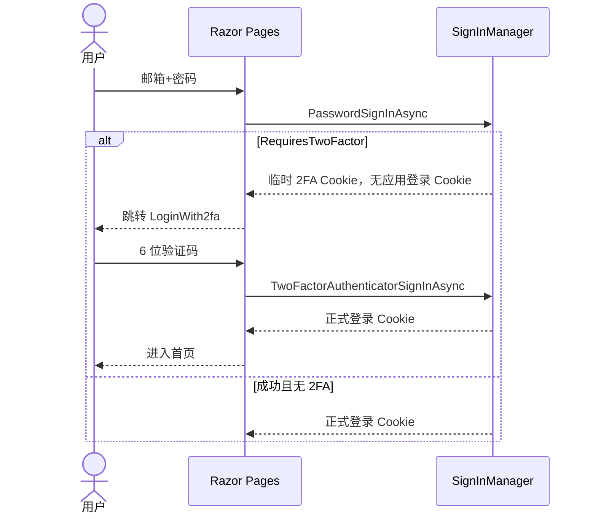

# Identity2FA_Demo

原生 **ASP.NET Core Identity** + **SQLite** 的 Authenticator（TOTP）二次认证示例。

> 更完整的原理说明（TOTP / Otp.NET / 两段式策略 / 时序图）见同级目录  
> **[Custom2FA_Demo/README.md](../Custom2FA_Demo/README.md)**。本页只写 Identity 版差异。

## 运行

```bash
cd Identity2FA_Demo
dotnet run
```

浏览器打开 https://localhost:5101

## 体验路径

1. 注册账号并登录  
2. 「管理 2FA」→ 用 Authenticator App 扫 `otpauth://` 或手输密钥  
3. 输入 6 位码启用  
4. 退出，再登录 → 密码通过后进入「二次认证」页  

## 用什么做 2FA？

- 标准：**TOTP**（约 30 秒一变的 6 位码）
- Identity 内置：`AuthenticatorTokenProvider`（与 Custom 版用的 Otp.NET **同属一类算法**）
- **不与**手机 App 联网；绑定时空共享密钥，之后各自算码

## 需要 2FA 时发不发「登录态」？

**不发正式登录 Cookie。** 策略与 Custom 版的 `mfa_ticket` 同构：

```text
PasswordSignInAsync 成功且需要 2FA
  → 返回 RequiresTwoFactor
  → 写入临时 Cookie：Identity.TwoFactorUserId（只记住 userId）
  → 还不写应用 Cookie（用户仍未真正登录）

TwoFactorAuthenticatorSignInAsync 成功
  → 正式 SignInAsync（应用 Cookie）
  → 清除临时 2FA Cookie
```

| | Identity 本项目 | Custom2FA_Demo |
|--|-----------------|----------------|
| 第一段临时态 | Cookie `TwoFactorUserId` | JWT `mfa_ticket` |
| 正式登录态 | 应用 Cookie | `access_token` |
| TOTP 校验 | `AuthenticatorTokenProvider` | Otp.NET |



## Identity 2FA 关键抽象

| 概念 | 谁做 |
|------|------|
| `TwoFactorEnabled` | `AspNetUsers` 字段 |
| AuthenticatorKey / RecoveryCodes | `AspNetUserTokens` |
| 密码登录后要 2FA | `PasswordSignInAsync` → `RequiresTwoFactor` |
| 临时记住「谁在做 2FA」 | Cookie `Identity.TwoFactorUserId` |
| 校验 TOTP | `TwoFactorAuthenticatorSignInAsync` |
| 正式登录 | 第二步成功后 `SignInAsync` |

数据库：`identity2fa.db`（`EnsureCreated` 自动建表）。
