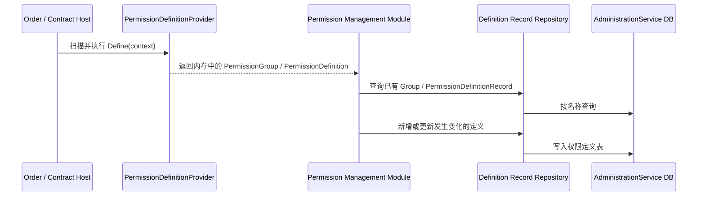

# ABP vNext 微服务权限与动态 Claims 设计

本文以“订单服务 + 合同服务”为例，对比 ABP vNext 在单服务和微服务场景下的权限定义、授权值管理、动态 Claims 刷新，以及服务间调用的设计。

## 先给结论

ABP 的基本分工是：

- **业务服务定义权限**：订单服务定义 `Orders.*`，合同服务定义 `Contracts.*`。
- **中心服务管理授权值**：用户、角色，以及用户 / 角色 / 客户端被授予哪些权限，由 Identity 和 Administration 等基础设施服务统一管理。
- **业务服务只校验自己关心的权限**：订单服务不需要知道合同权限，合同服务不需要复制用户、角色和权限表。
- **动态 Claims 解决身份信息即时刷新**：角色等身份信息变更后，通过分布式缓存失效，在下一请求生效，而不是等待 JWT 自然过期。

因此，不应在每个业务服务里各维护一套用户、角色、`PermissionGrant` 权限授权表。

---

## 一、先区分三类数据

讨论微服务权限时，最容易混淆的是“权限定义”“权限授权值”和“业务数据”。

| 数据 | 示例 | 归属 |
| --- | --- | --- |
| 业务数据 | 订单、订单行、合同、合同版本、签章状态 | 各业务服务独立拥有 |
| 权限定义 | `Orders.Create`、`Contracts.Approve` | 由对应业务服务的代码定义 |
| 权限授权值 | 某角色是否拥有 `Orders.Create` | 由中心权限管理服务保存和维护 |
| 身份数据 | 用户、角色、客户端、登录会话 | Identity / 认证中心负责 |

所以：

- 订单服务有自己的订单数据库。
- 合同服务有自己的合同数据库。
- 用户、角色、角色与权限的分配不应复制进订单库和合同库。
- 订单、合同服务仍然各自保有“权限定义代码”，因为接口和业务规则由它们自己实现。

## 二、单服务场景是什么样的

单体或模块化单体中，Identity、Permission Management、订单、合同等模块通常在同一应用进程中运行。

```text
订单模块 / 合同模块
    └─ PermissionDefinitionProvider 定义权限
              ↓
应用启动时将定义写入权限定义表
              ↓
管理员给角色 / 用户 / 客户端分配授权值
              ↓
接口使用 [Authorize("Orders.Create")] 或 PermissionChecker 校验
              ↓
允许访问或返回 403
```

例如：

1. 订单模块定义 `Orders.Create`。
2. 管理员把 `Orders.Create` 授予 `Sales` 角色。
3. 用户张三属于 `Sales` 角色。
4. 张三调用创建订单接口时，`IPermissionChecker` 计算其是否拥有 `Orders.Create`。

在单体中，这些表可以位于同一个数据库，但逻辑职责依然不同：

- Identity 表保存用户、角色。
- Permission Management 表保存用户 / 角色 / 客户端的授权值。
- Orders 表保存订单。
- Contracts 表保存合同。

## 三、ABP 微服务场景是什么样的

ABP 标准微服务方案不会让订单、合同服务都各自成为“完整的权限管理中心”。

更接近下面的结构：

```text
                 ┌──────────────────────────┐
                 │ Identity 服务             │
                 │ 用户、角色、登录、OIDC    │
                 └─────────────┬────────────┘
                               │
                 ┌─────────────▼────────────┐
                 │ Administration 服务       │
                 │ 权限、设置、功能、语言等    │
                 │ Permission Management     │
                 └───────┬──────────┬───────┘
                         │          │
          ┌──────────────▼───┐  ┌───▼──────────────┐
          │ Order 服务        │  │ Contract 服务     │
          │ 订单业务数据库     │  │ 合同业务数据库      │
          │ 定义 Orders.*     │  │ 定义 Contracts.*  │
          └──────────────────┘  └──────────────────┘
```

### 1. 订单与合同是否“一服务一库”

从领域边界看，应该是：

- Order 服务拥有订单相关业务数据及其数据库。
- Contract 服务拥有合同相关业务数据及其数据库。

是否物理上一服务一数据库，取决于团队规模和拆分阶段；但不要让合同服务直接读写订单服务的业务表，也不要让订单服务直接读写合同服务的业务表。

Identity 和 Administration 是公共基础设施服务，它们维护自己的数据库或独立的数据边界，用于管理用户、角色、权限授权值等横切能力。

### 2. 每个业务库是否都要建权限表

通常**不需要各自维护一套权限授权值真相表**。

这里的“同步到 Administration”很容易被理解成“Order 服务通过 HTTP 调用 Administration API，把权限推过去”。ABP 标准微服务模板的默认方式不是消息队列同步，也不是业务服务每次启动都调用一个注册 HTTP API；它是**各服务在启动阶段，将自己代码中定义的权限记录写入同一个 Permission Management 数据库边界**。

也就是说，Order 与 Contract 服务同步的是“权限定义目录”，不是用户权限结果：

```text
Order 服务启动
  → 扫描本服务 PermissionDefinitionProvider
  → 得到 Orders.View / Orders.Create / Orders.Cancel
  → 通过 Permission Management 的 Repository 写入 AdministrationService 数据库

Contract 服务启动
  → 扫描本服务 PermissionDefinitionProvider
  → 得到 Contracts.View / Contracts.Approve
  → 通过同一权限管理数据连接写入 AdministrationService 数据库
```

Administration 服务随后基于这份完整目录提供权限管理界面和 API；管理员给用户、角色或客户端分配授权值。

#### 2.1 同步的到底是什么

Permission Management 的 EF Core 上下文包含四类核心记录：

| 记录 | 示例 | 作用 |
| --- | --- | --- |
| `PermissionGroupDefinitionRecord` | `Orders`、`Contracts` | 权限组，用于管理界面分组 |
| `PermissionDefinitionRecord` | `Orders.Create`、`Contracts.Approve` | 权限定义目录：名称、父级、显示名、启用状态、多租户侧、允许的 Provider 等 |
| `PermissionGrant` | `R:Sales → Orders.Create = Granted` | 授权值：某个用户 / 角色 / 客户端是否被授予某权限 |
| `ResourcePermissionGrant` | `U:张三 → Contract:123 → Contracts.View` | 资源实例级授权值；按需使用 |

其中，Order、Contract 在启动时写入 / 更新的是前两类**定义记录**；它们不负责把用户、角色或 `PermissionGrant` 拷贝到自身业务库。

`PermissionDefinitionRecord` 的关键数据概念上类似：

```text
Name              = "Contracts.Approve"
GroupName         = "Contracts"
ParentName        = "Contracts"
DisplayName       = "审批合同"
IsEnabled         = true
MultiTenancySide  = Both
Providers         = "R,U,C"  // 角色、用户、客户端等可分配来源
```

#### 2.2 为什么每个服务能写入 Administration 的权限表

ABP 微服务模板通过**命名连接串映射**让 Permission Management 模块使用 Administration 服务数据库，而不是让每个业务服务生成自己的 `AbpPermissionManagement` 库。

基础设施配置的目标是：

```text
AbpPermissionManagement 模块
             ↓
AdministrationService 连接串
             ↓
AdministrationService 数据库
```

典型的全局数据库映射配置如下。不同模板版本的文件位置可能不同，但思路一致：

```csharp
Configure<AbpDbConnectionOptions>(options =>
{
    options.Databases.Configure("AdministrationService", database =>
    {
        database.MappedConnections.Add("AbpPermissionManagement");
        database.MappedConnections.Add("AbpSettingManagement");
        database.MappedConnections.Add("AbpFeatureManagement");
    });

    options.Databases.Configure("OrderService", database =>
    {
        database.MappedConnections.Add("OrderService");
    });

    options.Databases.Configure("ContractService", database =>
    {
        database.MappedConnections.Add("ContractService");
    });
});
```

连接串配置概念上类似：

```json
{
  "ConnectionStrings": {
    "AdministrationService": "Server=...;Database=MyApp_Administration;...",
    "OrderService": "Server=...;Database=MyApp_Order;...",
    "ContractService": "Server=...;Database=MyApp_Contract;..."
  }
}
```

因此：

- `OrderDbContext` 只连接 `OrderService` 数据库。
- `ContractDbContext` 只连接 `ContractService` 数据库。
- `IPermissionDefinitionRecordRepository`、`IPermissionStore` 通过 `AbpPermissionManagement` 映射连接到 `AdministrationService` 数据库。

这是一种“业务数据独立，横切基础设施数据集中”的设计。业务服务对 Permission Management 数据库存在受控访问，但不直接拥有 Identity 用户、角色或其他业务服务的数据。

> 如果团队严格要求“服务之间绝不共享数据库连接”，则不能原样采用模板的静态定义注册方式；需要自建一个权限目录注册 API，并由 Order / Contract 在发布或启动时通过 HTTP / 事件发布定义。那是自定义架构，不是 ABP 模板的默认实现。

#### 2.3 Order / Contract 服务需要写哪些代码

每个业务服务在其 `*.Contracts` 项目中定义自己的权限常量与 `PermissionDefinitionProvider`。

Order 示例：

```csharp
public static class OrderPermissions
{
    public const string GroupName = "Orders";

    public static class Orders
    {
        public const string Default = GroupName + ".Default";
        public const string Create = GroupName + ".Create";
        public const string Cancel = GroupName + ".Cancel";
    }
}

public class OrderPermissionDefinitionProvider : PermissionDefinitionProvider
{
    public override void Define(IPermissionDefinitionContext context)
    {
        var group = context.AddGroup(OrderPermissions.GroupName, L("Permission:Orders"));
        var orders = group.AddPermission(OrderPermissions.Orders.Default);
        orders.AddChild(OrderPermissions.Orders.Create);
        orders.AddChild(OrderPermissions.Orders.Cancel);
    }

    private static LocalizableString L(string name) =>
        LocalizableString.Create<OrderServiceResource>(name);
}
```

Contract 服务同样独立定义：

```csharp
public class ContractPermissionDefinitionProvider : PermissionDefinitionProvider
{
    public override void Define(IPermissionDefinitionContext context)
    {
        var group = context.AddGroup("Contracts", L("Permission:Contracts"));
        var contracts = group.AddPermission("Contracts.Default");
        contracts.AddChild("Contracts.Create");
        contracts.AddChild("Contracts.Approve");
    }

    private static LocalizableString L(string name) =>
        LocalizableString.Create<ContractServiceResource>(name);
}
```

框架会发现已注册模块中的 `PermissionDefinitionProvider`。服务侧需要依赖 Permission Management 的存储集成包；EF Core 方案通常包含：

```xml
<PackageReference Include="Volo.Abp.PermissionManagement.EntityFrameworkCore" Version="..." />
```

并在服务模块依赖链中包含对应模块。实际模板已预配这些依赖；自行创建服务时才需要手动补齐。

此外，静态定义落库由 `PermissionManagementOptions.SaveStaticPermissionsToDatabase` 控制，默认值就是 `true`：

```csharp
Configure<PermissionManagementOptions>(options =>
{
    options.SaveStaticPermissionsToDatabase = true;
});
```

通常不必显式写这段，因为默认已启用；写出来是为了说明启动注册的开关在哪里。

#### 2.4 服务启动时的内部原理

可以将启动过程理解为下面五步：



这是“幂等注册”思路：同一服务多次启动不会不断创建同名权限；新增定义会插入，显示名、父子关系、启用状态等变化会更新对应记录。

> 运行时真正做接口鉴权的 `PermissionDefinition` 仍在 Order / Contract 服务自身内存中。数据库中的定义记录主要服务于统一管理、管理界面和动态权限目录；不要把“定义落库”理解成每次接口请求都要从中心库加载权限定义。

#### 2.5 Administration 服务必须配置什么

Administration 是唯一需要开启动态权限目录管理的服务：

```csharp
private void ConfigurePermissionManagement()
{
    Configure<PermissionManagementOptions>(options =>
    {
        options.IsDynamicPermissionStoreEnabled = true;
    });
}
```

它还需要：

1. 引用 Permission Management 的 Application、HttpApi、Domain.Identity、Domain.OpenIddict 等管理侧模块；
2. 在自己的 DbContext 中实现 `IPermissionManagementDbContext`；
3. 执行迁移，创建 Permission Management 表；
4. 通过网关暴露权限管理 API 和 `/api/abp/application-configuration`。

管理界面请求权限列表、读取某角色已有权限、给用户 / 角色 / 客户端授予权限，最终都由 Administration 服务对 `PermissionGrant` 表执行读写。

#### 2.6 新增权限后为什么要重启业务服务

例如 Contract 新增了：

```text
Contracts.Archive
```

这个定义存在于 Contract 的代码和程序集里。已运行的旧实例没有加载新程序集，也不会自动发现新 Provider 代码。因此必须：

```text
修改 Contract 权限定义代码
    ↓
发布新版本
    ↓
启动 / 滚动重启 Contract 服务
    ↓
启动阶段将 Contracts.Archive 注册到中心定义表
    ↓
管理界面出现该权限
    ↓
管理员向角色 / 用户 / 客户端授予
```

需要注意一个 ABP 模板行为：业务服务注册新权限定义后，`admin` 角色不一定立刻自动拥有它。官方文档指出，只有 Administration 服务会尝试给 `admin` 角色做默认权限 Seed。因此应当：

- 在管理界面手动给 `admin` 角色授权；或
- 使用 `IPermissionDataSeeder` 在业务服务的 Data Seeder 中显式授予；或
- 在适当时机重启 Administration 服务，让其重新执行默认 Seed。

#### 2.7 权限定义注册与授权值变更是两条不同链路

| 事情 | 谁触发 | 是否要发版业务服务 | 最终写入哪里 |
| --- | --- | --- | --- |
| 新增 `Contracts.Approve` 定义 | Contract 开发与发布 | 是 | `PermissionDefinitionRecord` |
| 修改权限显示名称 / 父子关系 | Contract 开发与发布 | 是 | `PermissionDefinitionRecord` |
| 给 `Sales` 角色授予 `Contracts.Approve` | 管理员 | 否 | `PermissionGrant` |
| 收回张三的 `Orders.Cancel` | 管理员 | 否 | `PermissionGrant` |
| 动态新建“完全未知的业务权限” | 管理端 | 通常不能只靠数据库完成 | 仍需业务服务存在对应受保护代码 |

后一类“授予 / 回收”是在线操作；前一类“新增业务权限定义”是业务代码演进，必须随对应领域服务发布。

ABP 微服务模板中：

- 每个业务服务定义自己的权限，并在启动时注册静态权限定义。
- Administration 服务负责权限管理 API 和权限管理界面。
- 用户、角色、用户 / 角色 / 客户端对权限的授权值，在中心权限管理数据中维护。
- 业务服务只校验其自己的权限，不需要了解全部系统权限。

ABP 的 `PermissionManagementOptions.SaveStaticPermissionsToDatabase` 默认是 `true`。业务服务启动时会把自己的静态权限定义注册到权限定义表，使其出现在统一的权限管理界面中。

`IsDynamicPermissionStoreEnabled` 只需在 Administration 服务启用，因为 Administration 服务才是管理权限的中心。

## 四、新增权限、在线授权和回收权限

### 新增一个业务权限

例如合同服务需要新增“归档合同”：

```csharp
public static class ContractPermissions
{
    public const string Archive = "Contracts.Archive";
}
```

推荐流程：

1. 在 Contract 服务的 `PermissionDefinitionProvider` 中定义 `Contracts.Archive`。
2. 为需要受保护的接口或应用服务增加权限校验。
3. 发布并启动 / 重启 Contract 服务。
4. Contract 服务将新定义注册到中心权限定义表。
5. 管理员在 Administration 的权限管理界面，将该权限分配给角色、用户或客户端。
6. Contract 服务随后按 `Contracts.Archive` 校验访问。

注意：仅仅向数据库插入一条权限定义，并不能凭空创建受保护的业务能力。接口、应用服务和业务规则仍然属于 Contract 服务代码，需要随服务发布。

### 给用户或角色在线授予权限

授权值变更不必重新发布 Order 或 Contract 服务：

1. 管理员通过中心权限管理界面，或调用 `IPermissionManager`，把权限授予 / 回收给角色、用户或客户端。
2. 清理相关权限缓存、动态 Claims 缓存。
3. 下一请求重新得到最新身份与权限状态。
4. 用户访问目标接口时得到新的授权结果。

回收角色或权限后：

- 用户仍然通过认证，但无权执行某操作：通常返回 **403**。
- 会话或 Token 被撤销、身份不再有效：通常返回 **401**。

## 五、Dynamic Claims 在微服务中的作用

JWT 或 Cookie 签发后，内部 Claim 本身不会自动变化。若角色被回收，用户可能继续持有旧 Token，直到 Token 过期。

ABP 的 Dynamic Claims 用于解决这个问题。

### Identity 服务侧

`IdentityDynamicClaimsPrincipalContributor` 生成权威的动态 Claim，并使用分布式缓存保存快照。

缓存数据的核心结构是：

```csharp
public class AbpDynamicClaimCacheItem
{
    public List<AbpDynamicClaim> Claims { get; set; }
}

public class AbpDynamicClaim
{
    public string Type { get; set; }
    public string? Value { get; set; }
}
```

缓存键是：

```text
{tenantId}-{userId}
```

缓存命中时，运行时直接使用缓存中的动态 Claim 覆盖 Token / Cookie 中同类型的旧 Claim；缓存未命中时，Identity 服务才查询用户、生成新 `ClaimsPrincipal` 并写回缓存。

默认绝对过期时间为一小时。真正想实现“下一请求生效”，关键是变更后主动清理缓存：

```csharp
await identityDynamicClaimsCache.ClearAsync(userId, tenantId);
```

### 订单、合同等资源服务侧

在分布式场景中，资源服务不应该直连 Identity 的用户数据库。

ABP 提供：

- `RemoteDynamicClaimsPrincipalContributor`
- `WebRemoteDynamicClaimsPrincipalContributor`

资源服务优先从共享分布式缓存读取动态 Claim；如果缓存未命中，才调用认证中心配置的 `RemoteRefreshUrl`，请求认证中心生成并回填。

这意味着：

```text
请求到 Contract 服务
    ↓
验证 JWT
    ↓
读取共享 Redis 动态 Claims
    ↓
命中：覆盖当前 HttpContext.User 的旧 Claim
未命中：请求 Identity / Auth Server 刷新缓存
    ↓
Contract 服务按最新身份执行权限校验
```

## 六、服务间调用：用户调用与服务调用不是一回事

“服务已经注册为客户端，服务之间用客户端凭证访问”只回答了**调用服务是谁**，不能自动代表**最终用户是谁、是否有权限**。

| 场景 | Token 主体 | 应如何授权 |
| --- | --- | --- |
| 用户通过网关调用订单 API | 用户 Token | 校验用户权限、租户、资源归属 |
| 合同服务代表用户调用订单服务 | 用户委托上下文 / On-Behalf-Of | 下游校验用户权限、租户、资源边界 |
| 合同后台任务调用订单服务 | Client Credentials 服务 Token | 校验客户端 Scope / 服务权限和业务约束 |

### Client Credentials 的正确用途

例如 Contract 服务后台任务需要读取订单摘要：

1. Contract 服务通过 Client Credentials 获取代表自身的访问令牌。
2. Order 服务验证这个客户端身份。
3. Order 服务只允许该客户端访问明确、最小化的 Scope 或服务权限，例如 `orders.internal.read`。
4. Order 服务仍要控制查询范围、租户边界和审计记录。

此时 Order 服务看到的是“Contract 服务”，而不是某个最终用户。

因此，Client Credentials 不应被误用为“绕过用户授权”。若操作本质上是用户发起的，例如“张三在合同页面取消其订单”，应传递或委托用户上下文，并在目标服务重新执行用户与资源授权。

## 七、订单 + 合同服务的推荐落地方案

### 服务职责

| 服务 | 核心职责 |
| --- | --- |
| Identity / Auth Server | 用户、角色、登录、JWT / OIDC、客户端注册 |
| Administration | Permission Management、Feature Management、Setting Management 等公共管理能力 |
| Order | 订单数据、`Orders.*` 权限定义与订单资源授权 |
| Contract | 合同数据、`Contracts.*` 权限定义与合同资源授权 |
| Redis | 动态 Claims、权限相关缓存等跨实例共享缓存 |
| API Gateway | 统一入口、Token 转发与路由；不替代业务服务授权 |

### 实施原则

1. 每个服务只定义和校验本领域权限。
2. 用户、角色、授权值集中管理，避免跨服务复制权限数据。
3. 业务服务不能只校验功能权限；涉及具体订单、合同还必须做资源归属、租户和数据范围校验。
4. 权限、角色、用户状态变化后，主动清理动态 Claims / 权限相关缓存。
5. 服务间 Client Credentials 遵循最小权限原则，不能当作用户身份。
6. 业务服务数据库彼此隔离；通过 HTTP、gRPC 或分布式事件协作，而不是跨库查询。

## 八、与当前 DynamicClaims Demo 的对应关系

当前 Demo 中：

```csharp
var roles = _store.GetRoles(username);
RemoveAll(identity, ClaimTypes.Role);
foreach (var role in roles)
{
    identity.AddClaim(new Claim(ClaimTypes.Role, role));
}
```

为了演示清楚，`DemoUserClaimStore` 是内存字典，因此每请求读取的成本很低。

生产实现不应在每个请求直接查询用户、角色、权限表，而应接近 ABP 的方式：

```text
请求
  ↓
从 Redis 读取用户的动态 Claims 快照
  ↓
命中：直接覆盖当前请求的 Claims
未命中：由 Identity 服务查权威数据、生成 Claim、写入 Redis
  ↓
角色 / 用户状态变更后主动删除该用户缓存
```

## 参考

- ABP Dynamic Claims 官方文档：<https://abp.io/docs/latest/framework/fundamentals/dynamic-claims>
- ABP 微服务 Permission Management 官方文档：<https://abp.io/docs/latest/solution-templates/microservice/permission-management>
- ABP Permission Management 模块文档：<https://abp.io/docs/latest/modules/permission-management>
- ABP 源码：`IdentityDynamicClaimsPrincipalContributorCache`
