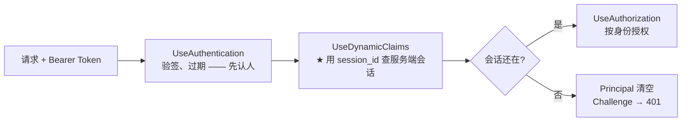
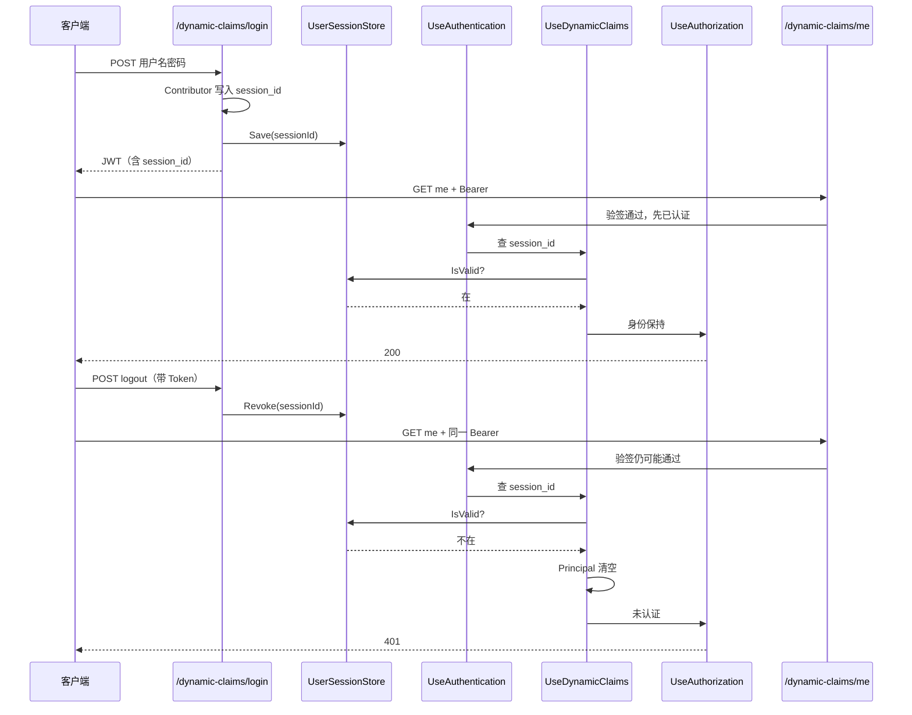

# DOTNET 鉴权系列- JWT 会话撤销与 Dynamic Claims（仿 ABP session_id）

前面几篇里，Cookie 有状态方案可以「删服务端会话 = 立刻踢人」；JWT 这边就不一样了——Token 签出去就是一张自包含的通行证，验签通过就算数，**服务端默认没有「收回」这一说**。

于是一个很现实的问题就冒出来了：

> 张三 9:00 登录，拿到有效期到晚上的 JWT。10:00 管理员要强制他下线，或者他自己点了退出。Token 还没过期，他拿着旧 Token 继续调接口——**怎么办？**

这一篇用原生 ASP.NET Core 做一版**仿 ABP Identity Session + Dynamic Claims** 的简洁实现：登录时往身份里塞 `session_id`，服务端存一份活跃会话；每个请求在授权前校验会话还在不在；不在就清空身份 → **401**。对应 Demo 在 `Authentication_jwt_cookie/DynamicClaims`。

---

## 先说说痛点

JWT 的好处人人知道：无状态、好水平扩展、网关也好验。坏处也跟着来了：

- **签发即固定**：Token 里的 `role`、`sub` 改不了，除非重新登录。
- **主动退出尴尬**：客户端把 Token 删了只是「自己不用了」，别人拷走那串 Bearer，在过期前仍可能继续用。
- **管理员踢人更尴尬**：后台把账号禁用了，旧 Access Token 往往还能晃荡到过期。

常见两条路：

| 方案 | 做法 | 直观感受 |
|------|------|----------|
| **黑名单（jti）** | 作废时把 Token Id 丢进黑名单，验签后再查一次 | 「默认相信 Token，除非记过它坏了」 |
| **会话白名单（session_id）** | 登录建会话，Token 只带会话号；每次请求查会话还在不在 | 「默认不相信，除非会话还挂着」 |

两条都能踢人。但真要做「在线设备列表 / 踢某一台 / 同账号互斥登录 / 和权限刷新走同一条管道」，**会话白名单更顺手**——这也是 ABP Session Management 选的路：依赖 Dynamic Claims，而不是在 `OnTokenValidated` 里塞一套临时逻辑。

> 一句话概括：**JWT 负责证明「这张票数学上还有效」；session 负责证明「这次登录业务上还算数」。主动踢人，砍的是后者。**

---

## 适用场景

| 场景 | 说明 |
|------|------|
| **主动退出立刻失效** | 用户 logout 后，旧 Access Token 再请求直接 401 |
| **管理员踢人 / 下线设备** | 删掉服务端某条会话，对应 Token 下次请求失效 |
| **多端会话管理** | 列出用户活跃 session，按台吊销 |
| **和动态权限同一管道** | 以后要刷角色，也可以继续挂在 Dynamic Claims Contributor 上 |

### 解决的核心问题

**在不推翻 JWT 无状态验签的前提下，让「登录会话」变成可撤销的权威源，实现主动下线。**

---

## 核心思路（对齐 ABP，但用原生代码）

ABP 把这件事拆成两层 Contributor，很多人容易混：

| 层次 | ABP | 本 Demo | 何时跑 |
|------|-----|---------|--------|
| **登录组 Claim** | `IdentitySessionClaimsPrincipalContributor` | `SessionClaimsPrincipalContributor` | 登录时：往身份里写入 `session_id` |
| **每请求校验** | `IdentitySessionDynamicClaimsPrincipalContributor` | `SessionDynamicClaimsContributor` | 每个已认证请求：查会话，无效则清空 Principal |

另外还有两步「胶水」：

1. 登录成功后把 `session_id` **登记到服务端**（ABP 的 `OnSignedIn` → `IdentitySession` 表；Demo 里是 `UserSessionStore.Save`）。
2. 管道里挂 **Dynamic Claims 中间件**（必须在 `UseAuthentication` 之后、`UseAuthorization` 之前）。

管道位置：



注意两点，和「声明转换」那篇对照着看更清楚：

- **ABP 官方的 `IClaimsTransformation` 只做声明改名**（结构层），**不查库、不踢人**。
- **查会话、刷权限这种「数据层」活，ABP 放在 Dynamic Claims 中间件里**，不塞进 `OnTokenValidated`。本 Demo 也按这个来——验签阶段只验证票，会话生死交给中间件。

---

## 和黑名单比，好处在哪

| 维度 | session_id 白名单 | jti 黑名单 |
|------|-------------------|------------|
| 管的对象 | **一次登录 / 一台设备** | **一张具体的 Token** |
| 存储规模 | 约等于当前在线会话数 | 要活到 Token 自然过期，容易越堆越大 |
| 产品能力 | 在线列表、按台踢、互斥登录很自然 | 更偏「作废这一串字符串」 |
| 和 Refresh | 一个会话可罩住 access/refresh 策略 | 换票就要跟新 jti，容易漏 |
| 默认信任 | 不在表里就不认 | 不在黑名单就认 |

不是说黑名单没用——短期 Token、偶尔作废一张票，黑名单更轻。但「主动踢在线」做主路径，会话方案通常更合适。

---

## 集成思路

Demo 和原 Cookie/JWT 演示拆开了：`Program.cs` 里用 `AuthDemoMode` 二选一。看本篇时切到：

```C#
var demo = AuthDemoMode.DynamicSession;
```

所有文件在 `Authentication_jwt_cookie/DynamicClaims/`，自成一体。

### 第一步：登录时写入 session_id（Contributor）

对应 ABP 的 `IdentitySessionClaimsPrincipalContributor`——**组身份的时候**就加，不要在 Controller 里手搓 Claim：

```C#
public class SessionClaimsPrincipalContributor : IClaimsPrincipalContributor
{
    public Task ContributeAsync(ClaimsPrincipalContributorContext context)
    {
        var identity = context.ClaimsPrincipal.Identities.FirstOrDefault();
        if (identity is null) return Task.CompletedTask;

        if (identity.FindFirst(AppClaimTypes.SessionId) is null)
        {
            identity.AddClaim(new Claim(AppClaimTypes.SessionId, Guid.NewGuid().ToString("N")));
        }

        return Task.CompletedTask;
    }
}
```

`LoginClaimsPrincipalFactory` 先铺 Name/Role，再跑 Contributor 链，拿到带 `session_id` 的 Principal。

### 第二步：登记服务端会话（≈ OnSignedIn）

```C#
var principal = await _principalFactory.CreateAsync(request.Username);
var sessionId = principal.FindFirst(AppClaimTypes.SessionId)!.Value;

_sessions.Save(sessionId, request.Username);   // 权威源：白名单
var (token, expiresUtc) = _tokenService.GenerateToken(principal);
```

Token 里只是「带着号」；**真假会话以服务端字典/表为准**。

### 第三步：每请求校验（Dynamic Claims）

中间件对齐 `AbpDynamicClaimsMiddleware`：已认证且带 `session_id` 才处理；Contributor 发现会话没了，就换成未认证 Principal，并同步 `AuthenticateResult`：

```C#
// SessionDynamicClaimsContributor（对齐 IdentitySessionDynamicClaimsPrincipalContributor）
if (!_sessions.IsValid(sessionId))
{
    context.Principal = new ClaimsPrincipal(new ClaimsIdentity()); // 强制登出
}
```

```C#
// DynamicClaimsMiddleware 片段
context.User = contributeContext.Principal;
if (context.User.Identity?.IsAuthenticated != true)
{
    feature.AuthenticateResult = AuthenticateResult.Fail("Session expired or revoked.");
}
```

授权阶段看到未认证 → Challenge → **401**。

### 第四步：注销 = 删会话，不是「假装客户端丢了 Token」

```C#
[HttpPost("logout")]
public IActionResult Logout()
{
    var sessionId = User.FindFirst(AppClaimTypes.SessionId)?.Value;
    _sessions.Revoke(sessionId!);
    return Ok(new { message = "会话已撤销，后续请求将返回 401", sessionId });
}
```

旧 Token 数学上可能还有效，但白名单没了，下次请求中间件直接踢。

### 注册与管道

```C#
builder.Services.AddDynamicSessionDemoAuthentication();
// ...
app.UseAuthentication();
app.UseDynamicClaims();   // ★ 必须在 UseAuthorization 之前
app.UseAuthorization();
```

---

## 走一遍完整流程



用 `.http` 实测：

```http
### 1. 登录
POST {{host}}/dynamic-claims/login
Content-Type: application/json
{ "username": "admin", "password": "123456" }

### 2. 访问（应 200，能看到 session_id）
GET {{host}}/dynamic-claims/me
Authorization: Bearer {{token}}

### 3. 撤销会话
POST {{host}}/dynamic-claims/logout
Authorization: Bearer {{token}}

### 4. 同一 Token 再访问（应 401）
GET {{host}}/dynamic-claims/me
Authorization: Bearer {{token}}
```

---

## 容易踩的坑

1. **别把会话校验塞进 `OnTokenValidated` 当「唯一手段」**  
   ABP 也不这么干。验签和会话是两层事；统一放 Dynamic Claims，以后刷角色、远程缓存才能共管道。本 Demo 已按中间件方案实现。

2. **`[Authorize(AuthenticationSchemes = "Bearer")]` 可能把人「救活」**  
   授权若强制再 Authenticate 一遍 Bearer，可能用缓存/重验结果把中间件刚清空的 `User` 盖回去。本 Demo 默认方案就是 JWT，接口用 `[Authorize]` 即可，让授权吃中间件之后的身份。

3. **Cookie 有状态 ≠ JWT session_id**  
   Cookie + `ITicketStore` 本身就能踢会话；JWT 无状态才需要这套 `session_id`。两套 Demo 分开切换，别揉成一锅。

4. **生产要换分布式存储**  
   Demo 用内存字典。多实例必须 Redis/DB，并和 ABP 一样考虑会话清理后台任务。

---

## 总结

这一篇抓住的是 JWT 场景下「主动下线」的缺口：验签只回答票真不真，**会话表回答登录还算不算**。做法对齐 ABP——登录 Contributor 写入 `session_id`，服务端登记会话，Dynamic Claims 中间件每请求校验，注销/踢人只删会话。

核心构件对照：

| 文件 | 角色 | 一句话职责 |
| --- | --- | --- |
| `SessionClaimsPrincipalContributor` | 登录 Contributor | 往身份写入 `session_id` |
| `LoginClaimsPrincipalFactory` | 登录工厂 | 基础 Claim + Contributor 链 |
| `UserSessionStore` | 会话权威源 | Save / IsValid / Revoke（白名单） |
| `SessionDynamicClaimsContributor` | 动态 Contributor | 会话无效则清空 Principal |
| `DynamicClaimsMiddleware` | 中间件 | 认证后、授权前跑 Contributor |
| `DynamicSessionController` | 用法 | login / me / logout 演示踢人 |

再说说和系列里其他篇的关系：

- **声明转换（`IClaimsTransformation`）**：适合补部门、权限点等「原料」；ABP 里同名钩子偏结构映射，动态刷新权限/会话走的是另一条 Dynamic Claims 路。
- **Cookie 有状态**：踢人靠 TicketStore；JWT 踢人靠 session 白名单——问题同类，载体不同。
- **功能授权 / 资源授权**：会话过了关，才谈得上「你能不能干」「能不能干这一条」。

最后还是那句贯穿系列的话：**认证和授权是两码事**。这一篇再往中间楔了一层——**会话**：认证证明「票有效」，会话证明「人还在线」，授权才证明「事能干」。三段（其实是四段）接齐，主动踢人这事才算落得干净。
