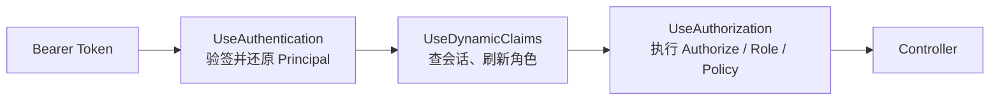

# DOTNET 鉴权系列- JWT 会话撤销与 Dynamic Claims（更严谨版）

前面聊 JWT 时，大家最喜欢它的一点就是“无状态”：服务端不用存会话，请求带上 Token，验签、验过期时间，能过就认。

但这套机制一旦进到真实业务，就会碰到一个很现实的问题：

> 用户上午 9 点登录，拿到一个 8 小时有效的 Access Token；10 点他主动退出，或者管理员要把他踢下线。旧 Token 还没过期，拿去请求接口，服务端凭什么拒绝它？

纯 JWT 的答案是：**拒绝不了。**

只要签名正确、`iss`/`aud` 正确、没有过期，JwtBearer 就会认为它有效。客户端把 Token 从本地删掉，只表示“这个浏览器不再使用它”，不代表别人复制走的 Token 也失效。

这篇结合 `Authentication_jwt_cookie/DynamicClaims` 的 Demo，聊一套“JWT + 可撤销会话 + 动态声明”的实现。先说结论：

> 给 JWT 加 `session_id`，并在每个请求查询服务端会话状态，可以实现主动下线和角色热更新；但这不再是严格意义上的无状态认证，而是在 JWT 验签后额外引入了一次状态校验。

这句话很重要。不要既想要“立刻踢人”，又宣称“服务端完全无状态”，两者不能同时成立。

---

## 1. JWT 验证的到底是什么

JWT 常被说成“登录凭证”，但更准确一点，它证明的是：

```text
这张 Token 由我签发；
它面向我的服务；
它还没有过期；
它里面的数据没有被篡改。
```

它**不天然证明**：

```text
这次登录是否仍被允许；
用户是否刚被禁用；
用户角色是否刚被收回；
这台设备是否已被踢下线。
```

例如 Token 里有：

```json
{
  "sub": "admin",
  "role": "Admin",
  "exp": 1710000000
}
```

管理员把该用户的角色从 `Admin` 改成普通用户，数据库已经变了，但旧 Token 里的 `role=Admin` 不会自动变化。JWT 是签发时的快照，不是数据库的实时视图。

所以“主动下线”和“动态角色”本质上是同一个问题：

> **Token 里的历史快照，怎样才能在下一次请求时服从服务端当前的权威状态？**

---

## 2. 常见方案：黑名单、版本号和会话白名单

先别急着写中间件，先把可选方案摆出来。

| 方案 | Token 中放什么 | 服务端保存什么 | 更适合什么场景 |
|---|---|---|---|
| `jti` 黑名单 | 每张 Token 一个 `jti` | 已作废 Token 的 `jti`，直到 Token 过期 | 偶尔撤销某一张 Token |
| Token Version / Security Stamp | 用户级版本号 | 用户当前版本号 | 改密码、禁用用户、全端下线 |
| `session_id` 白名单 | 一次登录一个会话 ID | 活跃会话记录 | 在线设备列表、踢指定设备、单设备登录 |

它们没有绝对的好坏。

### 2.1 jti 黑名单

签发 Token 时加入随机 `jti`；注销时把 `jti` 放进 Redis，过期时间和 Token 对齐；每个请求验签后再查它是否在黑名单。

优点是只记录“已经作废的少数 Token”。缺点也很明显：如果你需要展示“在线设备”、踢某一台设备、管理 Refresh Token 链路，黑名单很快会变得绕。

### 2.2 Token Version

用户表保存一个 `token_version` 或 `security_stamp`。JWT 内也带一份；每次请求比较两者，不一样就拒绝。

它适合“改密码后让所有旧登录失效”“账号禁用后全部下线”。但它是用户维度的，一般做不到精确踢掉某台设备而不影响其他设备。

### 2.3 session_id 白名单

每次登录创建一个随机 `session_id`，写到 JWT 中，同时在 Redis 或数据库中创建一条会话：

```text
JWT:      sub=admin, session_id=abc
服务器:   abc -> admin / 设备信息 / 创建时间 / 最后活动时间 / 到期时间
```

后续每次请求都检查 `session_id` 是否仍存在且有效。注销、踢设备就是删除或标记这条会话。

这个 Demo 选择的就是第三种，因为它天然支持：

- 用户查看自己的在线设备；
- 管理员踢掉某一台设备；
- 同账号新登录时撤销旧会话；
- Access Token 与 Refresh Token 都归属同一会话；
- 在同一请求管道里顺便刷新角色、部门、租户等动态 Claim。

---

## 3. 先接受代价：这会让 JWT 认证变成“半无状态”

原始 JWT 验证只依赖签名密钥和 Token 本身，理论上任意实例都能独立完成校验。

加入会话白名单以后，请求会变成：

```text
JWT 验签
  ↓
查询 session_id 是否有效
  ↓
接受或拒绝本次身份
```

第二步需要 Redis、数据库或其他共享状态。因此它牺牲了一部分无状态性，换来即时撤销能力。

这不是缺陷，而是明确的架构交换：

| 目标 | 代价 |
|---|---|
| Token 到期前可立即踢人 | 每个已认证请求多一次状态读取 |
| 在线设备管理 | 服务端要保存会话数据 |
| 多实例一致撤销 | 需要 Redis/数据库，不能只用本机内存 |
| 动态角色即时生效 | 角色权威源和缓存失效策略要可靠 |

如果系统只需要 10 分钟短 Access Token + Refresh Token，且不要求立即踢人，完全可以不走每请求查会话的路线。不要为了“看起来高级”给所有低风险接口额外加一次 Redis 访问。

---

## 4. Demo 的核心结构

Demo 把事情拆成了两类 Contributor：

```text
登录时：
  SessionClaimsPrincipalContributor
    → 给即将签发的 Principal 加 session_id
    → 保存服务端会话
    → 签发 JWT

每次请求：
  SessionDynamicClaimsContributor
    → 校验 session_id 是否仍有效
  IdentityDynamicClaimsContributor
    → 用权威源中的最新角色覆盖本次请求的 Role Claim
```

请求管道位置是：



`UseDynamicClaims` 必须在 `UseAuthentication()` 之后，否则没有已经认证的 `HttpContext.User` 可以处理；也必须在 `UseAuthorization()` 之前，否则角色已经拿旧 Claim 做完判断了，后面再刷新没有意义。

---

## 5. 登录：session_id 是怎样进入 JWT 的

登录期间先创建身份，再加上 `session_id`：

```csharp
public class SessionClaimsPrincipalContributor : IClaimsPrincipalContributor
{
    public Task ContributeAsync(ClaimsPrincipalContributorContext context)
    {
        var identity = context.ClaimsPrincipal.Identities.FirstOrDefault();
        if (identity is null)
            return Task.CompletedTask;

        if (identity.FindFirst(AppClaimTypes.SessionId) is null)
        {
            identity.AddClaim(new Claim(
                AppClaimTypes.SessionId,
                Guid.NewGuid().ToString("N")));
        }

        return Task.CompletedTask;
    }
}
```

随后把这条会话写入服务端权威源，再按当前 Principal 签发 JWT：

```csharp
var principal = await _principalFactory.CreateAsync(request.Username);
var sessionId = principal.FindFirst(AppClaimTypes.SessionId)!.Value;

_sessions.Save(sessionId, request.Username);
var (token, expiresUtc) = _tokenService.GenerateToken(principal);
```

这里有三个要求不要省：

1. `session_id` 必须不可预测。使用随机 GUID、随机字节都可以，不要用用户名、用户 ID、时间戳拼接。
2. 会话记录必须绑定用户 ID，生产上还应绑定设备信息、创建时间、最后活动时间、绝对到期时间。
3. 写会话和签 Token 最好以失败安全的顺序处理：会话未成功保存，不能把可用 Token 发出去。

Demo 的 `UserSessionStore` 使用 `ConcurrentDictionary` 只是为了演示。应用重启后它会清空，且多实例之间互相看不到对方会话，生产必须换 Redis 或数据库。

---

## 6. 每个请求：JWT 验签成功，不代表会话仍有效

JwtBearer 先完成密码学验证，得到 `HttpContext.User`。之后 `SessionDynamicClaimsContributor` 再从 Claim 中读取 `session_id`：

```csharp
public Task ContributeAsync(DynamicClaimsContributeContext context)
{
    var identity = context.Principal.Identities.FirstOrDefault();
    if (identity is null)
        return Task.CompletedTask;

    var sessionId = identity.FindFirst(AppClaimTypes.SessionId)?.Value;
    if (sessionId is null)
        return Task.CompletedTask;

    if (!_sessions.IsValid(sessionId))
    {
        context.Principal = new ClaimsPrincipal(new ClaimsIdentity());
    }

    return Task.CompletedTask;
}
```

会话不存在、已撤销或已过期时，把当前请求的 Principal 换成未认证 Principal。中间件随后同步更新 `HttpContext.User` 与认证结果：

```csharp
context.User = contributeContext.Principal;

if (context.User.Identity?.IsAuthenticated != true)
{
    feature.AuthenticateResult =
        AuthenticateResult.Fail("Session expired or revoked.");
}
```

后面的授权阶段看到用户未认证，对 `[Authorize]` 接口发起 Challenge，因此结果是 **401**。

这和“角色被移除”不同：

```text
会话撤销：当前请求不再是登录用户 → 401 Unauthorized
角色撤销：仍然是登录用户，但不再满足角色要求 → 403 Forbidden
```

状态码区分不能混。401 表示认证失败或不存在；403 表示认证已完成但授权不足。

---

## 7. Dynamic Claims：Token 不变，当前请求里的 Claim 可以变

JWT 一旦发出，字符串本身不会变。所谓 Dynamic Claims，不是修改客户端手中的 Token，而是：

1. JwtBearer 先从 Token 还原一份内存中的 `ClaimsPrincipal`；
2. 中间件查询当前权威数据；
3. 只修改这一次请求内存中的 Principal；
4. 后续授权和 Controller 使用修改后的结果。

Demo 的角色刷新逻辑是先删 Token 里的旧角色，再写入权威源里的新角色：

```csharp
var roles = _store.GetRoles(username);

RemoveAll(identity, ClaimTypes.Role);
RemoveAll(identity, "role");

foreach (var role in roles)
{
    identity.AddClaim(new Claim(ClaimTypes.Role, role));
}
```

因此一个 Token 即使签发时包含 `Admin`：

```text
Token 签发快照：Admin, User
数据库当前权威值：User
当前请求 Principal：User
```

请求 `[Authorize(Roles = "Admin")]` 时，角色判断使用的是最后一行的当前请求 Principal，于是返回 403。

这套机制适合角色、部门、租户、账号是否启用这类“当前值比历史快照更可信”的数据。但也不要把所有 Claim 都动态化：每请求查十几张表，性能和一致性都会变得不可控。通常只刷新真正会影响安全判断的数据，并通过缓存和版本号减少读取。

---

## 8. 注销、踢人和并发边界

注销的核心不是“让浏览器删 Token”，而是服务端撤销 `session_id`：

```csharp
[HttpPost("logout")]
public IActionResult Logout()
{
    var sessionId = User.FindFirst(AppClaimTypes.SessionId)?.Value;
    if (string.IsNullOrEmpty(sessionId))
        return BadRequest();

    _sessions.Revoke(sessionId);
    return Ok();
}
```

客户端仍然应该删除本地 Token，避免它继续被错误使用；但真正的安全保障是服务端会话已撤销。

还要认清“立即”的精确含义：

- 撤销完成**之后新开始**的请求，下次会话校验会失败；
- 已经通过会话校验、正在执行 Controller 的请求，通常不会被中途强行停止；
- 如果撤销和业务请求并发，谁先完成会话校验，谁就可能继续执行。

这是大多数会话系统的正常边界。对转账、删库这类强敏感操作，除了会话校验，还应在业务事务开始前做额外风控或重新认证，不能只依赖“用户刚刚点了退出”。

---

## 9. 原 Demo 中必须明确的安全边界

Demo 用了 `[AllowAnonymous]` 来方便演示：

```csharp
[AllowAnonymous]
[HttpPut("users/{username}/roles")]
public IActionResult SetRoles(...)

[AllowAnonymous]
[HttpPost("sessions/{sessionId}/revoke")]
public IActionResult RevokeSession(...)
```

这在教学 Demo 中能快速验证效果，但放到生产就是严重漏洞：任何匿名请求都能修改角色、踢掉任意会话、枚举用户会话。

生产至少要这样限制：

```text
修改角色：需要平台管理员权限，并记录审计日志
踢指定会话：需要本人拥有该会话，或具备会话管理权限
查看会话列表：只能看本人；管理员查看他人需单独授权
全端下线：需要本人重新认证，或管理员权限
```

另外还有几个不能省的细节：

### 9.1 会话到期与清理

Demo 的内存会话会持续存在到进程重启或人工撤销。即使 JWT 已经过期，它对应的会话仍可能留在字典里。

生产会话记录应至少有：

```text
SessionId
UserId
CreatedAt
LastAccessedAt
ExpiresAt
RevokedAt / RevokedReason
Device / Client / IP（按隐私策略决定）
```

并通过 TTL、Redis 过期或后台任务清理。通常会话的绝对过期时间不应晚于对应 Refresh Token 的最大有效期。

### 9.2 多实例一致性

只要有两个应用实例，内存字典就失效了：

```text
实例 A：保存了 session_id
实例 B：没有这条记录
负载均衡切到 B：用户被误判下线
```

所以需要 Redis 或共享数据库。若加缓存，也要设计撤销消息或短 TTL；否则管理员已经踢人，某个实例还在使用旧缓存，又会放行一小段时间。

### 9.3 失败时放行还是拒绝

Redis 暂时不可用时，要先做业务选择：

```text
Fail closed：查不到会话就拒绝请求，安全优先
Fail open：查不到会话先放行，可用性优先
```

涉及后台管理、资金、隐私数据时，通常更应该选择 Fail closed。无论选择哪一种，都应有监控、超时与降级策略，而不是把 Redis 异常当成“会话仍有效”。

### 9.4 多认证方案

当前 Demo 默认全部使用 Bearer，动态中间件修改 `HttpContext.User` 后，授权正常使用修改后的身份。

如果项目同时存在 Cookie、Bearer、API Key 等多种认证方案，并且某个 `[Authorize]` 显式指定方案，授权过程可能再次调用对应认证处理器。此时不要只依赖“先改 `HttpContext.User`”这一层来实现撤销，否则可能出现认证结果被重新覆盖的边界问题。

复杂项目更稳妥的选择是：

- 让会话校验成为对应认证方案的一部分；或
- 使用明确的授权 Requirement，在授权阶段再次校验会话；或
- 确保动态中间件同步更新框架使用的认证结果，并覆盖所有受保护端点。

选择哪一个取决于你的认证方案数量和现有框架，不存在所有项目都通用的一段中间件代码。

---

## 10. 和 Refresh Token 应该怎样配合

会话白名单最适合和 Refresh Token 一起设计。

推荐关系是：

```text
一条 Session
  ├─ 当前短期 Access Token（例如 10~30 分钟）
  └─ 一个或一组轮换 Refresh Token（例如 7~30 天）
```

撤销 Session 时：

```text
旧 Access Token：下一次请求查 session_id → 401
旧 Refresh Token：刷新时查 session_id → 拒绝换新 Token
```

这样不需要给每一张轮换后的 Access Token 单独记黑名单。会话是共同的“总开关”。

Refresh Token 本身应当随机、高熵、服务端只保存哈希，并采用轮换与重放检测。否则即使 Access Token 能撤销，攻击者偷走 Refresh Token 仍可能持续换取新 Token。

---

## 11. 完整流程再走一遍

以“管理员把某台设备踢下线”为例：

1. 用户登录，服务端生成随机 `session_id`。
2. 服务端保存会话记录，JWT 中写入 `sub`、`session_id` 和签发时的角色快照。
3. 用户请求业务接口，JwtBearer 验签成功。
4. Dynamic Claims 中间件读取 `session_id`，从 Redis/数据库查询会话是否有效。
5. 会话有效则刷新本请求所需的角色 Claim，再进入授权。
6. 管理员选择“踢此设备”，服务端撤销该 `session_id`。
7. 被踢设备下一次请求，JWT 的签名虽然仍正确，但会话校验失败；当前请求身份变为未认证，受保护接口返回 401。

角色热更新也是同一条链路：

```text
改角色权威数据
  ↓
下一请求刷新内存 Principal 的 Role Claim
  ↓
[Authorize(Roles = "Admin")] 重新按最新角色判断
  ↓
仍登录但无 Admin → 403
```

---

## 12. 总结

JWT 的“无状态”解决的是可扩展性和简单验证；会话撤销解决的是登录生命周期管理。两者不是互斥，但组合后必须承认：你为了可撤销性增加了服务端状态和每请求校验成本。

这套方案最核心的分工是：

```text
JWT：这张票是不是我签的，是否还没过期
Session：这次登录是否仍被允许
Dynamic Claims：当前请求使用的角色/部门/租户等是否仍是最新值
Authorization：在当前身份和当前声明下，是否允许访问目标资源
```

如果只需要短 Token 自然过期，不必急着做会话白名单；如果业务需要设备管理、管理员踢人、禁用立即生效、动态角色刷新，那么 `session_id + 共享会话存储 + 认证后授权前的动态刷新` 是一条很清晰的路。

最后别忘了，技术机制只能提供“撤销能力”，不能替代接口自身的授权。尤其是会话撤销、角色修改、查看他人设备列表这些接口，必须先做好管理员权限、资源归属校验和审计日志；Demo 里为了展示流程开的匿名入口，生产环境一个都不能照搬。
