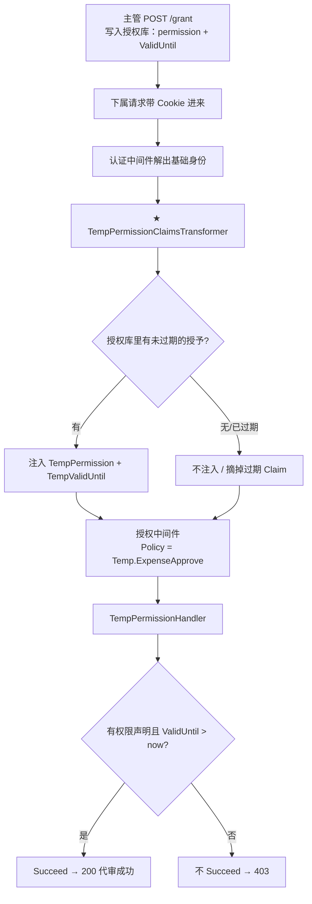
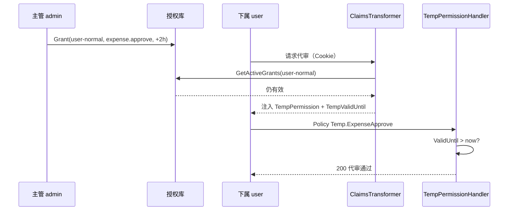

# DOTNET 鉴权系列- 临时权限授予（时效性令牌）

前面几篇的权限，不管是角色、策略编码还是声明转换补出来的权限点，有一个共同假设：**权限一旦给了，就一直有效**（直到改库、改角色、重新登录）。

可真实业务里经常不是这样——财务主管出差前，临时让下属代审报销单，**只开 2 小时**；客服值班时临时开工单处理权，下班自动收回。固定角色做不到「到点失效」；为每个临时场景单独改认证、发一套短时 Token，又太重。

这一篇要解决的就是：**在不大改认证流程的前提下，让权限带上时效。**

### 先说说痛点

财务系统里一个很常见的诉求：

> 主管把「代审报销」临时授给下属，有效期 2 小时。过期后下属再点审批，必须 403。

如果用固定角色硬扛：

- 给下属加个 `ExpenseApprover` 角色——**管不了时效**，忘了收回就一直能审；
- 做定时任务扫角色表删权限——能用，但和授权管道脱节，接口里还要自己判断「现在能不能审」；
- 直接发一个 2 小时过期的 JWT——可行，但等于**为临时场景改造整条认证链路**（签发、刷新、多 Token 并存），成本高。

标准角色 / Scope 表达的是「你有没有这个能力」，表达不了「**你暂时有、过了点就没有**」。于是每个临时场景都容易长出一套特殊逻辑。

> 一句话概括：**临时权限的本质不是新角色，而是「带失效时刻的权限声明」；用声明转换清洗过期 Claim，用自定义 Handler 做最后一道时效校验。**

### 适用场景

- **财务代审**：主管临时授权下属审批报销单 / 付款单（按小时计）。
- **值班授权**：客服、运维值班窗口内临时开通处理权限，下班自动失效。
- **应急提权**：线上故障时临时开生产操作权，TTL 极短，降低误操作窗口。
- **委托链接**：审批邮件里的「代办」链接附带短时权限，过期即废。

### 解决的核心问题

**标准角色 / Scope 无法表达「临时性权限」**，导致要么放弃时效控制，要么为每个临时场景单独改造认证与业务判断。

### 核心扩展点

- **声明转换**（`IClaimsTransformation`）：注入仍有效的临时 Claim，摘掉已过期的
- **自定义授权处理器**（`AuthorizationHandler<TempPermissionRequirement>`）：再校验 `TempValidUntil`，过期不 `Succeed`



### 集成思路

所有代码放在独立的 `TempPermissionAuthorization` 文件夹，自成一体。

#### 第一步：约定 Claim 与权限编码

临时权限用**成对 Claim** 表达，避免多条授权时「权限」和「时效」对不上号：

```C#
public static class TempClaimTypes
{
    public const string Permission = "TempPermission";   // 如 expense.approve
    public const string ValidUntil = "TempValidUntil";   // 如 expense.approve|2026-07-11T06:00:00.0000000Z
    public const string Enriched = "temp_permission_enriched"; // 幂等哨兵
}

public static class TempPermissionNames
{
    public const string ExpenseApprove = "expense.approve";
    public const string ExpenseApprovePolicy = "Temp.ExpenseApprove";
}
```

对应需求里「生成带时效性声明的 Token」的形态：

```C#
var claims = new List<Claim>
{
    new Claim("TempPermission", "expense.approve"),
    new Claim("TempValidUntil", "expense.approve|" + DateTime.UtcNow.AddHours(2).ToString("O"))
};
// var token = _tokenService.GenerateToken(claims);
```

本 Demo 用 Cookie 认证，不单独发 JWT；主管授权时把同样的信息写入**授权库**，由声明转换在每次请求时注入——效果等价，且过期 / 撤销后**下次请求立刻生效**，不必改登录流程。

#### 第二步：授权库（模拟 temp_permission_grants 表）

```C#
public class TempPermissionGrant
{
    public required string GranteeUserId { get; init; }
    public required string Permission { get; init; }
    public required DateTimeOffset ValidUntil { get; init; }
    public required string GrantedByUserId { get; init; }
    public bool IsActive => ValidUntil > DateTimeOffset.UtcNow;
}
```

`ITempPermissionStore` 提供 `GrantAsync` / `GetActiveGrantsAsync` / `RevokeAsync`。想给张三开 2 小时代审？往库里插一条带 `ValidUntil` 的记录即可。

#### 第三步：声明转换器（清洗过期 + 注入有效）

这是相对需求示例的增强版：示例里只删了过期的 `TempValidUntil`，这里把对应的 `TempPermission` **一并摘掉**，并从授权库注入仍有效的授予。

```C#
public class TempPermissionClaimsTransformer : IClaimsTransformation
{
    public async Task<ClaimsPrincipal> TransformAsync(ClaimsPrincipal principal)
    {
        // 1. 摘掉已过期的成对 Claim（Cookie 里残留的短时声明也会被清掉）
        // 2. 从授权库读取 IsActive 的授予，注入 TempPermission + TempValidUntil
        // 3. 打幂等哨兵，避免同一请求重复注入
    }
}
```

要点：

- **补出来的 Claim 只活在当前请求**，不写回 Cookie——库里一过期，下次请求转换器就不注入了。
- **必须做幂等保护**（和声明转换篇同一坑）。

> 和「声明转换」篇同时启用时：ASP.NET Core 默认只取最后一个 `IClaimsTransformation`。本模块用 `CompositeClaimsTransformation` 把两篇的转换器串起来，避免互相覆盖。

#### 第四步：Requirement + Handler（时效双保险）

```C#
public class TempPermissionRequirement : IAuthorizationRequirement
{
    public TempPermissionRequirement(string permission) => Permission = permission;
    public string Permission { get; }
}

public class TempPermissionHandler : AuthorizationHandler<TempPermissionRequirement>
{
    protected override Task HandleRequirementAsync(
        AuthorizationHandlerContext context,
        TempPermissionRequirement requirement)
    {
        // 有 TempPermission == requirement.Permission？
        // 且存在 TempValidUntil = "permission|ISO时间" 且时间 > UtcNow？
        // 是 → Succeed；否 → 不 Succeed（过期自动失效）
    }
}
```

为什么转换器清过一遍，Handler 还要再判？

1. 防止有人绕过转换器、直接把 Claim 塞进 Token；
2. 请求处理过程中若跨过失效点，Handler 仍能挡住；
3. 授权逻辑集中在 Handler，接口上只标策略名，业务代码零 `if (过期)`。

#### 第五步：注册到容器

```C#
builder.Services.AddTempPermissionAuthorization();
```

内部做了四件事：登记授权库、登记转换器（并 `Replace` 为 Composite）、登记 Handler、用原生 `AddPolicy` 挂上 `Temp.ExpenseApprove`。

**不替换** `IAuthorizationPolicyProvider`，与极简 PolicyCode / 仿 ABP / 资源授权等可同时启用。

### 在控制器里用起来

```C#
[ApiController]
[Route("api/temp-permission")]
[Authorize(AuthenticationSchemes = CookieAuthenticationDefaults.AuthenticationScheme)]
public class TempPermissionController : ControllerBase
{
    // 主管授权：写入授权库（等价于签发带 TempPermission + TempValidUntil 的时效令牌）
    [HttpPost("grant")]
    [Authorize(Roles = "Admin")]
    public async Task<IActionResult> Grant([FromBody] GrantTempPermissionRequest request) { ... }

    // 代审报销：必须持有未过期的 expense.approve
    [HttpPost("expenses/{id:int}/approve")]
    [Authorize(Policy = TempPermissionNames.ExpenseApprovePolicy)]
    public IActionResult ApproveExpense(int id) { ... }
}
```

控制器注释里写清了三件事：主管怎么授、转换器怎么注、Handler 怎么卡时效——对照代码看即可。

### 走一遍完整流程

1. `user` 登录，直接 `POST /api/temp-permission/expenses/1001/approve` → **403**（没有临时权限）。
2. `admin` 登录，`POST /api/temp-permission/grant`，给 `user-normal` 开 `expense.approve`，`durationMinutes: 120`。
3. 再切回 `user`，`GET /api/temp-permission/me` → 能看到转换器注入的 `TempPermission` / `TempValidUntil`。
4. `user` 再调代审接口 → **200**。
5. 等时效过期（或 Admin 调 `/revoke`）后再代审 → **403**。

快速演示过期时，grant 里把 `durationMinutes` 设成 `0.05`（约 3 秒）即可。



用 `.http` 实测：

```
### 1. admin 授权 2 小时
POST /api/temp-permission/grant
{ "granteeUserId": "user-normal", "permission": "expense.approve", "durationMinutes": 120 }

### 2. user 查看注入的临时声明
GET /api/temp-permission/me

### 3. user 代审报销单 → 200
POST /api/temp-permission/expenses/1001/approve

### 4. admin 撤销 / 或等过期后再代审 → 403
POST /api/temp-permission/revoke
{ "granteeUserId": "user-normal", "permission": "expense.approve" }
```

### 总结

临时权限抓住的是两个扩展点的组合：**声明转换**负责把「仍有效的时效声明」备进当前请求，**自定义 Handler**负责按 `TempValidUntil` 做最终裁决。权限从「有 / 没有」变成了「有，但只到某个时刻」。

| 文件 | 角色 | 一句话职责 |
| --- | --- | --- |
| `TempClaimTypes` / `TempPermissionNames` | 约定 | Claim 类型与权限 / 策略名常量 |
| `TempPermissionGrant` + Store | 数据源 | 主管授权记录（含 ValidUntil） |
| `TempPermissionClaimsTransformer` | 转换器 | 摘过期、注入未过期临时 Claim |
| `CompositeClaimsTransformation` | 串联 | 与声明转换篇共存，避免互相覆盖 |
| `TempPermissionRequirement` / `Handler` | 裁判 | 校验权限声明 + 时效，过期不 Succeed |
| `TempPermissionController` | 用法 | 授权 / 撤销 / 代审演示接口 |

适用边界：

- 适合「短时委托、值班提权、应急开口子」这类**有明确截止时间**的授权。
- 若权限本身长期有效、只是绑定到人，用前面的极简动态权限 / 仿 ABP 即可，不必上时效 Claim。
- 生产环境建议：授权库落库 + 审计；JWT 场景可把同样 Claim 打进短时 Token，转换器与 Handler 逻辑不用改。

最后仍是那句贯穿系列的话：**认证解决「你是谁」，声明转换解决「你此刻带着哪些凭证」，授权解决「凭这些凭证能不能干」**——临时权限只是在凭证上多盖了一个「有效期」章。
