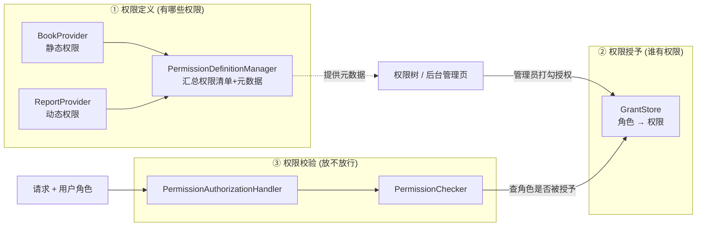
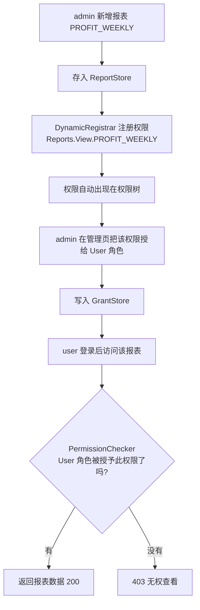

# DOTNET 鉴权系列- 动态权限（仿 ABP）

上一篇我们写了个「极简动态权限」，核心一句话——策略名就是权限编码，`userId` 直接查库。那套方案轻、快、代码少，但我也在结尾埋了个雷：它有天花板。这一篇就来把这个天花板捅破，聊聊一套更完整、更接近生产的动态权限框架，思路参考了 ABP。

先别急着上代码，我们得先想明白：上一篇那套到底缺了啥？为什么还要再搞一套更重的？

### 先说说痛点

上一篇的方案是「权限直接绑用户」——张三有哪些权限，库里 `user-permissions` 表一条条记着。这在小系统里没问题，但项目一旦正经起来，下面这几个场景它就扛不住了。

**痛点一：权限要按「角色」批量授权，不能一个个人去配。**

真实公司里，权限从来不是配到人头上的，而是配到「岗位/角色」上的。比如「财务」这个角色能看报表、能导出，「客服」只能查订单。来了个新财务，运营只要把他拉进「财务」角色，权限就全有了，根本不会去一条条给他勾权限。

上一篇那套 `userId → 权限` 的模型，来一个新人就得把一整套权限复制一遍，人一多就是灾难。我们需要的是 `角色 → 权限`，人只管挂角色。

**痛点二：得有个「权限管理页面」，让管理员自己勾。**

产品经理最爱说的一句话：「这个能不能做成后台可配的？」。意思就是要一个权限管理页，左边一棵权限树（按模块分组，图书管理下面挂着增删改查），右边选角色，管理员打勾就完成授权，不用找开发。

问题来了：原生 `[Authorize(Policy = "Books.Create")]` 里的 `"Books.Create"` 只是个**光秃秃的字符串**，它没有「显示名」，不知道属于哪个「分组」。你没法拿它去渲染一棵给人看的权限树。我们需要给权限配上**元数据**——它叫什么、归哪个组、是不是动态的。

**痛点三：有些权限编译期根本不知道，得运行时长出来。**

这个最要命。比如系统里有个「报表」功能，报表本身是运营在后台一张张配出来的。今天配了个「销售日报」，明天配个「库存月报」。而每张报表都要能单独控制「谁能看」——也就是说，每新增一张报表，系统里就得多出一个「查看销售日报」的权限。

这种权限，你写代码的时候压根不知道会有哪些，`Program` 里更没法提前 `AddPolicy`。它必须能**在运行时动态注册**。

这三个痛点，上一篇的极简方案一个都解决不了。而 ABP 那套权限体系，恰好就是冲着这三件事设计的。下面我们就一块块把它拼出来。

### 核心思路

ABP 这套东西组件不少，第一次看容易懵。但你只要抓住一条主线就不会乱——**它把「权限」这件事拆成了三段各管各的**：

1. **权限定义（有哪些权限）**：系统里一共存在哪些权限？它们叫什么、归哪个组？这是一份「权限说明书」，是元数据，和「谁有权限」无关。
2. **权限授予（谁有权限）**：哪个角色被授予了哪些权限？这是 `角色 → 权限` 的关系数据，存在库里，运营随时能改。
3. **权限校验（这次请求放不放行）**：请求进来，拿到用户的角色，去授予关系里查一下有没有这个权限，有就放行。

把这三段和上面三个痛点对一下号，你会发现严丝合缝：

- 「权限定义」带上显示名和分组 → 解决痛点二的权限树
- 「权限授予」是 `角色 → 权限` → 解决痛点一的角色批量授权
- 「权限定义」支持运行时追加 → 解决痛点三的动态权限

想清楚这条主线，剩下的就是把每一段用代码实现出来。三段的分工和数据流向如下图：



对照这张图记：上半区是「系统有哪些权限」（定义），中间是「谁被授予了权限」（授予），右侧是「这次请求放不放行」（校验）。下面按这个顺序逐段实现。

### 集成思路

#### 第一步：给权限定义「数据结构」

既然权限要有元数据（名字、显示名、分组），那第一件事就是把这些结构定义出来。三个类，很简单。

单个权限项，注意那个 `IsDynamic`，用来标记「这是运行时长出来的动态权限」（比如报表权限），后面有用：

```C#
public class PermissionDefinition
{
    public PermissionDefinition(string name, string displayName, string groupName)
    {
        Name = name;
        DisplayName = displayName;
        GroupName = groupName;
    }

    public string Name { get; }          // 权限名，如 Books.Create
    public string DisplayName { get; }   // 显示名，如 "创建图书"，给人看的
    public string GroupName { get; }     // 分组名，如 Books，用于权限树

    /// <summary>是否运行时动态注册（如新增报表后自动生成的 View 权限）。</summary>
    public bool IsDynamic { get; init; }
}
```

权限分组，一个组下面挂一堆权限，权限树的一级节点就是它：

```C#
public class PermissionGroupDefinition
{
    public PermissionGroupDefinition(string name, string displayName)
    {
        Name = name;
        DisplayName = displayName;
    }

    public string Name { get; }
    public string DisplayName { get; }
    public List<PermissionDefinition> Permissions { get; } = [];

    public PermissionDefinition AddPermission(string name, string displayName)
    {
        var permission = new PermissionDefinition(name, displayName, Name);
        Permissions.Add(permission);
        return permission;
    }
}
```

还有一个「上下文」，纯粹是给各个 Provider 声明权限时提供的一块「画板」，大家往这块画板上加分组、加权限：

```C#
public class PermissionDefinitionContext
{
    private readonly Dictionary<string, PermissionGroupDefinition> _groups = new(StringComparer.OrdinalIgnoreCase);

    public IReadOnlyCollection<PermissionGroupDefinition> Groups => _groups.Values;

    public PermissionGroupDefinition AddGroup(string name, string displayName)
    {
        if (_groups.TryGetValue(name, out var existing))
        {
            return existing;
        }

        var group = new PermissionGroupDefinition(name, displayName);
        _groups[name] = group;
        return group;
    }

    public IEnumerable<PermissionDefinition> GetAllPermissions()
        => _groups.Values.SelectMany(g => g.Permissions);
}
```

顺手把权限名抽成常量，别到处写字符串。这里 `Reports.GetViewPermission` 这个方法要留意，它能根据报表 Code 拼出动态权限名，痛点三就靠它：

```C#
public static class PermissionNames
{
    public static class Books
    {
        public const string Group = "Books";
        public const string Default = Group;              // 查看
        public const string Create = Group + ".Create";
        public const string Update = Group + ".Update";
        public const string Delete = Group + ".Delete";
    }

    public static class Reports
    {
        public const string Group = "Reports";
        public const string ManagementGroup = Group + ".Management";
        public const string Create = ManagementGroup + ".Create";
        public const string Delete = ManagementGroup + ".Delete";
        public const string ViewPrefix = Group + ".View.";

        /// <summary>根据报表 Code 生成动态查看权限名，如 Reports.View.SALES_DAILY。</summary>
        public static string GetViewPermission(string reportCode) => ViewPrefix + reportCode;
    }
}
```

#### 第二步：写 Provider 声明「有哪些权限」

结构有了，接下来得有人往画板上画。这个「画权限」的角色就是 `IPermissionDefinitionProvider`。每个业务模块写一个 Provider，声明自己那块有哪些权限。这和 ABP 里每个模块一个 `PermissionDefinitionProvider` 是一个套路。

先定义接口和抽象基类：

```C#
public interface IPermissionDefinitionProvider
{
    void Define(PermissionDefinitionContext context);
}

public abstract class PermissionDefinitionProvider : IPermissionDefinitionProvider
{
    public abstract void Define(PermissionDefinitionContext context);
}
```

图书模块的权限是**静态**的，编译期就定死了，直接写：

```C#
public class BookPermissionDefinitionProvider : PermissionDefinitionProvider
{
    public override void Define(PermissionDefinitionContext context)
    {
        var group = context.AddGroup(PermissionNames.Books.Group, "图书管理");

        group.AddPermission(PermissionNames.Books.Default, "查看图书");
        group.AddPermission(PermissionNames.Books.Create, "创建图书");
        group.AddPermission(PermissionNames.Books.Update, "编辑图书");
        group.AddPermission(PermissionNames.Books.Delete, "删除图书");
    }
}
```

报表模块就体现出「动态」了——它启动时从报表存储里把已有的报表**捞出来**，给每张报表现场生成一个「查看权限」。库里有几张报表，就长出几个权限：

```C#
public class ReportPermissionDefinitionProvider : PermissionDefinitionProvider
{
    private readonly IReportStore _reportStore;

    public ReportPermissionDefinitionProvider(IReportStore reportStore)
    {
        _reportStore = reportStore;
    }

    public override void Define(PermissionDefinitionContext context)
    {
        // 报表管理本身的权限（增删报表配置）
        var management = context.AddGroup(PermissionNames.Reports.ManagementGroup, "报表管理");
        management.AddPermission(PermissionNames.Reports.Create, "新增报表配置");
        management.AddPermission(PermissionNames.Reports.Delete, "删除报表配置");

        // 关键：每张报表动态生成一个"查看"权限
        var views = context.AddGroup(PermissionNames.Reports.Group + ".Views", "报表查看");
        var reports = _reportStore.GetAllAsync().GetAwaiter().GetResult();
        foreach (var report in reports)
        {
            views.AddPermission(
                PermissionNames.Reports.GetViewPermission(report.Code),
                $"查看报表：{report.Name}");
        }
    }
}
```

#### 第三步：Manager 把所有权限汇总起来

Provider 分散在各个模块，得有个人在启动时把它们都叫过来，让每个 Provider 往同一块画板上画，最后汇总成一份完整的「全系统权限清单」。这个人就是 `PermissionDefinitionManager`。

它还额外提供了一个 `AddDynamic`，允许**运行时往清单里追加**权限——这是痛点三的另一半（第一半是启动时加载，这一半是运行时新增报表时追加）。

```C#
public class PermissionDefinitionManager : IPermissionDefinitionManager
{
    private readonly Dictionary<string, PermissionDefinition> _permissions = new(StringComparer.OrdinalIgnoreCase);
    private readonly object _lock = new();

    // 构造时注入所有 Provider，挨个 Define，汇总权限
    public PermissionDefinitionManager(IEnumerable<IPermissionDefinitionProvider> providers)
    {
        var context = new PermissionDefinitionContext();
        foreach (var provider in providers)
        {
            provider.Define(context);
        }

        foreach (var permission in context.GetAllPermissions())
        {
            _permissions[permission.Name] = permission;
        }
    }

    public IReadOnlyList<PermissionDefinition> GetAll()
    {
        lock (_lock) { return _permissions.Values.ToList(); }
    }

    public bool Exists(string permissionName)
    {
        lock (_lock) { return _permissions.ContainsKey(permissionName); }
    }

    // 运行时追加动态权限（如新增报表后）
    public void AddDynamic(PermissionDefinition permission)
    {
        lock (_lock)
        {
            var dynamicPermission = new PermissionDefinition(
                permission.Name, permission.DisplayName, permission.GroupName)
            {
                IsDynamic = true
            };
            _permissions[dynamicPermission.Name] = dynamicPermission;
        }
    }
}
```

到这里，「有哪些权限」这段就齐了。注意 Manager 里存的**只是权限的定义（元数据）**，跟「谁有这个权限」半毛钱关系没有。这一点一定要分清楚，很多人一开始就是把「权限定义」和「权限授予」搅在一起才越写越乱。

#### 第四步：GrantStore 存「谁有权限」

接下来是第二段——授予关系。`角色 → 权限名` 的对应关系存在这，对应 ABP 里的 `AbpPermissionGrants` 表。真实项目就是一张数据库表，这里用内存的 `HashSet` 模拟。

```C#
public class InMemoryPermissionGrantStore : IPermissionGrantStore
{
    private readonly HashSet<(string Role, string Permission)> _grants = new();

    public InMemoryPermissionGrantStore() => Seed();

    public Task<IReadOnlyList<string>> GetGrantedPermissionsAsync(string roleName)
    {
        var permissions = _grants
            .Where(x => x.Role.Equals(roleName, StringComparison.OrdinalIgnoreCase))
            .Select(x => x.Permission)
            .ToList();
        return Task.FromResult<IReadOnlyList<string>>(permissions);
    }

    public Task GrantAsync(string roleName, string permissionName)   // 授权（后台勾选）
    {
        _grants.Add((roleName, permissionName));
        return Task.CompletedTask;
    }

    public Task RevokeAsync(string roleName, string permissionName)  // 取消授权
    {
        _grants.Remove((roleName, permissionName));
        return Task.CompletedTask;
    }

    // 初始化：Admin 权限全开，User 只能看图书 + 销售日报
    private void Seed()
    {
        foreach (var permission in new[]
                 {
                     PermissionNames.Books.Default, PermissionNames.Books.Create,
                     PermissionNames.Books.Update, PermissionNames.Books.Delete,
                     PermissionNames.Reports.Create, PermissionNames.Reports.Delete,
                     PermissionNames.Reports.GetViewPermission("SALES_DAILY"),
                     PermissionNames.Reports.GetViewPermission("STOCK_MONTHLY")
                 })
        {
            _grants.Add(("Admin", permission));
        }

        _grants.Add(("User", PermissionNames.Books.Default));
        _grants.Add(("User", PermissionNames.Reports.GetViewPermission("SALES_DAILY")));
    }
}
```

`GrantAsync` / `RevokeAsync` 这两个方法，就是后台权限管理页「打勾/取消勾」背后调的东西。运营在页面上一勾，这里插一条数据，权限立刻生效，全程不碰代码。痛点一，解决。

#### 第五步：PermissionChecker 校验

第三段——校验。逻辑很直白：从用户的 `Claims` 里把角色都掏出来（一个人可能有多个角色），挨个去 GrantStore 里查，只要有一个角色被授予了这个权限，就算过。

```C#
public class PermissionChecker : IPermissionChecker
{
    private readonly IPermissionGrantStore _grantStore;

    public PermissionChecker(IPermissionGrantStore grantStore)
    {
        _grantStore = grantStore;
    }

    public async Task<bool> IsGrantedAsync(ClaimsPrincipal user, string permissionName)
    {
        if (user.Identity?.IsAuthenticated != true)
        {
            return false;
        }

        // 取用户所有角色（认证阶段写进 Claim 的）
        var roles = user.FindAll(ClaimTypes.Role).Select(c => c.Value)
                        .Distinct(StringComparer.OrdinalIgnoreCase);

        // 任一角色拥有该权限即放行
        foreach (var role in roles)
        {
            var granted = await _grantStore.GetGrantedPermissionsAsync(role);
            if (granted.Any(p => p.Equals(permissionName, StringComparison.OrdinalIgnoreCase)))
            {
                return true;
            }
        }

        return false;
    }
}
```

这里的 `user.FindAll(ClaimTypes.Role)`，取的还是上一篇认证阶段登录时写进 Cookie 的角色 Claim。又一次印证：认证负责把身份塞进去，授权负责取出来判断。

#### 第六步：接入 .NET 的授权管道

前面五步是我们自己的一套「权限内核」，现在得把它**焊接**到 .NET 的授权机制上，让 `[Authorize]` 能用起来。这部分和上一篇 PolicyCode 完全同构，我快速过一下。

一个 `Requirement`（诉求单，携带权限名）：

```C#
public class PermissionAuthorizationRequirement : IAuthorizationRequirement
{
    public PermissionAuthorizationRequirement(string permissionName)
    {
        PermissionName = permissionName;
    }

    public string PermissionName { get; }
}
```

一个 `Handler`（裁判，转手交给 `PermissionChecker`）。注意这是**唯一**一个 Handler，全系统所有权限校验都走它，不需要为每个权限写一个：

```C#
public class PermissionAuthorizationHandler : AuthorizationHandler<PermissionAuthorizationRequirement>
{
    private readonly IPermissionChecker _permissionChecker;

    public PermissionAuthorizationHandler(IPermissionChecker permissionChecker)
    {
        _permissionChecker = permissionChecker;
    }

    protected override async Task HandleRequirementAsync(
        AuthorizationHandlerContext context,
        PermissionAuthorizationRequirement requirement)
    {
        if (await _permissionChecker.IsGrantedAsync(context.User, requirement.PermissionName))
        {
            context.Succeed(requirement);
        }
    }
}
```

一个语法糖特性，让接口上写起来更顺眼：

```C#
[AttributeUsage(AttributeTargets.Class | AttributeTargets.Method, AllowMultiple = true)]
public class RequirePermissionAttribute : AuthorizeAttribute
{
    public RequirePermissionAttribute(string permissionName)
    {
        Policy = permissionName;
    }
}
```

最后是那个「动态 PolicyProvider」——它是让「策略不用提前 `AddPolicy`」的关键，上一篇已经详细拆过，这里只看它在本篇的角色：**任何没被 `AddPolicy` 注册的策略名，都会被它兜住，现场造一个挂着 `PermissionAuthorizationRequirement` 的策略**。它只服务本篇的仿 ABP 方案，是自包含的，不引用上一篇 PolicyCode 的任何类型。

```C#
namespace Authorization_Extend.Permissions.Authorization;

public class PermissionPolicyProvider : IAuthorizationPolicyProvider
{
    private readonly DefaultAuthorizationPolicyProvider _fallback;

    public PermissionPolicyProvider(IOptions<AuthorizationOptions> options)
        => _fallback = new DefaultAuthorizationPolicyProvider(options);

    public async Task<AuthorizationPolicy?> GetPolicyAsync(string policyName)
    {
        // 1. Program 里 AddPolicy 注册过的，优先用原生的
        var registered = await _fallback.GetPolicyAsync(policyName);
        if (registered is not null)
        {
            return registered;
        }

        // 2. 其余没注册的策略名 → 统一走本篇的 ABP 风格角色授权
        return new AuthorizationPolicyBuilder()
            .AddRequirements(new PermissionAuthorizationRequirement(policyName))
            .Build();
    }

    public Task<AuthorizationPolicy> GetDefaultPolicyAsync() => _fallback.GetDefaultPolicyAsync();
    public Task<AuthorizationPolicy?> GetFallbackPolicyAsync() => _fallback.GetFallbackPolicyAsync();
}
```

> ⚠️ 注意：`IAuthorizationPolicyProvider` 在容器里全局只有一个，本篇用 `Replace` 换成了 `PermissionPolicyProvider`。上一篇的极简方案（PolicyCode）同样会 `Replace` 一个自己的 `PolicyCodePolicyProvider`，两者互相覆盖、**后注册的生效**。所以这两套动态权限是互斥的，同一项目里演示时只启用其中一套（在 `Program` 里二选一），各自的代码也分别独立在 `Permissions` 和 `PolicyCodeAuthorization` 两个文件夹里，互不引用。

#### 第七步：注册容器

组件多，但注册起来一目了然，按「定义、授予、校验、集成」分层看：

```C#
public static IServiceCollection AddDynamicPermissions(this IServiceCollection services)
{
    services.AddSingleton<IReportStore, InMemoryReportStore>();
    services.AddSingleton<IPermissionGrantStore, InMemoryPermissionGrantStore>();

    // 权限定义：两个 Provider + 一个 Manager
    services.AddSingleton<IPermissionDefinitionProvider, BookPermissionDefinitionProvider>();
    services.AddSingleton<IPermissionDefinitionProvider, ReportPermissionDefinitionProvider>();
    services.AddSingleton<IPermissionDefinitionManager, PermissionDefinitionManager>();

    // 权限校验 + 动态注册
    services.AddScoped<IPermissionChecker, PermissionChecker>();
    services.AddSingleton<IDynamicPermissionRegistrar, DynamicPermissionRegistrar>();

    // 接入授权管道：唯一 Handler + 替换默认 PolicyProvider
    services.AddSingleton<IAuthorizationHandler, PermissionAuthorizationHandler>();
    services.Replace(ServiceDescriptor.Singleton<IAuthorizationPolicyProvider, PermissionPolicyProvider>());

    return services;
}
```

注意注册了**两个** `IPermissionDefinitionProvider`，Manager 构造时会用 `IEnumerable<IPermissionDefinitionProvider>` 一次性全拿到，挨个 `Define`。以后新增一个业务模块，就多注册一个 Provider，其他啥都不用动，扩展性就体现在这。

### 实战场景一：给角色批量授权（权限树 + 打勾）

框架搭好了，先看痛点一、痛点二怎么落地——权限管理页。

后台需要两个能力：一是把系统所有权限**按分组**吐出来给前端渲染成树；二是给某个角色**授予**某个权限。看 `PermissionAdminController`：

```C#
// 权限树：把 Manager 里的权限按 GroupName 分组返回，前端拿去渲染
[HttpGet("tree")]
[RequirePermission(PermissionNames.Reports.Create)]
public IActionResult GetPermissionTree()
{
    var tree = _definitionManager.GetAll()
        .GroupBy(p => p.GroupName)
        .Select(g => new
        {
            group = g.Key,
            permissions = g.Select(p => new { p.Name, p.DisplayName, p.IsDynamic })
        });

    return Ok(tree);
}

// 授权：给角色勾一个权限。先校验权限确实存在，再写入 GrantStore
[HttpPost("roles/{roleName}/grant")]
[RequirePermission(PermissionNames.Reports.Create)]
public async Task<IActionResult> Grant(string roleName, [FromBody] GrantPermissionRequest request)
{
    if (!_definitionManager.Exists(request.PermissionName))
    {
        return BadRequest(new { message = $"权限 {request.PermissionName} 未定义" });
    }

    await _grantStore.GrantAsync(roleName, request.PermissionName);
    return Ok(new { message = $"已授予 {roleName} → {request.PermissionName}" });
}
```

看到没，权限树能出来，全靠第一步给权限配了 `DisplayName` 和 `GroupName` 这些元数据。要是像原生那样只有个字符串策略名，这棵树根本渲染不出来。授权时还先用 `Exists` 校验一把，防止把不存在的权限授出去。

这就是完整的「后台可配」——运营点点鼠标就完成授权，权限即时生效。

### 实战场景二：动态权限（新增报表自动长出权限）

再看最硬核的痛点三。流程是这样的：管理员新增一张报表 → 系统自动为它注册一个「查看权限」→ 管理员在权限树里就能看到这个新权限 → 授给对应角色 → 有权限的人就能看这张报表了。

先看新增报表的接口，关键是新增报表后紧接着调 `RegisterReportPermission`：

```C#
[HttpPost("configs")]
[RequirePermission(PermissionNames.Reports.Create)]
public async Task<IActionResult> CreateReport([FromBody] CreateReportRequest request)
{
    var report = new ReportRecord { Code = request.Code, Name = request.Name };

    await _reportStore.AddAsync(report);                        // 存报表
    _dynamicPermissionRegistrar.RegisterReportPermission(report); // 顺手注册动态权限

    return Ok(new
    {
        message = "报表已创建，动态权限已注册",
        permission = PermissionNames.Reports.GetViewPermission(report.Code),
        hint = "请在权限管理接口中把该权限授予角色"
    });
}
```

那个 `DynamicPermissionRegistrar` 干的事，就是把新报表对应的权限**追加进 Manager 的清单**（调用第三步那个 `AddDynamic`），并打上 `IsDynamic = true` 的标记：

```C#
public void RegisterReportPermission(ReportRecord report)
{
    var permissionName = PermissionNames.Reports.GetViewPermission(report.Code);
    if (_definitionManager.Exists(permissionName))
    {
        return; // 已存在就别重复加
    }

    _definitionManager.AddDynamic(new PermissionDefinition(
        permissionName,
        $"查看报表：{report.Name}",
        PermissionNames.Reports.Group + ".Views")
    {
        IsDynamic = true
    });
}
```

追加进去之后，这个新权限马上就会出现在第一步那棵权限树里，管理员就能授权了。

那访问报表数据时怎么校验呢？权限名是运行时按报表 Code 拼出来的，没法写成固定的特性，所以这里**手动调** `IPermissionChecker`：

```C#
[HttpGet("{reportCode}/data")]
public async Task<IActionResult> GetReportData(string reportCode)
{
    var report = await _reportStore.FindAsync(reportCode);
    if (report is null)
    {
        return NotFound(new { message = $"报表 {reportCode} 不存在" });
    }

    // 运行时拼权限名：Reports.View.{reportCode}
    var permissionName = PermissionNames.Reports.GetViewPermission(reportCode);
    if (!await _permissionChecker.IsGrantedAsync(User, permissionName))
    {
        return StatusCode(StatusCodes.Status403Forbidden, new
        {
            message = "无权查看该报表",
            requiredPermission = permissionName
        });
    }

    return Ok(new { report.Code, report.Name, data = new[] { new { column = "示例列", value = 100 } } });
}
```

这里体现了一个重要的用法：`IPermissionChecker` 既能被特性（Handler）用，也能被你在代码里**直接调**。碰到权限名要动态拼、或者要在业务逻辑中间做判断的场景，手动调 `IsGrantedAsync` 就对了。而图书那种权限名固定的接口，直接标 `[RequirePermission(...)]` 特性最省事。

### 走一遍完整流程

拿「新增报表 → 授权 → 访问」串一遍，体会下动态的味道（预置数据里 `admin` 是 Admin 角色权限全开，`user` 是 User 角色权限少）：



对着图走一遍文字版：

1. **admin 登录**，认证阶段往 Cookie 写入 `Role = Admin`。
2. **admin 新增一张报表** `PROFIT_WEEKLY`（利润周报）。系统存报表 + 自动注册权限 `Reports.View.PROFIT_WEEKLY`，此时权限树里就多了这一项，但还没人被授予。
3. **admin 打开权限树**，看到新权限 `Reports.View.PROFIT_WEEKLY`（显示名"查看报表：利润周报"）。
4. **admin 把这个权限授给 User 角色**（往 GrantStore 插一条 `User → Reports.View.PROFIT_WEEKLY`）。
5. **user 登录**（Role = User），访问 `GET /api/reports/PROFIT_WEEKLY/data`。
6. `PermissionChecker` 取出 user 的角色 `User`，查 GrantStore，发现 `User` 确实被授予了 `Reports.View.PROFIT_WEEKLY`，放行，报表数据正常返回。

整个过程里，「利润周报」这个权限从无到有、到授权、到生效，**一行代码没改，一次都没重新部署**。这就是动态权限真正的价值。

配合 `.http` 实测：

```
### 1. admin 登录（Role=Admin，全开）
POST /Auth/login    { "username": "admin", "password": "123456" }

### 2. 查图书：User 也能看（预置授权了 Books 查看）
GET /api/books

### 3. 建图书：仅 Admin（User 调会 403）
POST /api/books     { "title": "新书名" }

### 4. 看销售日报：User 能看；看库存月报：User 会 403（没授权）
GET /api/reports/SALES_DAILY/data
GET /api/reports/STOCK_MONTHLY/data

### 5. 权限树：看到全系统权限（含动态报表权限）
GET /api/permission-admin/tree
```

### 和上一篇 PolicyCode 怎么选

两套都写完了，到底啥时候用哪个？一句话：**看你要不要"权限管理"这套上层建筑**。

| 对比项 | 极简 PolicyCode（上一篇） | 动态权限 ABP 风格（本篇） |
| --- | --- | --- |
| 授权模型 | userId → 权限（绑到人） | Role → 权限（绑到角色） |
| 权限有没有元数据 | 没有，就是个编码字符串 | 有（显示名、分组、是否动态） |
| 能不能渲染权限树 | 不能 | 能 |
| 角色批量授权 | 不支持 | 支持（后台勾选） |
| 动态权限（运行时长出来） | 不支持 | 支持（如报表权限） |
| 核心类数量 | 3 个 + 1 个查库服务 | 10 来个，分定义/授予/校验三层 |
| 适合场景 | 小系统、权限直接绑人、无管理页 | 中大型、要权限管理页、权限会增长 |

说白了：

- 权限就那么几个、直接绑到人、也不需要什么管理页面，用**上一篇**，别给自己找麻烦。
- 要做后台权限管理、要按角色授权、权限还会随业务动态增长（报表、菜单、租户……），那就得上**本篇**这套，前期多写点代码，后期运营自助配置，开发彻底解放。

### 总结

回头看这一整套，其实没什么魔法，就是把「权限」这件事拆成了三段各司其职：

- **定义**（`PermissionDefinition` + `Provider` + `Manager`）：系统里有哪些权限，带元数据，支持静态声明和运行时动态追加。
- **授予**（`GrantStore`）：角色被授予了哪些权限，存库里，运营随时改。
- **校验**（`PermissionChecker` + `Handler` + `PolicyProvider`）：请求进来，用户角色 → 查授予 → 放不放行，全系统一个 Handler 搞定。

这三段拆干净了，扩展起来就很舒服：加个业务模块就多写个 `Provider`；权限归属的调整全在后台点鼠标；权限会动态增长的场景（报表就是典型）也接得住。它比上一篇重不少，但换来的是一套真正「后台可配、能自我生长」的权限体系。

最后照例强调那句贯穿整个系列的话：**认证和授权是两码事**。这一整套花活，全都建立在上一篇认证已经把用户身份和角色写进 Claim 的基础上。认证解决「你是谁」，授权解决「你能干嘛」——先把人认出来，才谈得上判断他能干什么。
