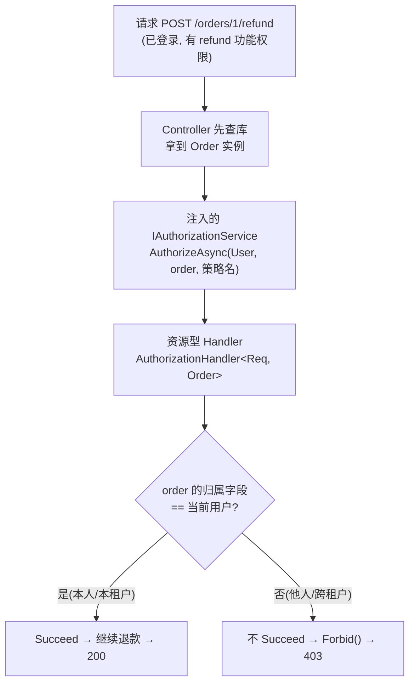
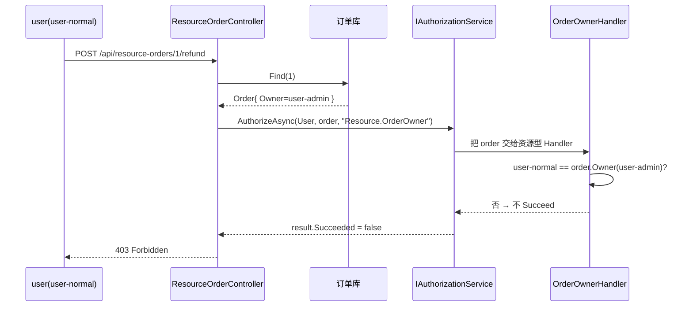

# DOTNET 鉴权系列- 基于资源的动态授权

前面几篇我们把「功能权限」聊透了：不管是原生 `AddPolicy`、极简 PolicyCode，还是仿 ABP 的动态权限，回答的都是同一个问题——**你能不能干这件事**。张三能不能删用户、李四能不能退款，判断依据是这个人**有没有这个权限编码/角色**，和具体操作的是哪一条数据没有半毛钱关系。

这一篇要补上最容易被忽略、又最容易出安全事故的一环：**你能不能干这件事，落到「这一条」数据上，还成立吗？**

### 先说说痛点

设想一个再常见不过的场景：订单系统，运营给客服开了 `orders.refund`（退款）权限。功能权限校验妥妥地过了——客服确实能退款。可问题是：

- 客服 A 拿着退款接口，把**客户 B 的订单**给退了。
- SaaS 平台里，A 门店的店员登录后，调接口退了**B 门店的订单**。

功能权限一点没错，A 确实「有退款权限」。但他退的是**不属于他的那一条订单**。这就是典型的**越权漏洞（Broken Object Level Authorization）**，常年稳居 OWASP API 安全风险榜首。

根子在于：功能权限是「粗粒度」的，它只管「能不能退款」这个动作，管不到「能不能退**这张**订单」。要堵住这个洞，就得引入**基于资源的授权**——校验时不光看用户有什么权限，还要把**具体的资源对象**拿出来，比一比这条数据到底归不归他管。

> 一句话概括：**功能权限回答「能不能退款」，资源权限回答「能不能退『这张』订单」。**

### 适用场景

- **多租户系统**：用户只能操作所属租户的数据（如 SaaS 平台中门店员工仅能管理本门店订单）。
- **数据所有权控制**：用户仅能操作自己创建的内容（如内容平台中作者只能编辑自己的文章）。

### 解决的核心问题

**避免「功能权限有，资源权限无」的越权漏洞**（如用户有 `orders.refund` 权限，却能退他人订单）。

### 核心思路

.NET 的授权系统其实早就为这种场景留好了口子。回忆一下前几篇的 `Requirement + Handler` 套路，`Handler` 有一个我们一直没用到的泛型重载：

```C#
// 普通 Handler：只拿到 Requirement
AuthorizationHandler<TRequirement>

// 资源型 Handler：还能额外拿到「资源对象」！
AuthorizationHandler<TRequirement, TResource>
```

第二个泛型参数 `TResource` 就是钥匙。只要 Handler 声明成 `AuthorizationHandler<OrderOwnerRequirement, Order>`，框架就会把你**手动传进来的那个 `Order` 实例**送到 Handler 手里，你就能拿订单的归属字段和当前用户比对了。

那这个资源对象怎么「传进去」？靠的是主动调用 `IAuthorizationService.AuthorizeAsync`：

```C#
var result = await _authorizationService.AuthorizeAsync(
    User,      // 当前登录用户（Claims 在这）
    order,     // ★ 具体资源对象——这就是「基于资源」的精髓
    "OrderOwnerPolicy");

if (!result.Succeeded) return Forbid();
```

和前几篇 `[Authorize(Policy = "...")]` 那种**声明式、进方法前自动拦截**不同，资源授权几乎都是**命令式**的——因为「哪条资源」这个信息，往往要先查库拿到实体才知道，没法在进方法前就判断。所以标准姿势是：**先把资源查出来，再拿着资源去问授权系统**。

整套流程如下图：



下面把它落成代码。为了同时演示开头两个场景，我们做两条策略：**数据所有权**（只能退自己的订单）和**多租户隔离**（只能看本租户订单）。

### 集成思路

所有代码都放在独立的 `ResourceBasedAuthorization` 文件夹里，自成一体，不和别的鉴权方案共用任何类型。

#### 第一步：定义资源对象

先有「资源」，授权才有的可比。订单上带着两个归属字段，分别对应两个场景：

```C#
namespace Authorization_Extend.ResourceBasedAuthorization;

public class Order
{
    public int Id { get; init; }

    /// <summary>所属租户（门店）ID —— 多租户隔离用</summary>
    public string TenantId { get; init; } = string.Empty;

    /// <summary>创建者用户 ID —— 数据所有权用</summary>
    public string OwnerUserId { get; init; } = string.Empty;

    public decimal Amount { get; init; }
    public string Description { get; init; } = string.Empty;
}
```

配一个内存数据源模拟查库，预置几条数据专门用来演示越权拦截：

```C#
public class InMemoryOrderStore : IOrderStore
{
    private readonly List<Order> _orders =
    [
        new Order { Id = 1, TenantId = "tenant-a", OwnerUserId = "user-admin",  Amount = 100m },
        new Order { Id = 2, TenantId = "tenant-b", OwnerUserId = "user-normal", Amount = 200m },
        new Order { Id = 3, TenantId = "tenant-a", OwnerUserId = "user-normal", Amount = 300m }
    ];

    public Order? Find(int id) => _orders.FirstOrDefault(o => o.Id == id);
    public IReadOnlyList<Order> All() => _orders;
}
```

#### 第二步：定义 Requirement（诉求单）

和前几篇一样，`Requirement` 只是个空标记，负责让框架路由到对应 Handler。这里两个场景两张诉求单：

```C#
// 场景一：多租户隔离
public class SameTenantRequirement : IAuthorizationRequirement { }

// 场景二：数据所有权
public class OrderOwnerRequirement : IAuthorizationRequirement { }
```

#### 第三步：写资源型 Handler（真正干活的裁判）

**这是全篇的核心**。注意 Handler 的泛型签名 `AuthorizationHandler<TRequirement, TResource>`——多出来的 `Order` 就是框架帮我们送进来的资源实例：

```C#
using System.Security.Claims;
using Microsoft.AspNetCore.Authorization;

namespace Authorization_Extend.ResourceBasedAuthorization;

/// <summary>数据所有权：订单创建者本人才能操作</summary>
public class OrderOwnerAuthorizationHandler
    : AuthorizationHandler<OrderOwnerRequirement, Order>
{
    protected override Task HandleRequirementAsync(
        AuthorizationHandlerContext context,
        OrderOwnerRequirement requirement,
        Order resource) // ★ 这个 resource 就是 AuthorizeAsync 时传进来的 Order
    {
        var userId = context.User.FindFirst(ClaimTypes.NameIdentifier)?.Value;

        // 订单创建者 == 当前用户，才放行
        if (!string.IsNullOrEmpty(userId) &&
            string.Equals(userId, resource.OwnerUserId, StringComparison.OrdinalIgnoreCase))
        {
            context.Succeed(requirement);
        }

        return Task.CompletedTask;
    }
}
```

多租户那个同理，只是比对的字段换成租户 Claim：

```C#
/// <summary>多租户隔离：订单必须属于当前用户所在租户</summary>
public class SameTenantAuthorizationHandler
    : AuthorizationHandler<SameTenantRequirement, Order>
{
    protected override Task HandleRequirementAsync(
        AuthorizationHandlerContext context,
        SameTenantRequirement requirement,
        Order resource)
    {
        // tenant_id 是登录（认证阶段）时写进 Claim 的
        var tenantId = context.User.FindFirst("tenant_id")?.Value;

        if (!string.IsNullOrEmpty(tenantId) &&
            string.Equals(tenantId, resource.TenantId, StringComparison.OrdinalIgnoreCase))
        {
            context.Succeed(requirement);
        }

        return Task.CompletedTask;
    }
}
```

老规矩，`context.Succeed()` **只在通过时调用**，不 Succeed 就等于拒绝，框架最终返回 403。所有判断都建立在**认证阶段已经把 `userId`、`tenant_id` 写进 Claim** 的前提上。

#### 第四步：注册到容器

把数据源、两个 Handler、两条命名策略一起注册。这里有个关键点值得说：

```C#
using Authorization_Extend.ResourceBasedAuthorization;
using Microsoft.AspNetCore.Authorization;

namespace Microsoft.Extensions.DependencyInjection;

public static class ResourceBasedAuthorizationExtensions
{
    public static IServiceCollection AddResourceBasedAuthorization(this IServiceCollection services)
    {
        services.AddSingleton<IOrderStore, InMemoryOrderStore>();

        // 资源型 Handler，框架按 <Requirement, Resource> 类型自动路由
        services.AddSingleton<IAuthorizationHandler, SameTenantAuthorizationHandler>();
        services.AddSingleton<IAuthorizationHandler, OrderOwnerAuthorizationHandler>();

        // 用原生 AddPolicy 登记两条策略，把 Requirement 挂上去
        services.AddAuthorization(options =>
        {
            options.AddPolicy("Resource.SameTenant", p =>
                p.Requirements.Add(new SameTenantRequirement()));

            options.AddPolicy("Resource.OrderOwner", p =>
                p.Requirements.Add(new OrderOwnerRequirement()));
        });

        return services;
    }
}
```

> 划重点：本方案**不去 `Replace` `IAuthorizationPolicyProvider`**，只是老老实实用 `AddPolicy` 注册命名策略。这一点很关键——前两篇的极简 PolicyCode 和仿 ABP 都替换了默认 Provider，且二者互斥。而本篇走的是命令式 `AuthorizeAsync`，压根不碰 Provider，所以它和那两套**井水不犯河水，可以同时启用**。（而且那两套的 Provider 都会「优先返回 AddPolicy 注册过的策略」，所以这里注册的策略在任何配置下都能被正确解析到。）

`Program` 里一行接入：

```C#
builder.Services.AddAppCookieAuthentication();     // 认证

builder.Services.AddResourceBasedAuthorization();  // 本篇：基于资源的授权（可与其它方案共存）

builder.Services.AddControllers();
var app = builder.Build();
app.UseAuthentication();
app.UseAuthorization();
app.MapControllers();
app.Run();
```

### 在控制器里用起来

资源授权是**命令式**的，所以逻辑都写在 Action 里：先查库拿资源，再拿资源去问授权系统。

```C#
[ApiController]
[Route("api/resource-orders")]
[Authorize(AuthenticationSchemes = CookieAuthenticationDefaults.AuthenticationScheme)] // 先保证是登录用户
public class ResourceOrderController : ControllerBase
{
    private readonly IOrderStore _orderStore;
    private readonly IAuthorizationService _authorizationService; // ★ 注入授权服务

    public ResourceOrderController(IOrderStore orderStore, IAuthorizationService authorizationService)
    {
        _orderStore = orderStore;
        _authorizationService = authorizationService;
    }

    // 退款：只有订单创建者本人能退
    [HttpPost("{id:int}/refund")]
    public async Task<IActionResult> Refund(int id)
    {
        var order = _orderStore.Find(id);          // 1. 先把资源查出来
        if (order is null) return NotFound();

        var result = await _authorizationService   // 2. 拿着资源去问授权系统
            .AuthorizeAsync(User, order, "Resource.OrderOwner");

        if (!result.Succeeded) return Forbid();    // 3. 不通过 → 403

        return Ok(new { message = $"已为订单 {id} 退款 {order.Amount:C}" });
    }

    // 查看详情：只有同租户能看
    [HttpGet("{id:int}")]
    public async Task<IActionResult> GetDetail(int id)
    {
        var order = _orderStore.Find(id);
        if (order is null) return NotFound();

        var result = await _authorizationService
            .AuthorizeAsync(User, order, "Resource.SameTenant");

        if (!result.Succeeded) return Forbid();

        return Ok(order);
    }
}
```

控制器上的 `[Authorize(...)]` 是**认证**，保证进来的是登录用户；方法内的 `AuthorizeAsync(User, order, ...)` 才是**资源授权**，判断这个登录用户能不能碰这条具体订单。两层各司其职。

### 走一遍完整流程

拿 `user`（`user-normal`，租户 `tenant-b`）去退**订单 1**（归属 `user-admin`）举例：

1. `user` 登录，认证阶段往 Cookie 里写了 `NameIdentifier = user-normal`、`tenant_id = tenant-b`。
2. 请求 `POST /api/resource-orders/1/refund`，带着 Cookie。
3. 认证中间件解开 Cookie，确认是登录用户（功能层面他也「能退款」）。
4. Controller 先 `Find(1)` 查出订单 1，`OwnerUserId = user-admin`。
5. 调 `AuthorizeAsync(User, order1, "Resource.OrderOwner")`，框架把订单 1 送进 `OrderOwnerAuthorizationHandler`。
6. Handler 比对：当前用户 `user-normal` ≠ 订单创建者 `user-admin`，**不 Succeed**。
7. `result.Succeeded == false`，Controller 返回 **403 Forbidden**。

越权被干净利落地挡在了门外。换成退**订单 2**（归属自己）就能通过。时序图：



用 `.http` 或 Postman 实测，预置数据下的效果：

```
### 登录 admin(tenant-a) / user(tenant-b)
POST /Auth/login   { "username": "admin", "password": "123456" }
POST /Auth/login   { "username": "user",  "password": "123456" }

### 退款(数据所有权)：订单 2 归属 user → user 可退，admin 退 403
POST /api/resource-orders/2/refund

### 退款：订单 1 归属 admin → user 退 403
POST /api/resource-orders/1/refund

### 查看详情(多租户)：订单 1 属 tenant-a → admin 可看，user(tenant-b) 403
GET  /api/resource-orders/1
```

可以看到，同一个退款接口，能不能成，取决于**操作的是哪一条订单**，而不再只看「有没有退款权限」。

### 总结

基于资源的授权，抓住的是 .NET 授权系统里 `AuthorizationHandler<TRequirement, TResource>` 这个泛型重载：它允许 Handler 拿到**具体的资源对象**，从而把校验从「你能不能干这件事」升级到「你能不能对『这条数据』干这件事」。用法上和前几篇最大的不同是**命令式**——先查库拿到资源，再用注入的 `IAuthorizationService.AuthorizeAsync(User, resource, policy)` 去判断。

几个核心构件对照记：

| 文件 | 角色 | 一句话职责 |
| --- | --- | --- |
| `Order` | 资源对象 | 带上归属字段（TenantId / OwnerUserId），供比对 |
| `IOrderStore` / 内存实现 | 数据源 | 先查出资源，才有的可授权 |
| `SameTenantRequirement` / `OrderOwnerRequirement` | 诉求单 | 空标记，路由到对应资源 Handler |
| `SameTenantAuthorizationHandler` / `OrderOwnerAuthorizationHandler` | 资源裁判 | `AuthorizationHandler<Req, Order>`，比对资源归属 |
| `ResourceBasedAuthorizationExtensions` | 注册 | 挂 Handler + AddPolicy 登记命名策略 |
| `ResourceOrderController` | 用法 | 注入 `IAuthorizationService`，查库后传资源校验 |

再说说**适用边界**和几个实践要点：

- 它是**功能权限的补充，不是替代**。正确的姿势是「功能权限（能不能退款）」+「资源权限（能不能退这张）」**两层叠加**：先用前几篇的方案卡住功能入口，再用本篇卡住数据归属。
- 判断依据（`tenant_id`、`ownerId`）最好在**认证阶段就写进 Claim**，授权阶段直接取，别在 Handler 里再查一次库。
- 资源授权几乎都是**命令式**的，因为「哪条资源」通常要先查库才知道，没法在进方法前用 `[Authorize]` 声明式拦截。
- 一个资源可以挂**多个 Handler**（比如「本人 or 管理员」都放行），框架里只要有**任意一个** Handler `Succeed` 该 Requirement 即算通过，组合起来很灵活。
- 本方案不替换 `IAuthorizationPolicyProvider`，因此和极简 PolicyCode、仿 ABP 那两套动态权限**互不冲突，可同时启用**。

最后照例强调那句贯穿整个系列的话：**认证和授权是两码事**。资源授权比对用的 `userId`、`tenant_id`，全是认证阶段塞进 Claim 的。认证解决「你是谁」，功能授权解决「你能干嘛」，资源授权再进一步解决「你能不能动这条数据」——三层配合，才是一套真正堵得住越权的鉴权体系。
