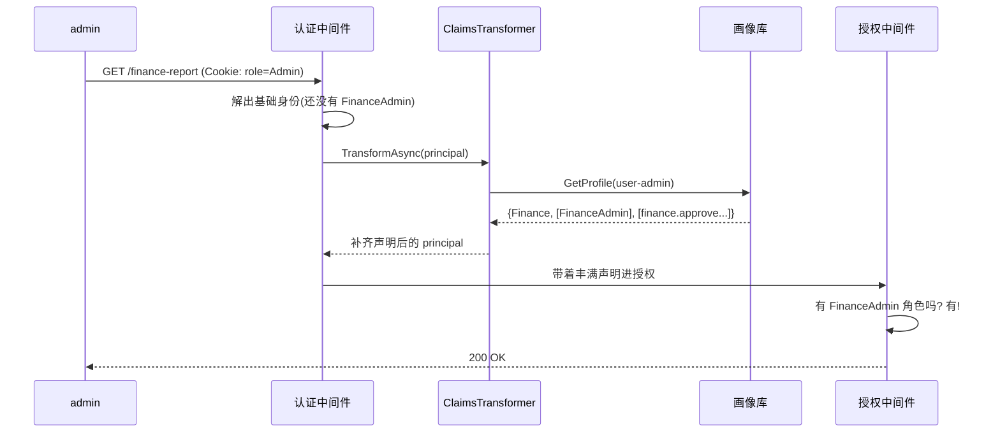

# DOTNET 鉴权系列- 声明转换（IClaimsTransformation）

前面几篇不管是功能权限还是资源权限，判断的原料都是同一个东西——用户的 **Claims（声明）**。认证阶段登录时往 Cookie/Token 里塞了 `role=Admin`、`NameIdentifier=user-admin`，授权阶段就靠这些 Claim 来决定放不放行。

但你有没有想过一个问题：**登录那一刻塞进去的 Claim，够用吗？**

这一篇聊的 `IClaimsTransformation`，解决的就是「原始声明不够用」的问题——**在认证之后、授权之前，给当前用户的身份「二次加工」，把真正需要的声明补齐**。

### 先说说痛点

登录签发的 Token（或 Cookie）里，声明往往是**又粗又静态**的。原因很现实：

- **Token 要小**：JWT 会跟着每个请求跑，不可能把用户几十上百个权限点全塞进去。
- **第三方登录做不了主**：用 OAuth2、企业微信、LDAP 登录，人家吐回来的 Claim 就那么几个（openid、name、部门代码），你的业务角色、权限点它压根不知道。
- **签发即固定**：Token 一旦签发，里面的 `role=Admin` 就写死了。你在后台把张三从「财务管理员」调成「内容管理员」，可他手里的 Token 还写着老身份，不重新登录就不生效。

于是就出现了这种尴尬：

> 系统里有俩管理员，登录后 Token 里都是 `role=admin`。可一个是**财务管理员**（能看财务报表、能审批），一个是**内容管理员**（只能改文章）。光凭 `role=admin` 这一个声明，**根本区分不出来谁是谁**。

你可能会说：那在每个接口里自己查库判断不就行了？可以，但每个 Action 都写一遍「查库 → 判断部门 → 判断权限」，又啰嗦又容易漏，而且这活儿本该由授权系统统一干。

.NET 给了一个更优雅的扩展点：`IClaimsTransformation`。它像一道**中间加工工序**，卡在「认证完成」和「授权开始」之间。认证把人认出来（拿到基础身份），转换器再从业务库把这个人的部门、细分角色、权限点**补进 Claims**，等轮到授权时，`[Authorize]` 看到的就是一个「声明丰满」的用户了。

> 一句话概括：**认证给你一张「基础身份证」，声明转换在上面盖满「业务权限章」，再交给授权去核验。**

### 适用场景

- **多源身份集成**：合并 OAuth2、LDAP、数据库的权限声明（如企业微信登录后补充部门角色）。
- **上下文敏感权限**：根据请求参数动态注入临时权限（如临时审批链接附带时效性权限）。

### 解决的核心问题

**原始 Token 中的声明无法覆盖复杂业务权限**（如仅靠 `role=admin` 无法区分「财务管理员」和「内容管理员」）。

### 核心思路

先看清楚 `IClaimsTransformation` 站在整个管道的哪个位置：


它就是一个只有一个方法的接口：

```C#
public interface IClaimsTransformation
{
    Task<ClaimsPrincipal> TransformAsync(ClaimsPrincipal principal);
}
```

框架在**每次认证成功后**都会调用 `TransformAsync`，把当前用户的 `ClaimsPrincipal` 交给你，你往里加料后再返回。有三个细节必须记牢，否则容易踩坑：

1. **它会被反复调用**。一次请求里，只要发生了认证（有时不止一次），它就会被调一次。所以**必须做幂等保护**，否则同样的 Claim 会被重复塞进去，越堆越多。
2. **补出来的 Claim 只活在当前请求**。它不写回 Cookie/Token，纯内存。这恰恰是优点——库里权限一改，**下次请求立刻生效，不用重新登录**，完美解决了「Token 签发即固定」的痛点。
3. **别在里面干重活别缓存请求态**。因为每次请求都跑，查库要轻、要缓存得当；注册时用 `Transient`/`Scoped`，别用 `Singleton`。

下面把它落成代码，所有文件都放在独立的 `ClaimsTransformation` 文件夹里，自成一体。

### 集成思路

#### 第一步：定义画像和数据源

先要有「补什么」的数据。真实项目里就是查库 / 查 LDAP / 调企业微信接口，这里用内存模拟一个「用户画像」：

```C#
namespace Authorization_Extend.ClaimsTransformation;

public class UserProfile
{
    public string Department { get; init; } = string.Empty;      // 部门：区分财务/内容管理员
    public IReadOnlyList<string> Roles { get; init; } = [];       // 细粒度角色（Token 里没有）
    public IReadOnlyList<string> Permissions { get; init; } = []; // 权限点
}

public interface IUserProfileService
{
    Task<UserProfile?> GetProfileAsync(string userId);
}
```

内存实现里，两个用户虽然基础身份不同，但重点是**画像里的细分身份都是 Token 里没有的**：

```C#
public class InMemoryUserProfileService : IUserProfileService
{
    private readonly Dictionary<string, UserProfile> _profiles = new(StringComparer.OrdinalIgnoreCase)
    {
        // 财务管理员：细分角色 FinanceAdmin + 财务权限
        ["user-admin"] = new UserProfile
        {
            Department = "Finance",
            Roles = ["FinanceAdmin"],
            Permissions = ["finance.report.view", "finance.approve"]
        },
        // 内容管理员：细分角色 ContentEditor + 内容权限
        ["user-normal"] = new UserProfile
        {
            Department = "Content",
            Roles = ["ContentEditor"],
            Permissions = ["content.article.edit"]
        }
    };

    public Task<UserProfile?> GetProfileAsync(string userId)
    {
        _profiles.TryGetValue(userId, out var profile);
        return Task.FromResult(profile);
    }
}
```

#### 第二步：实现 IClaimsTransformation（核心）

这是全篇的重点。注意里面的**幂等保护**——这是新手最容易踩的坑：

```C#
using System.Security.Claims;
using Microsoft.AspNetCore.Authentication;

namespace Authorization_Extend.ClaimsTransformation;

public class PermissionClaimsTransformer : IClaimsTransformation
{
    private readonly IUserProfileService _profileService;

    public PermissionClaimsTransformer(IUserProfileService profileService)
        => _profileService = profileService;

    public async Task<ClaimsPrincipal> TransformAsync(ClaimsPrincipal principal)
    {
        // 只处理已认证的身份
        if (principal.Identity is not ClaimsIdentity identity || !identity.IsAuthenticated)
        {
            return principal;
        }

        // ★ 幂等保护：TransformAsync 一个请求里可能被调多次，
        //   用一个"哨兵"Claim 标记已处理，避免重复塞。
        if (identity.HasClaim(c => c.Type == "claims_enriched"))
        {
            return principal;
        }

        var userId = principal.FindFirst(ClaimTypes.NameIdentifier)?.Value;
        if (string.IsNullOrEmpty(userId)) return principal;

        // 从"数据库"加载画像（真实场景可合并 LDAP / OAuth2 / 企业微信等多源）
        var profile = await _profileService.GetProfileAsync(userId);
        if (profile is null) return principal;

        // 补部门 → 让 role=Admin 也能区分财务/内容管理员
        identity.AddClaim(new Claim("department", profile.Department));
        // 补细粒度角色（原始 Token 里没有）
        foreach (var role in profile.Roles)
            identity.AddClaim(new Claim(ClaimTypes.Role, role));
        // 补权限点声明
        foreach (var perm in profile.Permissions)
            identity.AddClaim(new Claim("permission", perm));

        // 打哨兵，避免后续重复转换
        identity.AddClaim(new Claim("claims_enriched", "true"));
        return principal;
    }
}
```

对比一下需求里给的最小示例，本质是一样的（拿身份 → 查库 → `AddClaim`），只是补了两处生产必备的健壮性：**判断是否已认证**，以及**幂等哨兵**。这两点少了就会出 bug。

#### 第三步：注册到容器

注册就两件事：把转换器登记进 DI，顺便把「基于补充声明」的策略用 `AddPolicy` 登记好。

```C#
using Authorization_Extend.ClaimsTransformation;
using Microsoft.AspNetCore.Authentication;

namespace Microsoft.Extensions.DependencyInjection;

public static class ClaimsTransformationExtensions
{
    public static IServiceCollection AddClaimsTransformation(this IServiceCollection services)
    {
        services.AddSingleton<IUserProfileService, InMemoryUserProfileService>();

        // 官方建议 Transient/Scoped：每次认证都会调用，别用 Singleton
        services.AddTransient<IClaimsTransformation, PermissionClaimsTransformer>();

        // 用转换补出来的 permission 声明做授权
        services.AddAuthorization(options =>
        {
            options.AddPolicy("Claims.FinanceApprove", policy =>
                policy.RequireClaim("permission", "finance.approve"));
        });

        return services;
    }
}
```

> 说明：本模块**不替换** `IAuthorizationPolicyProvider`，只是老实用 `AddPolicy` 和 `[Authorize(Roles=...)]`。所以它和前面「极简 PolicyCode」「仿 ABP」那两套（它们替换了 Provider 且互斥）**井水不犯河水，可以同时启用**。

`Program` 里一行接入，注意它天然就卡在认证和授权之间，你不用操心顺序：

```C#
builder.Services.AddAppCookieAuthentication();   // 认证

builder.Services.AddClaimsTransformation();       // 本篇：声明转换

builder.Services.AddControllers();
var app = builder.Build();
app.UseAuthentication();  // 认证 → 之后框架自动触发 TransformAsync
app.UseAuthorization();   // 授权时看到的已是"丰满"的用户
app.MapControllers();
app.Run();
```

### 在控制器里用起来

控制器里**什么特殊代码都不用写**——这正是声明转换的优雅之处。你照常用 `[Authorize(Roles=...)]`、`[Authorize(Policy=...)]`，只不过这些 Role 和 Policy 依赖的声明，是转换器悄悄补进来的：

```C#
[ApiController]
[Route("api/claims-demo")]
[Authorize(AuthenticationSchemes = CookieAuthenticationDefaults.AuthenticationScheme)]
public class ClaimsDemoController : ControllerBase
{
    // 看看"转换后"到底有哪些声明
    [HttpGet("me")]
    public IActionResult GetMyClaims()
        => Ok(User.Claims.Select(c => new { c.Type, c.Value }));

    // 财务报表：需 FinanceAdmin —— 这个角色原始 Token 里没有，是补出来的
    [HttpGet("finance-report")]
    [Authorize(Roles = "FinanceAdmin")]
    public IActionResult GetFinanceReport() => Ok("财务报表数据");

    // 财务审批：需 finance.approve 权限声明 —— 同样是补出来的
    [HttpPost("finance-approve")]
    [Authorize(Policy = "Claims.FinanceApprove")]
    public IActionResult Approve() => Ok("审批通过");

    // 编辑文章：内容管理员专属
    [HttpPut("articles/{id:int}")]
    [Authorize(Roles = "ContentEditor")]
    public IActionResult EditArticle(int id) => Ok($"已编辑文章 {id}");
}
```

### 走一遍完整流程

拿 `admin` 登录后访问「财务报表」举例，看 `FinanceAdmin` 这个原始 Token 里没有的角色是怎么生效的：

1. `admin` 登录，认证阶段 Cookie 里只写了 `role=Admin`、`NameIdentifier=user-admin`——**没有** `FinanceAdmin`。
2. 请求 `GET /api/claims-demo/finance-report`，带着 Cookie。
3. 认证中间件解开 Cookie，拿到基础身份（此刻还没有 `FinanceAdmin`）。
4. 框架紧接着调用 `PermissionClaimsTransformer.TransformAsync`：取出 `user-admin` → 查画像 → 补上 `department=Finance`、`role=FinanceAdmin`、`permission=finance.approve` 等。
5. 授权中间件此时看到的用户，已经有了 `FinanceAdmin` 角色。
6. `[Authorize(Roles = "FinanceAdmin")]` 校验通过，返回 **200**。

换成 `user` 登录，画像里补的是 `ContentEditor`，没有 `FinanceAdmin`，第 6 步就 **403**。时序图：



用 `.http` 或 Postman 实测，预置画像下的效果：

```
### 登录 admin(财务) / user(内容)
POST /Auth/login   { "username": "admin", "password": "123456" }
POST /Auth/login   { "username": "user",  "password": "123456" }

### 看转换后的全部声明（能看到 department / 补充的 Role / permission）
GET  /api/claims-demo/me

### 财务报表：需 FinanceAdmin → admin 通过，user 403
GET  /api/claims-demo/finance-report

### 财务审批：需 finance.approve 声明 → admin 通过，user 403
POST /api/claims-demo/finance-approve

### 编辑文章：需 ContentEditor → user 通过，admin 403
PUT  /api/claims-demo/articles/1
```

调 `/me` 你会直观看到：Cookie 里明明只塞了 `role=Admin`，返回的声明里却多出了 `department`、`FinanceAdmin`、`permission` 一堆——这些全是转换器现补的。

### 总结

声明转换抓住的是 .NET 认证与授权之间的扩展点 `IClaimsTransformation`：认证负责把人认出来给一张「基础身份证」，转换器再从业务库把部门、细分角色、权限点**盖章补齐**，最后交给授权基于这份丰满声明去判断。它让「原始 Token 声明太粗、撑不起复杂业务权限」这个老大难，有了一个统一、优雅的解法。

核心构件对照：

| 文件 | 角色 | 一句话职责 |
| --- | --- | --- |
| `UserProfile` | 画像模型 | 承载要补的部门 / 细分角色 / 权限点 |
| `IUserProfileService` / 内存实现 | 数据源 | 按 userId 查画像（对应库 / LDAP / 企业微信） |
| `PermissionClaimsTransformer` | 转换器 | 认证后把画像补进 Claims，含幂等保护 |
| `ClaimsTransformationExtensions` | 注册 | AddTransient 转换器 + AddPolicy 登记声明策略 |
| `ClaimsDemoController` | 用法 | 照常用 `[Authorize(Roles/Policy)]`，无感享受丰满声明 |

再说说**适用边界**和几个实践要点：

- **一定要做幂等保护**。`TransformAsync` 每次认证都跑，不加哨兵判断，Claim 会重复堆积，这是最常见的 bug。
- **补出来的声明不落 Token**，只活在当前请求。好处是权限改动即时生效、无需重新登录；代价是每次请求都要重新算，所以查库要轻、该缓存就缓存。
- **注册用 `Transient`/`Scoped`**，不要 `Singleton`（会把请求态缓存串号）。
- 它和前几篇是**互补**关系：转换器负责把授权要用的「原料」（角色、权限声明）备齐，前几篇的功能授权、资源授权负责拿这些原料「下判断」。本模块不替换 `IAuthorizationPolicyProvider`，可与它们任意组合、同时启用。
- 需求里提到的「上下文敏感权限」（如带时效的临时审批链接）也走这个口子：在 `TransformAsync` 里读请求上下文（可注入 `IHttpContextAccessor`），按条件临时补一个短时权限声明即可。

最后照例强调那句贯穿整个系列的话：**认证和授权是两码事**，而声明转换恰好是这两者之间的桥。认证解决「你是谁」，转换解决「你身上到底带着哪些权限凭证」，授权再解决「凭这些凭证你能不能干」——三段接力，鉴权链条才算完整。
