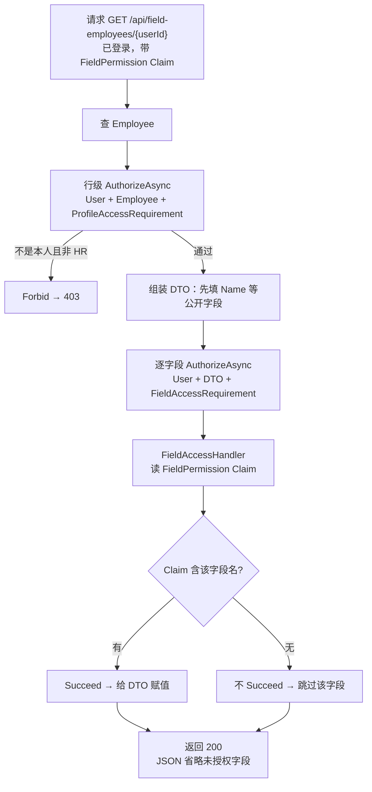
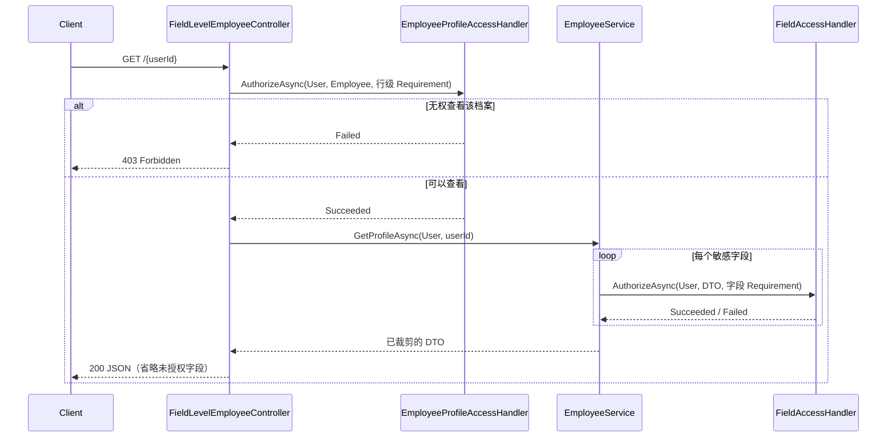

# DOTNET 鉴权系列- 字段级动态授权

前面一篇「基于资源的动态授权」解决的是：**你能不能操作『这一条』数据**。这一篇再往下钻一层——**同一条数据里，你能不能看『这一个』字段**。本篇仍假设认证已经完成：`UseAuthentication()` 先把 Cookie 还原成 `ClaimsPrincipal`，随后业务代码才拿着 Claims 做资源与字段授权。

HR 系统里最典型：普通员工打开自己的薪资页，只能看到基本工资；HR 专员打开同一份档案，还能看到绩效奖金、社保明细。资源是同一份 `Employee`，差异全在字段上。

### 先说说痛点

如果只用角色硬扛，很快就会陷入「角色爆炸」：

- `employee-base`：只能看基本工资
- `employee-full`：能看基本工资 + 奖金
- `hr-social`：能看社保
- `hr-full`：全部字段
- ……字段一组合，角色就按指数涨

更糟的是，很多人会在业务代码里写死过滤：

```C#
if (User.IsInRole("HR"))
{
    dto.Bonus = employee.Bonus;
    dto.SocialSecurityDetail = employee.SocialSecurityDetail;
}
```

权限规则散落在 Service / Controller 各处，业务层和权限层缠在一起：改一个字段可见性，要翻业务代码、回归一堆接口。

> 一句话概括：**传统角色模型管不好「同一资源、不同字段」；字段过滤不该写死在业务 if 里，而该交给授权系统。**

### 适用场景

- **HR / 薪资系统**：员工看自己的基本工资，HR 看奖金、社保、个税明细。
- **医疗 / 隐私数据**：患者本人看部分病历，主治医生看完整记录，行政只看挂号信息。
- **金融 / 风控**：柜员看脱敏卡号，风控岗看完整账户与流水字段。
- **任意「列级权限」**：同一张表、同一行，不同角色看到的列集合不同。

### 解决的核心问题

**传统角色模型无法实现「同一资源不同字段差异化授权」**；硬编码字段过滤会导致业务层与权限层耦合，并为字段组合制造大量角色。

### 核心思路

字段级授权不能只看「字段」，还必须先看「这条数据」。否则普通用户只要猜到别人的 `userId`，即便看不到奖金，也可能读到对方基本工资。

因此这次把授权拆成两步：

1. **行级资源授权**：`AuthorizeAsync(User, employee, new EmployeeProfileAccessRequirement())`。员工只能看自己的档案，Admin（演示中的 HR）可看任意档案；失败直接 `Forbid()`。
2. **字段级授权**：行级通过后，`AuthorizeAsync(User, dto, new FieldAccessRequirement(fieldName))`。`FieldAccessHandler` 根据 `FieldPermission` Claim 决定是否给某个字段赋值。

两次调用都直接传 `Requirement` **实例**，不走 `[Authorize(Policy = "...")]` 的 `IAuthorizationPolicyProvider` 取策略流程；ASP.NET Core 会按 `AuthorizationHandler<TRequirement, TResource>` 的泛型类型，把它路由到对应 Handler。这也是为什么字段过滤要发生在 Service 组装 DTO 的时候，而不是只靠控制器上的特性。

和上一篇资源授权的差别在于：资源授权失败整接口 `Forbid()`；字段级授权失败时，**接口仍返回 200，只是不写入该敏感字段**。`EmployeeDto` 用 `JsonIgnore(WhenWritingNull)` 省略未授权字段，避免把它们以 `null` 的形式暴露到响应 schema。



### 集成思路

所有代码放在独立的 `FieldLevelAuthorization` 文件夹，自成一体。

#### 第一步：定义字段名与 Claim 类型

```C#
public static class FieldNames
{
    public const string BaseSalary = "BaseSalary";
    public const string Bonus = "Bonus";
    public const string SocialSecurity = "SocialSecurity";
}

public static class FieldClaimTypes
{
    public const string FieldPermission = "FieldPermission";
}
```

登录时写入多条 `FieldPermission` Claim（一条 Claim = 一个可访问字段），而不是造一堆角色：

| 账号 | NameIdentifier | 角色 | FieldPermission |
| --- | --- | --- |
| `user` | `user-normal`（张三） | User（普通员工） | `BaseSalary` |
| `admin` | `user-admin`（王 HR） | Admin（模拟 HR） | `BaseSalary`、`Bonus`、`SocialSecurity` |

这里的「动态」是指响应会随调用者拥有的字段集合而变化，**不是**极简动态权限篇那种「运行时动态构造 Policy」。当前演示在登录时把字段权限写进 Cookie Claim；生产中若要权限修改立即生效，可结合「声明转换」篇，在每次请求时从权限库补充 Claim。

#### 第二步：定义两类 Requirement（诉求单）

```C#
public class FieldAccessRequirement : IAuthorizationRequirement
{
    public string FieldName { get; }
    public FieldAccessRequirement(string fieldName)
    {
        ArgumentException.ThrowIfNullOrWhiteSpace(fieldName);
        FieldName = fieldName;
    }
}
```

`FieldAccessRequirement` 只携带「要访问哪个字段」；`EmployeeProfileAccessRequirement` 是无状态标记 Requirement，用来表达「能否查看这份员工档案」。真正判断都交给 Handler。

#### 第三步：自定义资源型 Handler

```C#
public class FieldAccessHandler : AuthorizationHandler<FieldAccessRequirement, EmployeeDto>
{
    protected override Task HandleRequirementAsync(
        AuthorizationHandlerContext context,
        FieldAccessRequirement requirement,
        EmployeeDto resource)
    {
        var allowedFields = context.User.Claims
            .Where(c => c.Type == FieldClaimTypes.FieldPermission)
            .Select(c => c.Value);

        if (allowedFields.Contains(requirement.FieldName, StringComparer.OrdinalIgnoreCase))
            context.Succeed(requirement);

        return Task.CompletedTask;
    }
}
```

权限原料是 Claim，不是 `IsInRole`。以后要给某人临时开「看奖金」权限，加一条 Claim / 改权限表即可，不用新建角色。

行级 Handler 则负责防越权：

```C#
public sealed class EmployeeProfileAccessHandler
    : AuthorizationHandler<EmployeeProfileAccessRequirement, Employee>
{
    protected override Task HandleRequirementAsync(
        AuthorizationHandlerContext context,
        EmployeeProfileAccessRequirement requirement,
        Employee resource)
    {
        var currentUserId = context.User.FindFirstValue(ClaimTypes.NameIdentifier);
        if (string.Equals(currentUserId, resource.UserId, StringComparison.OrdinalIgnoreCase)
            || context.User.IsInRole("Admin"))
        {
            context.Succeed(requirement);
        }

        return Task.CompletedTask;
    }
}
```

#### 第四步：在组装 DTO 时注入授权服务

```C#
public async Task<EmployeeDto?> GetProfileAsync(ClaimsPrincipal user, string userId)
{
    var employee = _store.Find(userId);
    if (employee is null) return null;

    var dto = new EmployeeDto { UserId = employee.UserId, Name = employee.Name };
    var visible = new List<string> { nameof(EmployeeDto.Name) };

    if (await AuthorizeFieldAsync(user, dto, FieldNames.BaseSalary))
    {
        dto.BaseSalary = employee.BaseSalary;
        visible.Add(FieldNames.BaseSalary);
    }

    if (await AuthorizeFieldAsync(user, dto, FieldNames.Bonus))
    {
        dto.Bonus = employee.Bonus;
        visible.Add(FieldNames.Bonus);
    }

    if (await AuthorizeFieldAsync(user, dto, FieldNames.SocialSecurity))
    {
        dto.SocialSecurityDetail = employee.SocialSecurityDetail;
        visible.Add(FieldNames.SocialSecurity);
    }

    dto.VisibleFields = visible;
    return dto;
}

private async Task<bool> AuthorizeFieldAsync(ClaimsPrincipal user, EmployeeDto dto, string fieldName)
{
    var result = await _authorizationService.AuthorizeAsync(
        user, dto, new FieldAccessRequirement(fieldName));
    return result.Succeeded;
}
```

业务层只问「这个字段能不能看」，不问「你是不是 HR」。过滤逻辑集中在授权 Handler，业务与权限解耦。注意 `SocialSecurity` 是权限名，DTO 对外属性叫 `SocialSecurityDetail`；可空字段不代表值为零，而是本次没有获得授权，因此序列化时会被省略。

#### 第五步：注册并挂上控制器

```C#
builder.Services.AddAppCookieAuthentication();
builder.Services.AddFieldLevelAuthorization();

// ...
app.UseAuthentication();
app.UseAuthorization();
```

`AddFieldLevelAuthorization()` 会注册 `AddAuthorization()`、数据源、Service 和两类 Handler；它不替换 `IAuthorizationPolicyProvider`，所以可以和极简动态权限、资源授权共存。

控制器只做认证和资源边界校验，字段裁剪仍由 Service 完成：

```C#
[HttpGet("{userId}")]
public async Task<IActionResult> GetProfile(string userId)
{
    var employee = _employeeStore.Find(userId);
    if (employee is null) return NotFound();

    var result = await _authorizationService.AuthorizeAsync(
        User, employee, new EmployeeProfileAccessRequirement());
    if (!result.Succeeded) return Forbid();

    var dto = await _employeeService.GetProfileAsync(User, userId);
    return Ok(new { data = dto });
}
```

`GET /api/field-employees/me` 供当前用户查看自己；`GET /api/field-employees/{userId}` 也会先做行级校验。`GET /api/field-employees` 的列表接口仅限 Admin，避免普通用户枚举档案标识。

### 走一遍完整流程

用 `user` 登录后请求 `GET /api/field-employees/me`：

1. 认证解开 Cookie，Claims 里只有 `FieldPermission=BaseSalary`。
2. Controller 查到 `user-normal` 对应的张三，行级 Handler 比对 `NameIdentifier` 与 `Employee.UserId`，通过。
3. Service 查到张三的完整薪资（含奖金、社保），先组装公开字段。
4. 对 `BaseSalary` 授权 → Handler Succeed → 赋值。
5. 对 `Bonus` / `SocialSecurity` 授权 → Claim 没有 → 不 Succeed → 不给 DTO 赋值。
6. 接口 **200**，响应里只有姓名和基本工资；未授权字段不会序列化为 `null`。

换成 `admin`，三条字段授权都 Succeed，奖金和社保明细一并返回。

> ⚠️ 用普通 `user` 请求 `GET /api/field-employees/user-admin` 时，行级 Handler 会先拒绝并返回 **403**；不会进入字段裁剪。字段级授权只解决「哪些列能看到」，必须和功能权限、资源归属授权叠加，才能防止水平越权。

调用时序如下：



```
### 1. 登录 user（仅基本工资字段权限）
POST /Auth/login
{ "username": "user", "password": "123456" }

### 2. 看自己的字段权限
GET /api/field-employees/me/field-permissions

### 3. 看自己的薪资：仅返回 BaseSalary，Bonus / SocialSecurityDetail 不出现在 JSON
GET /api/field-employees/me

### 4. 普通员工查 HR 档案 → 403（先做行级校验）
GET /api/field-employees/user-admin

### 5. 换 admin 登录后再请求同一接口 → 全部字段可见
POST /Auth/login
{ "username": "admin", "password": "123456" }
GET /api/field-employees/me
GET /api/field-employees/user-normal
GET /api/field-employees
```

### 总结

| 文件 | 角色 | 一句话职责 |
| --- | --- | --- |
| `FieldAccessRequirement` | 诉求单 | 携带要校验的字段名 |
| `EmployeeProfileAccessRequirement` | 行级诉求单 | 表示「能否查看这份员工档案」 |
| `EmployeeProfileAccessHandler` | 行级裁判 | 本人或 Admin 才能通过，先堵住跨用户读取 |
| `FieldAccessHandler` | 字段裁判 | 读 `FieldPermission` Claim，决定字段是否可见 |
| `FieldNames` / `FieldClaimTypes` | 权限字典 | 统一字段权限名和 Claim 类型，避免散落字符串 |
| `Employee` / `EmployeeDto` | 资源 | 实体含全量字段；DTO 的空敏感字段会被 JSON 忽略 |
| `EmployeeService` | 组装层 | 逐字段 `AuthorizeAsync`，有权限才赋值 |
| `FieldLevelEmployeeController` | 入口 | 认证、行级校验和响应；演示 me / 按人查询 |
| `FieldLevelAuthorizationExtensions` | 注册 | 授权、数据源、Service 与两类 Handler，不替换 PolicyProvider |

**适用边界**：

- 适合「列级 / 字段级」可见性控制，尤其是敏感个人信息。
- 字段很多时，可把「字段名列表」收到配置或权限表，Handler 仍只做 Claim/库表比对。
- 真实 HR 往往还要叠加功能权限、资源归属（只能看自己 / 本部门）与字段裁剪；本示例已实现「本人 / Admin」的最小行级校验，复杂组织关系可继续复用上一篇资源授权的思路。

和系列其它篇的关系：认证阶段写入身份与字段 Claim；功能权限管「能不能进这个接口」，资源权限管「能不能碰这条数据」，**字段权限管「这条数据里哪些列能露出来」**。三层各管一段，叠在一起才是完整的细粒度授权。
