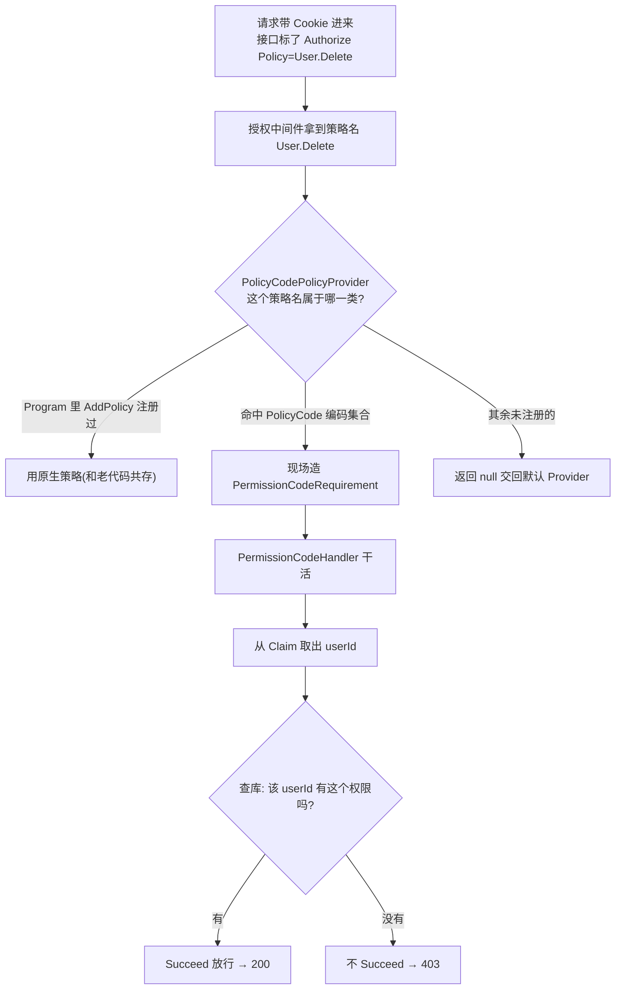
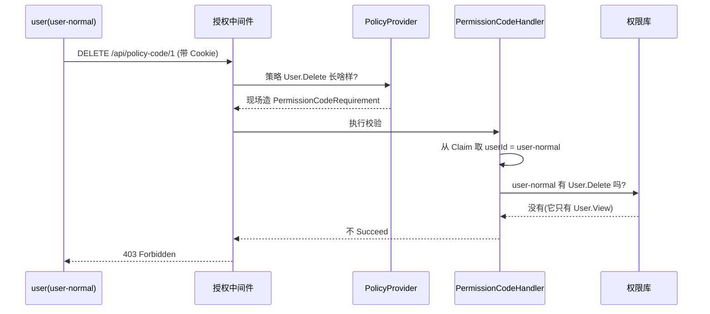

# DOTNET 鉴权系列- 极简动态权限

上一篇我们聊了「认证」，解决的是**你是谁**的问题，登录后系统知道来的人是张三还是李四。这一篇接着聊「授权」，解决的是**你能干嘛**的问题，同样是登录用户，张三能删人、李四只能看，这就是授权要管的事。

认证和授权在 .NET Core 里是两个独立的中间件，还记得上一篇那个顺序吗，`app.UseAuthentication()` 在前，`app.UseAuthorization()` 在后，先搞清楚你是谁，再判断你能不能干。这篇讲的所有东西，都建立在用户已经登录、`Claims` 已经在手的前提上。

### 先说说痛点

授权这块，框架自带的三板斧相信大家都用过：

第一板斧，基于角色，简单粗暴。

```C#
[Authorize(Roles = "Admin")]
public IActionResult DeleteUser(int id) { ... }
```

第二板斧，基于策略，稍微灵活点，但要先在 `Program` 里一个个注册。

```C#
builder.Services.AddAuthorization(options =>
{
    options.AddPolicy("User.Delete", policy => policy.RequireRole("Admin"));
    options.AddPolicy("User.View", policy => policy.RequireRole("Admin", "User"));
    options.AddPolicy("Order.Create", policy => policy.RequireRole("Admin"));
    // ... 还有 200 个权限点在路上
});
```

第三板斧，基于策略 + 自定义 `Requirement` + `Handler`，能处理复杂逻辑。

前两个在小项目里够用了，但只要项目一大，问题立马就来了。我随便描述几个真实场景，你品品是不是很熟悉：

- 产品说，这个「导出报表」按钮，以后不是所有管理员都能点了，要单独控制。于是你新增一个权限点，回到 `Program` 加一行 `AddPolicy`，改代码、走流程、重新发版。一个权限的调整，走了一遍完整的上线流程。

- 系统跑了两年，权限点从 10 个涨到 300 个，`Program` 里的 `AddPolicy` 堆成了一座山，谁都不敢动，一改就怕影响别的。

- 更要命的是，权限用 `RequireRole("Admin")` 写死了角色和权限的绑定关系。运营想给某个**具体的人**临时开个权限，对不起，做不到，因为权限是绑在角色上的，不是绑在人身上的。

说白了，原生 `AddPolicy` 最大的问题是：**权限是"编译期"写死的**。你想加一个权限点、调一个权限归属，都得改代码重新编译。而真实业务里，权限恰恰是最需要「运行时动态调整」的东西——今天给张三开个口子，明天把李四的权限收回来，这些操作压根不应该惊动开发。

那有没有办法，让「加权限」这件事不再需要改 `Program`、不再需要重新发版呢？这篇要分享的极简方案，核心就一句话：

> **策略名直接就是权限编码，权限归属存在库里，运行时查。**

加权限？往库里插条数据就行，代码一行不用动。

### 核心思路

在动手写代码之前，先把整个思路捋顺，不然容易迷路。

原生 `[Authorize(Policy = "User.Delete")]` 这套机制，框架内部其实是这么跑的：

1. 请求进来，框架看到 `[Authorize]` 上写了 `Policy = "User.Delete"`。
2. 框架拿着 `"User.Delete"` 这个名字，去找一个叫 `IAuthorizationPolicyProvider` 的东西，问它：这个策略长啥样？
3. 默认的 Provider 就去 `Program` 里 `AddPolicy` 注册过的字典里查，查到了就返回，查不到就报错。
4. 拿到策略后，执行策略里挂的 `Requirement`，交给对应的 `Handler` 判断通不通过。

问题就出在第 3 步——默认 Provider 只认「事先注册好」的策略。**那我们能不能自己写一个 Provider，不查字典，而是不管来什么策略名，都现场给它造一个策略出来？** 造出来的策略统一挂一个「查库校验」的 Handler，Handler 拿着策略名（也就是权限编码）去库里查当前用户有没有这个权限。

这么一改，`AddPolicy` 就彻底不需要了。你在接口上写 `[Authorize(Policy = "随便什么编码")]`，Provider 都能接住，Handler 都会去库里查。加权限从此和代码解耦。

整个方案就 6 个小文件，它们的协作关系如下图，先有个整体印象，后面逐个实现：



### 集成思路

#### 第一步：定义 Requirement（要求）

`Requirement` 就是一张「诉求单」，上面写着这个接口要求用户拥有哪个权限编码。它本身不干活，只负责携带信息。

```C#
using Microsoft.AspNetCore.Authorization;

namespace Authorization_Extend.PolicyCodeAuthorization;

/// <summary>
/// 权限要求：携带权限编码（如 User.Delete），由 Handler 查库验证用户是否拥有。
/// </summary>
public class PermissionCodeRequirement : IAuthorizationRequirement
{
    public PermissionCodeRequirement(string permissionCode)
    {
        PermissionCode = permissionCode;
    }

    public string PermissionCode { get; }
}
```

这里注意 `IAuthorizationRequirement` 其实是个空接口，纯粹是个标记。它的作用就是让框架能识别「这是一个授权要求」，然后帮你路由到对应的 Handler。

#### 第二步：定义查库服务（模拟 user_permissions 表）

权限归属得存在某个地方，真实项目里就是数据库里的一张 `user_permissions` 表，记录着「哪个用户拥有哪些权限编码」。这里为了演示，我用内存字典模拟一下，你换成 EF Core 查库、查 Redis 缓存都是一样的道理。

先定义接口，把「怎么查」和「谁来查」解耦：

```C#
namespace Authorization_Extend.PolicyCodeAuthorization;

/// <summary>
/// 模拟数据库：按用户 ID 查询是否拥有某权限编码。
/// </summary>
public interface IUserPermissionService
{
    Task<bool> UserHasPermissionAsync(string userId, string permissionCode);

    Task<IReadOnlyList<string>> GetUserPermissionsAsync(string userId);
}
```

再来个内存实现，可以看到 `user-admin` 拥有全部三个权限，`user-normal` 只能看：

```C#
namespace Authorization_Extend.PolicyCodeAuthorization;

/// <summary>
/// 内存模拟 user_permissions 表：userId → permissionCode。
/// </summary>
public class InMemoryUserPermissionService : IUserPermissionService
{
    private readonly Dictionary<string, HashSet<string>> _userPermissions = new(StringComparer.OrdinalIgnoreCase)
    {
        ["user-admin"] =
        [
            PolicyCodePermissionNames.UserView,
            PolicyCodePermissionNames.UserDelete,
            PolicyCodePermissionNames.OrderCreate
        ],
        ["user-normal"] =
        [
            PolicyCodePermissionNames.UserView
        ]
    };

    public Task<bool> UserHasPermissionAsync(string userId, string permissionCode)
    {
        if (!_userPermissions.TryGetValue(userId, out var permissions))
        {
            return Task.FromResult(false);
        }

        return Task.FromResult(permissions.Contains(permissionCode));
    }

    public Task<IReadOnlyList<string>> GetUserPermissionsAsync(string userId)
    {
        if (!_userPermissions.TryGetValue(userId, out var permissions))
        {
            return Task.FromResult<IReadOnlyList<string>>(Array.Empty<string>());
        }

        return Task.FromResult<IReadOnlyList<string>>(permissions.ToList());
    }
}
```

**这一步是整个「动态」的灵魂**。想给张三加权限？往这张表插条数据就行，接口立刻生效，不用改代码、不用重启。这就是我们前面痛点里最想解决的那个诉求。

顺便把权限编码抽成常量，避免到处写魔法字符串。这里有个关键的 `All` 集合，后面 Provider 要靠它来做路由判断，先记住它。

```C#
namespace Authorization_Extend.PolicyCodeAuthorization;

/// <summary>
/// 极简动态权限编码常量。策略名 = 权限编码，无需 AddPolicy。
/// </summary>
public static class PolicyCodePermissionNames
{
    public const string UserView = "User.View";
    public const string UserDelete = "User.Delete";
    public const string OrderCreate = "Order.Create";

    /// <summary>走「用户直查库」模式的权限编码集合，PolicyProvider 据此路由到对应 Handler。</summary>
    public static readonly HashSet<string> All = new(StringComparer.OrdinalIgnoreCase)
    {
        UserView,
        UserDelete,
        OrderCreate
    };
}
```

#### 第三步：写 Handler（真正干活的裁判）

`Handler` 是真正做判断的地方。它拿到 `Requirement`（诉求单）后，从当前登录用户的 `Claims` 里把 `userId` 抠出来，再拿着 `userId` + 权限编码去问查库服务：这人有没有这个权限？有就放行。

```C#
using System.Security.Claims;
using Microsoft.AspNetCore.Authorization;

namespace Authorization_Extend.PolicyCodeAuthorization;

/// <summary>
/// 极简权限 Handler：从 Claim 取 userId → 查 IUserPermissionService 是否拥有权限编码。
/// </summary>
public class PermissionCodeHandler : AuthorizationHandler<PermissionCodeRequirement>
{
    private readonly IUserPermissionService _permissionService;

    public PermissionCodeHandler(IUserPermissionService permissionService)
    {
        _permissionService = permissionService;
    }

    protected override async Task HandleRequirementAsync(
        AuthorizationHandlerContext context,
        PermissionCodeRequirement requirement)
    {
        // 从 Claims 里取 userId，这是认证阶段登录时写进去的
        var userId = context.User.FindFirst(ClaimTypes.NameIdentifier)?.Value;
        if (string.IsNullOrEmpty(userId))
        {
            return; // 没取到 userId，直接不通过（注意：不 Succeed 就等于不通过）
        }

        // 拿 userId + 权限编码去查库，有就放行
        if (await _permissionService.UserHasPermissionAsync(userId, requirement.PermissionCode))
        {
            context.Succeed(requirement);
        }
    }
}
```

这里有两个细节值得念叨一下：

一是 `context.User.FindFirst(ClaimTypes.NameIdentifier)`，这个 `userId` 是**认证阶段**登录时写进 Cookie 的 Claim，授权阶段直接取出来用。认证和授权就是这么串起来的，认证负责往里塞身份信息，授权负责取出来判断。

二是 `context.Succeed(requirement)` 这行**只在通过时调用**。如果不调用，框架就默认这个要求没被满足，最终返回 403。所以你会发现代码里没有任何「显式拒绝」的逻辑——不 `Succeed`，就是拒绝。

#### 第四步：写动态 PolicyProvider（最核心的一步）

前面三步其实还是原生那套 `Requirement + Handler` 的路子。真正让方案「脱胎换骨」的是这一步——我们要替换掉框架默认的 `IAuthorizationPolicyProvider`，让它不再依赖 `AddPolicy` 注册的字典，而是**按策略名现场造策略**。

```C#
using Microsoft.AspNetCore.Authorization;
using Microsoft.Extensions.Options;

namespace Authorization_Extend.PolicyCodeAuthorization;

/// <summary>
/// 极简（原生扩展）动态 Policy 提供器：策略名 = 权限编码，按需现场构建，无需 AddPolicy。
/// 完全独立于仿 ABP 方案，只认自己这套编码，其余一律交回默认 Provider。
/// </summary>
public class PolicyCodePolicyProvider : IAuthorizationPolicyProvider
{
    private readonly DefaultAuthorizationPolicyProvider _fallback;

    public PolicyCodePolicyProvider(IOptions<AuthorizationOptions> options)
    {
        // 保留一个默认 Provider 作为兜底
        _fallback = new DefaultAuthorizationPolicyProvider(options);
    }

    public async Task<AuthorizationPolicy?> GetPolicyAsync(string policyName)
    {
        if (string.IsNullOrWhiteSpace(policyName))
        {
            return await _fallback.GetPolicyAsync(policyName);
        }

        // 规则一：Program 里 AddPolicy 显式注册过的，优先用原生的
        var registered = await _fallback.GetPolicyAsync(policyName);
        if (registered is not null)
        {
            return registered;
        }

        // 规则二：策略名命中 PolicyCode 集合 → 现场造「用户直查库」的 Requirement
        if (PolicyCodePermissionNames.All.Contains(policyName))
        {
            return new AuthorizationPolicyBuilder()
                .AddRequirements(new PermissionCodeRequirement(policyName))
                .Build();
        }

        // 规则三：其余的都不认识，返回 null 交回默认 Provider，绝不越权处理别的方案的策略
        return null;
    }

    public Task<AuthorizationPolicy> GetDefaultPolicyAsync() => _fallback.GetDefaultPolicyAsync();

    public Task<AuthorizationPolicy?> GetFallbackPolicyAsync() => _fallback.GetFallbackPolicyAsync();
}
```

这段代码是全篇的重点，我多解释几句。

`GetPolicyAsync` 就是框架拿着策略名来问「这策略长啥样」时调用的方法。我们的实现里做了个**三级路由**：

1. 先问默认 Provider，如果这个策略名是 `Program` 里 `AddPolicy` 老老实实注册过的，那就尊重原生的，直接返回。这一步保证了新方案能和老代码**和平共处**，你不用把存量的 `AddPolicy` 全删掉。
2. 如果没注册过，再看策略名在不在我们的 `PolicyCodePermissionNames.All` 集合里。在，就当场 new 一个 `PermissionCodeRequirement`，走「用户直查库」这套。
3. 都不是，就返回 `null` 交回默认 Provider——这套方案只管自己认识的编码，**绝不去插手别的授权方案**（比如另一篇的仿 ABP）。

这里特别强调一点：这个 Provider 是**自包含**的，命名空间就在 `PolicyCodeAuthorization` 文件夹下，不引用、不依赖任何仿 ABP 的类型。之所以第 3 步返回 `null` 而不是硬造一个别的方案的 Requirement，就是为了让它和仿 ABP 方案彻底解耦、各过各的。

关键在于第 2 步——**策略压根不是提前注册的，而是每次请求现场造的**。所以你想加多少权限编码都行，只要进了 `All` 集合，Provider 就来者不拒。这就是「动态」二字的真正含义。

> 提个醒：`GetPolicyAsync` 会被频繁调用，框架内部对结果有缓存，但你自己实现里别在这个方法里干重活（比如查库），造策略要轻。真正的查库放在 Handler 里，那里才是每次请求真正执行判断的地方。

#### 第五步：搞个语法糖特性（可选但推荐）

每次写 `[Authorize(Policy = "User.Delete")]` 有点啰嗦，而且 `Policy =` 这个写法看不出来它是个「权限编码」。我们可以封装一个特性，让语义更清晰：

```C#
using Microsoft.AspNetCore.Authorization;

namespace Authorization_Extend.PolicyCodeAuthorization;

/// <summary>
/// 声明式标记权限编码，等价于 [Authorize(Policy = "User.Delete")]。
/// </summary>
[AttributeUsage(AttributeTargets.Class | AttributeTargets.Method, AllowMultiple = true)]
public class RequirePermissionCodeAttribute : AuthorizeAttribute
{
    public RequirePermissionCodeAttribute(string permissionCode)
    {
        Policy = permissionCode;
    }
}
```

它就是继承 `AuthorizeAttribute`，然后把传进来的权限编码塞给 `Policy` 属性。本质上和 `[Authorize(Policy = "xxx")]` 一模一样，只是写起来变成了 `[RequirePermissionCode("xxx")]`，一眼就知道这是在要权限，不是在配策略。

#### 第六步：注册到容器

万事俱备，最后把服务、Handler 和 Provider 注册进去。这套方案是**自包含**的——查库服务、Handler 以及最核心的 `PolicyProvider`，全都在 PolicyCode 自己的扩展方法里搞定，不依赖任何别的模块：

```C#
using Authorization_Extend.PolicyCodeAuthorization;
using Microsoft.AspNetCore.Authorization;
using Microsoft.Extensions.DependencyInjection.Extensions;

namespace Microsoft.Extensions.DependencyInjection;

public static class PolicyCodeAuthorizationExtensions
{
    public static IServiceCollection AddPolicyCodeAuthorization(this IServiceCollection services)
    {
        services.AddScoped<IUserPermissionService, InMemoryUserPermissionService>();
        services.AddScoped<IAuthorizationHandler, PermissionCodeHandler>();

        // 用我们自己的 Provider 替换掉框架默认的 IAuthorizationPolicyProvider
        services.Replace(ServiceDescriptor.Singleton<IAuthorizationPolicyProvider, PolicyCodePolicyProvider>());

        return services;
    }
}
```

`Replace` 而不是 `Add`，这点很重要。框架启动时已经默认注册了一个 `DefaultAuthorizationPolicyProvider`，我们得把它换掉，而不是加一个，否则不知道用哪个。

最后在 `Program` 里一行调用，收工：

```C#
builder.Services.AddAppCookieAuthentication();   // 上一篇的认证

builder.Services.AddPolicyCodeAuthorization();   // 注册查库服务 + Handler + 独立 PolicyProvider

builder.Services.AddControllers();

var app = builder.Build();
app.UseAuthentication();  // 先认证
app.UseAuthorization();   // 再授权
app.MapControllers();
app.Run();
```

> ⚠️ 一个坑要提醒：`IAuthorizationPolicyProvider` 在容器里**全局只有一个**（我们用 `Replace` 换掉了默认实现）。所以如果你同时还启用了另一篇的仿 ABP 方案（它也会 `Replace` 一个自己的 Provider），两者会互相覆盖——**后注册的那个生效**。这两套动态权限是互斥的，同一个项目里演示时请只启用其中一套。

### 在控制器里用起来

到这儿框架就搭好了，控制器里用起来非常清爽，直接标编码就完事：

```C#
[ApiController]
[Route("api/policy-code")]
[Authorize(AuthenticationSchemes = CookieAuthenticationDefaults.AuthenticationScheme)]
public class PolicyCodeUserController : ControllerBase
{
    // 用语法糖特性，一眼看出要 User.View 权限
    [HttpGet]
    [RequirePermissionCode(PolicyCodePermissionNames.UserView)]
    public IActionResult GetUsers()
    {
        return Ok(new { data = new[] { new { Id = 1, Name = "张三" } } });
    }

    // 用原生写法也完全等价，都会被我们的 Provider 接住
    [HttpDelete("{id:int}")]
    [Authorize(Policy = PolicyCodePermissionNames.UserDelete)]
    public IActionResult DeleteUser(int id)
    {
        return Ok(new { message = $"已删除用户 {id}" });
    }

    [HttpPost("orders")]
    [Authorize(Policy = PolicyCodePermissionNames.OrderCreate)]
    public IActionResult CreateOrder()
    {
        return Ok(new { message = "订单已创建" });
    }
}
```

注意控制器上还是标了 `[Authorize(AuthenticationSchemes = Cookie...)]`，这是**认证**，保证进来的是登录用户；方法上的 `[RequirePermissionCode]` 才是**授权**，判断这个登录用户有没有对应权限。两层各司其职。

### 走一遍完整流程

我们串起来看一次请求，比如 `user`（普通用户，只有 `User.View`）去删用户：

1. `user` 先登录，认证阶段往 Cookie 里写了 `NameIdentifier = user-normal` 这个 Claim。
2. 请求 `DELETE /api/policy-code/1`，带着 Cookie。
3. 认证中间件解开 Cookie，确认是登录用户，`Claims` 到手。
4. 授权中间件看到方法上 `[Authorize(Policy = "User.Delete")]`，拿着 `"User.Delete"` 去问我们的 `PolicyCodePolicyProvider`。
5. Provider 发现 `Program` 没注册过它，但它在 `PolicyCodePermissionNames.All` 里，于是现场造了个挂着 `PermissionCodeRequirement("User.Delete")` 的策略。
6. 框架执行策略，调到 `PermissionCodeHandler`。Handler 从 Claim 取出 `user-normal`，查库问：`user-normal` 有 `User.Delete` 吗？
7. 库里 `user-normal` 只有 `User.View`，没有 `User.Delete`，Handler 不 `Succeed`。
8. 框架最终判定不通过，返回 **403 Forbidden**。

这段流程用时序图看更清楚：



换成 `admin`（`user-admin`，三个权限全有）走一遍，第 7 步查到有权限，Handler `Succeed`，接口正常返回。整个过程 `Program` 里一行 `AddPolicy` 都没有，全靠运行时查库决定。

用 `.http` 或者 Postman 实测一下就更直观了：

```
### 1. 登录 admin（权限多）
POST /Auth/login
{ "username": "admin", "password": "123456" }

### 2. 登录 user（权限少）
POST /Auth/login
{ "username": "user", "password": "123456" }

### 3. 查看当前用户有哪些权限
GET /api/policy-code/me/permissions

### 4. 删除用户：admin 通过，user 返回 403
DELETE /api/policy-code/1

### 5. 创建订单：仅 admin 通过
POST /api/policy-code/orders
```

用 admin 登录后 4、5 都能通；换 user 登录，4、5 直接 403。而这一切，`Program` 里没有一行针对这些权限的 `AddPolicy`。

### 总结

回头看，这套「极简动态权限」其实就是抓住了原生授权的一个扩展点——`IAuthorizationPolicyProvider`。原生默认 Provider 只认 `AddPolicy` 注册过的策略，我们把它换成一个「来者不拒、现场造策略」的 Provider，就把权限从「编译期写死」变成了「运行时查库」。加权限从此不用改代码、不用发版，插条数据就行。

整个方案就 6 个文件，职责很清楚，可以对照记一下：

| 文件 | 角色 | 一句话职责 |
| --- | --- | --- |
| `PermissionCodeRequirement` | 诉求单 | 携带要校验的权限编码 |
| `IUserPermissionService` / 内存实现 | 数据源 | 查 userId 有没有某权限（对应库里的 user_permissions 表） |
| `PermissionCodeHandler` | 裁判 | 取 userId + 编码去查库，通过就 Succeed |
| `PolicyCodePermissionNames` | 编码常量 + 路由集合 | 避免魔法字符串，供 Provider 判断走哪条路 |
| `PolicyCodePolicyProvider` | 动态工厂 | 按策略名现场造策略，替换框架默认 Provider（自包含，不依赖仿 ABP） |
| `RequirePermissionCodeAttribute` | 语法糖 | 让 `[Authorize(Policy=...)]` 写起来更语义化 |

再说说它的**适用边界**，别把它当银弹：

- 它适合「权限直接绑定到用户」、没有复杂权限树和权限管理 UI 的场景。轻、快、代码少。
- 它**没有**权限定义的元数据管理，没有「角色批量授权」，也没有权限的动态注册。如果你的系统需要一套完整的权限中心——权限树、角色分组、给角色批量授权、前端动态渲染菜单——那就得上更重的 ABP 风格方案了（那是另一篇的主题，代码在独立的 `Permissions` 文件夹里，和本篇这套完全解耦、各有各的 Provider）。

最后强调一个贯穿全篇的点：**认证和授权是分开的**。这篇所有的判断，都建立在上一篇认证已经把 `userId` 写进 Claim 的基础上。认证解决「你是谁」，授权解决「你能干嘛」，两个中间件一前一后，配合起来才是一套完整的鉴权体系。
