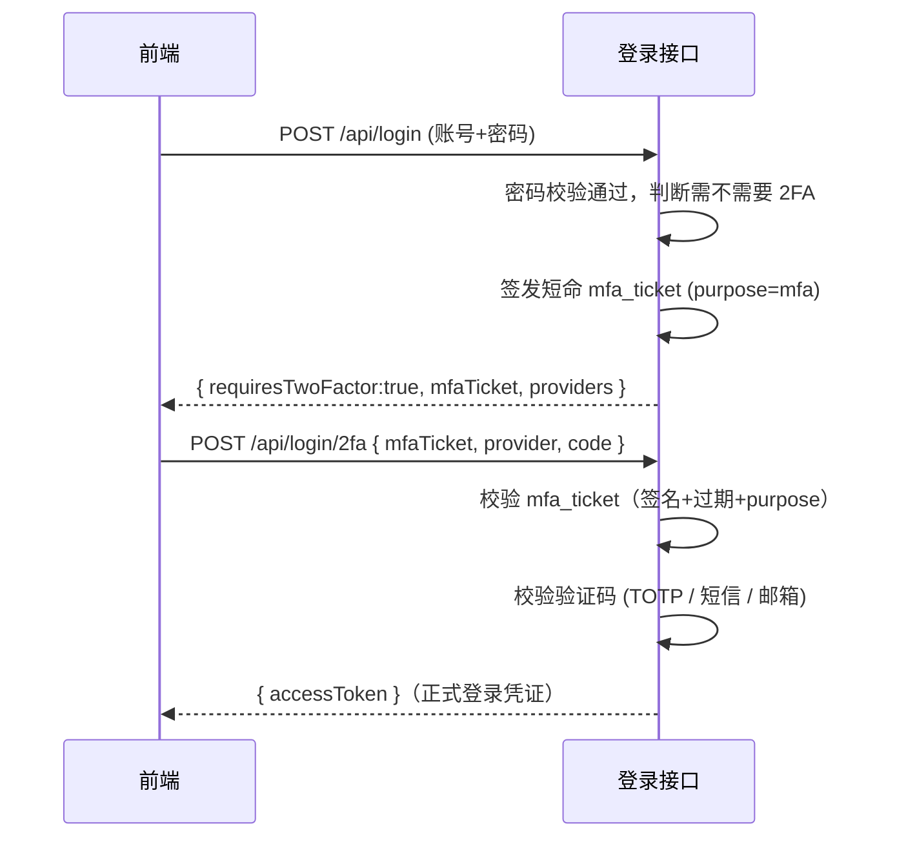

# DOTNET 鉴权系列- 自定义二次认证(2FA)实现

前面几篇聊的都是「认证」和「授权」这两个大块：认证解决你是谁，授权解决你能干嘛。这一篇聊的东西严格来说还是属于「认证」的范畴，只不过是认证里更细一点的一个专题——**二次认证（2FA / MFA）**。说白了就是登录这件事，从「一步到位」变成「两步走」，中间多插一道验证，账号密码泄露了也不至于直接被人登进去。

这篇不用 Identity 自带的 `SignInManager` 那一套（那是 Cookie 会话体系原生支持的），而是在一个**自建用户系统 + JWT** 的场景下，从零把两段式登录、TOTP 绑定、多种验证方式选择这一整套东西撸一遍。之所以要自己写，是因为咱们不少小伙伴的项目压根没用 Identity，就是自己拍的用户表 + 手写 JWT，这时候想加个 2FA，网上抄不到现成的，只能照着 Identity 的思路自己搬一遍。

---

## 1. 先说说为什么需要二次认证

账号密码这套东西，本质上是「你知道什么（What you know）」，只要密码被拖库、被撞库、被钓鱼，别人跟你本人在系统眼里就没有任何区别了。加一道 2FA，本质是再验一层「你有什么（What you have）」——你手机上的 Authenticator App、收到的短信验证码、收到的邮箱验证码。两层加起来，密码泄露了，没有你手上这个东西照样进不去。

这个概念大家应该都不陌生，登录 GitHub、登录支付宝多少都碰到过。今天要聊的不是"要不要做"，而是"自己撸一套的时候会踩哪些坑"。

---

## 2. 先想清楚：认证成功之后，token 到底该怎么发

如果你的登录接口原来是这样的：

```csharp
[HttpPost("login")]
public async Task<IActionResult> Login(LoginRequest req)
{
    var user = await VerifyPasswordAsync(req.UserName, req.Password);
    var token = CreateAccessToken(user);
    return Ok(new { accessToken = token });
}
```

现在要加 2FA，第一反应可能是：密码验证过了以后，判断一下用户是否开了 2FA，开了就多问一次验证码呗。听起来简单，但具体怎么落地，会有几个真实的坑：

**场景一：密码对了就直接发 token，2FA 形同虚设。**

如果密码校验通过之后，不管有没有开 2FA，都先把 `access_token` 发出去，前端再拿这个 token 去弹一个"请输入验证码"的框——那这个 2FA 就是纯粹的**摆设**。因为攻击者拿到密码之后，第一步就是密码登录接口，只要这一步返回了有效的 `access_token`，2FA 那道弹窗跳不跳，攻击者根本不需要关心，直接拿 token 去调接口就完事了。

**场景二：什么都不发，第二步怎么知道你是谁？**

那反过来，密码校验通过后什么都不发，只回一个"需要二次认证"，是不是就安全了？问题来了：第二步提交验证码的接口，怎么知道当前是"谁"在提交？总不能让前端把用户名 + 密码在第二步接口里再传一遍吧——这等于把密码校验做了两次，一是画蛇添足，二是把密码在网络上多暴露了一次，反而不安全。

**场景三：Cookie 体系的做法，搬到 JWT / API 场景不好使。**

Identity 原生的 `SignInManager` 是怎么处理这个「中间状态」的？它会先签一个**临时 Cookie**（`IdentityConstants.TwoFactorUserIdScheme`），里面只放 `userId`，浏览器带着这个临时 Cookie 去调第二步接口，服务端从 Cookie 里取出 `userId`，验证码对了再签发正式的登录 Cookie。这套思路没问题，但它是靠 Cookie + Session 这套"服务端认你这次会话"的机制撑起来的。

如果你的系统是**纯 API + JWT**（没有 Cookie、前后端分离、甚至给 App/小程序用），没有会话这个东西给你挂"临时状态"，那这个"密码过了、等第二步"的中间态，到底应该放在哪儿？

想清楚这三个场景，就会发现关键问题其实是一个：**密码验证通过之后，到底该发个什么东西，才能既证明"密码是对的"，又不能被当成正式的登录凭证直接拿去访问业务接口。**

---

## 3. 解决思路：发一张"半成品"票据，而不是正式 token

思路并不复杂：**密码校验通过后，不发 `access_token`，改发一张短命的过渡票据，姑且叫它 `mfa_ticket`。**

这张票据只干一件事：证明"密码已经验证通过，正在等待第二步"，除此之外什么权限都不给。拿着它，只能去调"提交验证码"或者"提交恢复码"这两个接口，除此之外哪儿都去不了。

对比一下几种方案：

| 方案 | 做法 | 问题 |
| :--- | :--- | :--- |
| A. 密码对了直接发 token | 前端弹窗做"软拦截" | 2FA 形同虚设，token 已经能干活了 |
| B. 什么都不发 | 第二步再传一次用户名密码 | 密码多暴露一次，体验也差 |
| C. Cookie 临时会话 | Identity 原生思路 | 依赖服务端会话，纯 API/JWT 场景不好落地 |
| D. 短命票据 JWT | 签一个 `purpose=mfa` 的短过期 JWT | **本项目采用**，天然适配无状态 API |

具体到代码里，这张票据是一个独立签发的 JWT，跟正式的 `access_token` **共享签名密钥但用途不同**：

```csharp
public sealed class MfaTicketService(JwtOptions options) : IMfaTicketService
{
    public const string PurposeClaim = "purpose";
    public const string MfaPurpose = "mfa";

    public string CreateTicket(Guid userId)
    {
        var claims = new[]
        {
            new Claim(ClaimTypes.NameIdentifier, userId.ToString()),
            new Claim(PurposeClaim, MfaPurpose)
        };
        // 默认 5 分钟，够用户切到 Authenticator App 抄一遍码
        return CreateToken(claims, TimeSpan.FromMinutes(options.MfaTicketMinutes));
    }

    public Guid? ValidateTicket(string ticket)
    {
        try
        {
            var principal = Validate(ticket);
            // 关键：必须带 purpose=mfa，别的 JWT 别想冒充
            if (principal.FindFirst(PurposeClaim)?.Value != MfaPurpose) return null;
            var id = principal.FindFirst(ClaimTypes.NameIdentifier)?.Value;
            return Guid.TryParse(id, out var userId) ? userId : null;
        }
        catch { return null; }
    }
}
```

**这里有两个关键细节：**

**1.** `mfa_ticket` 只放了 `userId` 和 `purpose=mfa` 两个 Claim，没有角色、没有任何业务权限信息。就算它被人截获，拿去调业务接口也没用——因为它压根不是给业务接口用的。

**2.** 光靠"claims 里没塞权限信息"防君子不防小人，万一有人手动改造一张带业务 claim 的 `mfa_ticket`，或者干脆想拿它冒充正式 token 硬闯呢？这时候就得让 JwtBearer 自己把这条路堵死：

```csharp
.AddJwtBearer(options =>
{
    options.TokenValidationParameters = mfaTicketService.ValidationParameters();
    options.Events = new JwtBearerEvents
    {
        OnTokenValidated = ctx =>
        {
            var purpose = ctx.Principal?.FindFirst(MfaTicketService.PurposeClaim)?.Value;
            if (purpose == MfaTicketService.MfaPurpose)
                ctx.Fail("mfa_ticket 不能当作 access_token 使用");
            return Task.CompletedTask;
        }
    };
});
```

这一步很容易被忽略，但恰恰是整个方案能不能站住脚的关键——**签发时约定的"这张票据只干一件事"，必须在校验时真正强制生效，而不是只停留在口头约定上。** 只要 `purpose=mfa`，`OnTokenValidated` 一律 `Fail`，不管这张票据签名多正确、有效期多新鲜，一律不认。

登录接口对应的完整逻辑就是这样：

```csharp
public async Task<AuthResult> PasswordSignInAsync(string userName, string password)
{
    var user = await users.FindByNameAsync(userName);
    if (user is null || !passwordHasher.Verify(password, user.PasswordHash))
        return new AuthResult(false, Error: "用户名或密码错误");

    var providers = GetAvailableProviders(user);
    if (user.TwoFactorEnabled && providers.Count > 0)
    {
        // 密码对了，但需要第二步：发 mfa_ticket，不发 access_token
        var ticket = mfaTickets.CreateTicket(user.Id);
        return new AuthResult(true, RequiresTwoFactor: true,
            MfaTicket: ticket, Providers: providers.ToArray());
    }

    // 没开 2FA：走原来的路，直接发正式 token
    var principal = claimsFactory.Create(user, "Bearer", [new Claim("amr", "pwd")]);
    return new AuthResult(true, AccessToken: accessTokens.CreateAccessToken(principal));
}
```

第二步接口拿着 `mfa_ticket` + 验证码，校验通过才真正签发正式 `access_token`：

```csharp
public async Task<AuthResult> TwoFactorSignInAsync(string mfaTicket, string provider, string code)
{
    var userId = mfaTickets.ValidateTicket(mfaTicket);
    if (userId is null) return new AuthResult(false, Error: "mfa_ticket 无效或已过期");

    var user = await users.FindByIdAsync(userId.Value);
    var ok = provider switch
    {
        TwoFactorMethodNames.Authenticator =>
            !string.IsNullOrEmpty(user.AuthenticatorKey) && totp.Validate(user.AuthenticatorKey, code),
        TwoFactorMethodNames.Sms or TwoFactorMethodNames.Email =>
            !string.IsNullOrWhiteSpace(code) && code.Length >= 4,
        _ => false
    };
    if (!ok) return new AuthResult(false, Error: "验证码无效");

    // amr(Authentication Methods References) 记一笔：这次是密码+2FA 一起认证的
    var principal = claimsFactory.Create(user, "Bearer",
        [new Claim("amr", "mfa"), new Claim("mfa_provider", provider)]);
    return new AuthResult(true, AccessToken: accessTokens.CreateAccessToken(principal));
}
```

两段登录合起来的完整时序：



值得一提的是，`access_token` 签发的时候要把 `mfa_ticket` 里那个 `purpose` claim 过滤掉，不能让它混进正式 token：

```csharp
public string CreateAccessToken(ClaimsPrincipal principal)
{
    // 过滤掉临时 purpose，避免污染正式 token
    var claims = principal.Claims.Where(c => c.Type != MfaTicketService.PurposeClaim).ToList();
    // ...签发
}
```

---

## 4. TOTP 怎么落地：密钥、二维码、时间窗

上面解决的是"登录流程该怎么串"，接下来说说验证码本身。最常见的一种 2FA 方式是**基于时间的一次性密码（TOTP，RFC 6238）**，也就是 Google/Microsoft Authenticator 里那个每 30 秒刷新一次的 6 位数字。

原理很简单：服务端给用户生成一个随机密钥（Base32 编码），用户拿这个密钥"绑定"到 App 里；之后不管是服务端还是 App，都拿着"同一个密钥 + 当前时间戳"往同一个算法里一喂，算出来的 6 位数字必然一致。所以 TOTP 压根不需要网络请求去核对，App 离线也能生成验证码，服务端只要拿相同算法反算一遍对比就行。

```csharp
public sealed class TotpService : ITotpService
{
    public string GenerateKey()
    {
        var key = KeyGeneration.GenerateRandomKey(20);
        return Base32Encoding.ToString(key);
    }

    // 生成 otpauth:// 协议串，给 App 扫码/手动导入用，不是给浏览器打开的
    public string BuildOtpAuthUri(string issuer, string accountName, string key)
        => $"otpauth://totp/{Uri.EscapeDataString(issuer)}:{Uri.EscapeDataString(accountName)}" +
           $"?secret={key}&issuer={Uri.EscapeDataString(issuer)}&digits=6";

    public bool Validate(string key, string code)
    {
        var bytes = Base32Encoding.ToBytes(key);
        var totp = new Totp(bytes);
        // 允许前后各 2 个时间窗（±60s），避免手机和服务器时间差几秒就验证失败
        return totp.VerifyTotp(code, out _, new VerificationWindow(previous: 2, future: 2));
    }
}
```

**这里有两个容易忽略的细节：**

**1.** `BuildOtpAuthUri` 拼出来的 `otpauth://...` 不是网页链接，浏览器打不开。它的唯一用途是变成二维码给 App 扫，或者把 `secret` 手动敲进 App。前端拿这串东西去生成图片就行，别指望点它能跳转到哪个页面。

**2.** `VerificationWindow(previous: 2, future: 2)` 是在"安全"和"体验"之间找平衡。TOTP 每 30 秒变一次，如果服务器和手机的系统时间有偏差，或者用户输完码卡了几秒才点提交，严格按当前这一个时间窗校验很容易验证失败。留出前后各 2 个窗口（相当于 ±60 秒容差），能大幅减少"我明明输对了怎么还是不通过"的投诉，同时也没有放宽到不安全的程度。

绑定流程是"两步确认"：先拿密钥生成二维码，用户扫码后**必须**输入一次当前验证码才算真正启用，而不是扫完码就直接算绑定成功——万一二维码没扫上、密钥记串了，起码在这一步能发现：

```csharp
public async Task<AuthResult> ConfirmEnable2FaAsync(Guid userId, string code)
{
    var user = await users.FindByIdAsync(userId);
    if (!totp.Validate(user.AuthenticatorKey, code))
        return new AuthResult(false, Error: "验证码无效，无法启用 2FA");

    // 顺手发一批恢复码：手机丢了/App 卸载了，还有条后路
    var recovery = Enumerable.Range(0, 5)
        .Select(_ => Convert.ToHexString(RandomNumberGenerator.GetBytes(4)))
        .ToArray();

    user.TwoFactorEnabled = true;
    user.TwoFactorMethods |= TwoFactorMethods.Authenticator;
    user.RecoveryCodes = string.Join(';', recovery);
    await users.UpdateAsync(user);
    return new AuthResult(true, RecoveryCodes: recovery);
}
```

恢复码这东西容易被忽视，但特别现实：用户手机丢了、换新机没迁移 Authenticator，如果没有恢复码，这个账号基本就废了，只能走人工申诉。提前发几个一次性恢复码，让用户抄下来存好，是这套体系里的兜底方案。

---

## 5. 一个用户，多种验证方式，怎么设计

现实里用户的 2FA 手段往往不止一种：有的绑了 Authenticator，有的图方便只想收短信。这就引出一个问题：**怎么表示"用户开了哪几种方式"，以及"登录时到底给他哪几个选项"？**

最直接的想法是加几个 `bool` 字段：`UseAuthenticator`、`UseSms`、`UseEmail`。能用，但每加一种新方式就要加一列，属于"能跑但不优雅"。这里用的是**位标志（Flags）**,一个 `int` 顶好几个 `bool`：

```csharp
[Flags]
public enum TwoFactorMethods
{
    None = 0,
    Authenticator = 1,
    Sms = 2,
    Email = 4
    // 以后加 WebAuthn = 8，照样不用改表结构
}
```

用户勾选 `Authenticator + Email` 存的就是 `1 | 4 = 5`，全选就是 `7`。这一步跟前面聊动态权限时"权限编码存字符串"是一个思路的延伸——只不过权限点多到上百个适合用字符串编码查表，2FA 方式统共就几种，位运算存一个 `int` 更省事。

但光存"用户勾选了什么"还不够，真正登录时能不能用某个方式，还要看**这个方式的前提条件是否具备**：勾了 Sms，但手机号还没验证过，这个通道显然不能真的拿来发验证码。所以登录时给前端的候选列表，是"勾选的位标志" **与** "实际具备前提条件"求交集：

```csharp
/// 位标志 ∩ 实际可用前提。
/// 例如 Methods=7 但没绑 Authenticator、手机未确认，则只返回 Email。
public static List<string> GetAvailableProviders(AppUser user)
{
    var list = new List<string>();
    if (!user.TwoFactorEnabled || user.TwoFactorMethods == TwoFactorMethods.None)
        return list;

    if (user.TwoFactorMethods.HasFlag(TwoFactorMethods.Authenticator)
        && !string.IsNullOrEmpty(user.AuthenticatorKey))
        list.Add(TwoFactorMethodNames.Authenticator);

    if (user.TwoFactorMethods.HasFlag(TwoFactorMethods.Sms)
        && user.PhoneConfirmed && !string.IsNullOrWhiteSpace(user.PhoneNumber))
        list.Add(TwoFactorMethodNames.Sms);

    if (user.TwoFactorMethods.HasFlag(TwoFactorMethods.Email)
        && user.EmailConfirmed && !string.IsNullOrWhiteSpace(user.Email))
        list.Add(TwoFactorMethodNames.Email);

    return list;
}
```

这里要提一句设计上容易踩的坑：**「用户勾选的方式」和「登录时真正能用的方式」必须是两件事，分两层判断**,不能为了省事把它们揉成一层。 如果在保存勾选的那一步就做"前提过滤"——用户没绑密钥就直接把 `Authenticator` 这一位悄悄清掉——表面上看起来是"帮用户兜底",实际后果是用户明明在界面上勾了三个方式,保存后一刷新却发现只剩一个,体验上等于「点了保存但没生效」,排查起来还很容易怀疑是不是接口没调通、数据没落库。正确的做法是:**勾选值原样落库,只在登录这一刻才做"勾选 ∩ 前提"的实时求交**,这样用户随时能看到自己勾选的原始状态,只是暂时用不了的方式不会出现在登录候选列表里,提示也可以做得更精准——「你勾选了短信登录，但还没验证手机号，请先完成验证」，而不是一句不明不白的「保存失败」。

---

## 6. 数据存哪儿：照着 Identity 的表结构搬一遍

自建用户表的时候，`AuthenticatorKey`、`RecoveryCodes` 这种敏感信息，很容易图省事直接加两列扔进 `Users` 表。但翻一下 Identity 的源码就知道，官方压根没这么干——它专门搞了张 `AspNetUserTokens` 表，`UserId + LoginProvider + Name` 三元组当主键，`Value` 存值，密钥、恢复码全走这张表，`Users` 表只留必要的登录信息。

照着这个思路搬一遍：

```sql
CREATE TABLE UserTokens (
    UserId TEXT NOT NULL,
    LoginProvider TEXT NOT NULL,
    Name TEXT NOT NULL,
    Value TEXT NULL,
    PRIMARY KEY (UserId, LoginProvider, Name)
);
```

`AuthenticatorKey` 存成 `(userId, "[AspNetUserStore]", "AuthenticatorKey")` 这一行，`RecoveryCodes` 存成同一 `userId` 下的另一行。这么拆的好处是**结构统一、好扩展**：以后要接微信小程序登录凭证、要接 WebAuthn 的凭据 ID，都是往这张表插一行，不用再改 `Users` 表结构；`Users` 表本身也能保持"干净",只放跟登录身份直接相关的字段。

---

## 7. 完整流程串起来看一次

假设一个用户开了 Authenticator + Email 两种方式，手机没验证过：

1. 用户提交账号密码，密码校验通过。
2. 服务端算出 `GetAvailableProviders`：`TwoFactorMethods` 里 Sms 那一位就算勾了也没手机号确认，被排除；最终候选是 `["Authenticator", "Email"]`。
3. 服务端签发 `mfa_ticket`（`purpose=mfa`，5 分钟过期），**不发** `access_token`，把候选列表一起返回给前端。
4. 前端拿到候选列表，让用户选一种，弹出验证码输入框。
5. 用户选 Authenticator，输入 App 上的 6 位数字，连同 `mfa_ticket` 提交到 `/api/login/2fa`。
6. 服务端校验 `mfa_ticket`（签名 + 过期时间 + `purpose=mfa`），再用 `TotpService.Validate` 校验验证码。
7. 两项都过，签发正式 `access_token`（`amr=mfa`），这次才是真正能拿去访问业务接口的凭证。

---

## 8. 总结 + 能怎么接着扩展

这一套东西的核心，其实就是一句话：**密码验证通过之后，别急着把"能干活的凭证"发出去，先发一张只能证明"密码过了"的过渡票据，等第二步也过了，再换成正式凭证。** 围绕这个核心，剩下的都是配套设施——TOTP 怎么生成校验、多种方式怎么用位标志表示、密钥和恢复码怎么照着 Identity 的套路存表。这套思路不挑用不用 Identity，Cookie 会话和纯 API/JWT 场景都能套。

几个可以接着往下扩展的方向，留给感兴趣的小伙伴：

- **`mfa_ticket` 目前不是严格一次性的**,它靠的是短过期(5 分钟)兜底,没有验证成功后立刻失效的机制。如果要做成真正一次性,可以在签发时带一个 `jti`,验证成功后把这个 `jti` 记进 Redis(哪怕只留到过期时间),第二次再拿同一张票据来,直接拒。
- **短信/邮箱验证码目前是 Demo 级别的占位判断**(长度够就算过),真正接入需要一套"生成一次性码 → 存 Redis(带过期)→ 发送 → 核销"的完整链路,思路和上面 `mfa_ticket` 的"发票据、核销票据"是一回事,可以直接复用。
- **多因素叠加**,现在是"密码 + 任选一种第二因素",如果安全等级要求更高,完全可以在 `amr` claim 上做文章,要求敏感操作必须是`amr` 里带了 `mfa` 且用的是 `Authenticator` 而不是短信,这就跟前面聊的基于策略/资源的授权能接上了——认证阶段把"这次是怎么登录的"记进 Claims,授权阶段的 `Handler` 就能拿这个信息做更细粒度的判断。

认证这条线,从最早的账号密码,到 Cookie 和 JWT 怎么落地,到请求怎么在中间件链路里跑起来,再到今天这道"多一步验证",其实都是在回答同一个问题的不同侧面——**系统怎么才能更有把握地确认"你就是你"**。想清楚这条线,再回头看授权那一层"你能干嘛",两者配合起来,才是一套站得住脚的鉴权体系。
