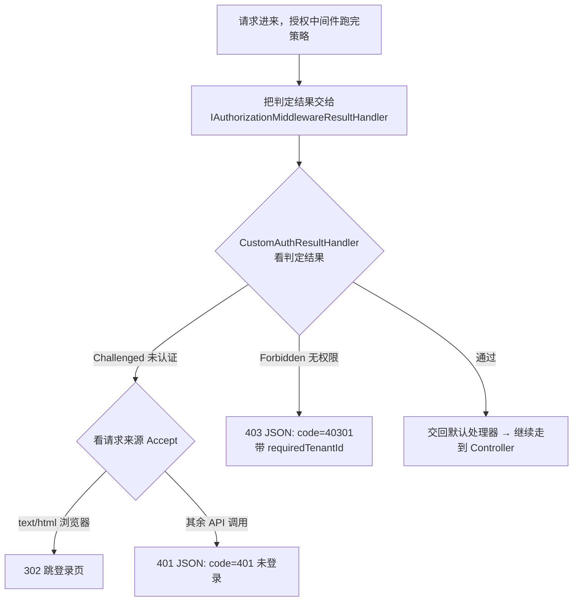
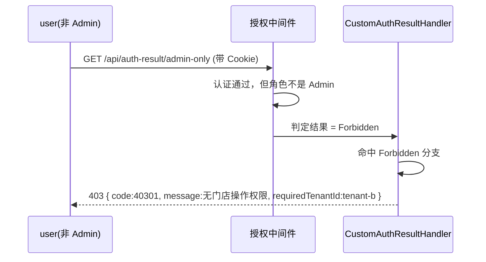

# DOTNET 鉴权系列- 自定义授权结果处理

前面几篇我们一直在聊「怎么判断能不能过」——从角色、策略，到动态权限、基于资源的授权，讲的都是**授权的判定逻辑**。这一篇换个角度，聊聊判定完之后的事：**没通过的时候，接口该怎么回话**。

这事看着小，其实特别影响体验。默认情况下，授权中间件把人拦下来，只会甩一个光秃秃的状态码回去，body 是空的。前端拿到这么个东西，经常一脸懵：到底是没登录，还是登录了但没权限？该弹「请登录」还是弹「无权限」？这一篇就来把这块响应给「接管」过来，让它回话回得明明白白。

### 适用场景

- **统一授权失败响应**：所有被拦下的请求，都返回一个结构化的 JSON 错误，比如 `{ "code": 40301, "message": "无门店操作权限" }`，前端有稳定的字段可以解析和提示。
- **特殊场景跳转**：未登录时根据请求来源区别对待——浏览器直接打开页面就 302 跳登录页，前后端分离的 API 调用就返回 401 JSON，交给前端拦截器处理。

### 先说说痛点

授权失败，框架默认只做两件事：把状态码设成 401 或 403，然后……就没有然后了，body 空空如也。问题就藏在这个「空」里。

**第一个痛点：401 和 403 前端分不清、也不好处理。**

- `401 Unauthorized` 其实说的是「未认证」——你没登录，或者登录过期了。
- `403 Forbidden` 说的是「已认证但无权限」——你登录了，但这事你干不了。

这俩是两码事，前端的处理也完全不同：401 应该把人踢到登录页重新登录；403 应该留在当前页、弹个「你没这个权限」的提示。可默认响应 body 是空的，前端只能靠状态码硬猜，稍不注意就把「没权限」也当成「没登录」，把人无端踢去登录页，体验很差。

**第二个痛点：没有业务错误码，也没有排障细节。**

真实业务里，一个 403 背后可能有好几种原因：是差了某个功能权限？还是租户对不上、想操作别的门店的数据？光一个 403 啥也看不出来。我们希望回一个带业务码的结构化响应，比如 `code = 40301` 表示「无门店操作权限」，再顺手带上「当前要求的租户」这类信息，前端能精准提示，排查问题时也有据可查。

**第三个痛点：未登录的跳转，Web 端和 API 端诉求不一样。**

同样是「没登录」，浏览器直接打开一个页面时，最顺的体验是直接 302 跳到登录页；但如果是页面里的 Ajax / fetch 请求，你 302 跳转它是处理不了的（拿到的是登录页的 HTML），这时候就该老老实实回一个 401 JSON，让前端的请求拦截器统一去处理。**同一个「未登录」，要按请求来源给不同的回应。**

说到底，这些痛点的根子是同一个：**授权中间件默认那套「拒绝响应」太糙了**，我们需要一个地方，把「被拒绝时到底回什么」这件事整个接管过来。

### 核心思路

好在框架早就留好了这个扩展点。授权中间件（`app.UseAuthorization()`）在跑完所有策略、拿到判定结果之后，并不会自己直接写响应，而是把结果交给容器里一个叫 `IAuthorizationMiddlewareResultHandler` 的东西，由它来决定「接下来怎么办」。

这个 Handler 容器里**全局只有一个**，框架默认注册的是 `AuthorizationMiddlewareResultHandler`。我们要做的，就是写一个自己的实现把它换掉，在里面区分三种情况分别回话：



判定结果封装在 `PolicyAuthorizationResult` 里，我们主要看它两个属性：

- `Challenged`：未认证。人没登录，或者认证信息（Cookie / Token）失效了。
- `Forbidden`：已认证，但权限不够。人是登录了，但这个操作它没权。

剩下的就是「通过」，这种情况我们不折腾，原样交回默认处理器继续走管道就行。

### 集成思路

#### 第一步：写自定义结果处理器（核心）

实现 `IAuthorizationMiddlewareResultHandler` 接口，它只有一个 `HandleAsync` 方法。这里有个小技巧：我们内部保留一个官方默认处理器的实例，**授权通过时把控制权原样交回给它**，这样后续管道的细节不用我们自己操心，只专注改写「被拒绝」的分支。

```C#
using System.Text.Json;
using Microsoft.AspNetCore.Authorization;
using Microsoft.AspNetCore.Authorization.Policy;

namespace Authorization_Extend.AuthResultHandler;

/// <summary>
/// 自定义授权结果处理器：接管授权中间件「拒绝」时的响应。
/// </summary>
public class CustomAuthResultHandler : IAuthorizationMiddlewareResultHandler
{
    // 授权「通过」时把控制权原样交回默认处理器，避免自己漏处理管道细节
    private readonly AuthorizationMiddlewareResultHandler _defaultHandler = new();

    public async Task HandleAsync(
        RequestDelegate next,
        HttpContext context,
        AuthorizationPolicy policy,
        PolicyAuthorizationResult authorizeResult)
    {
        // 情况一：未认证（没登录 / Cookie 失效）
        if (authorizeResult.Challenged)
        {
            // 浏览器页面请求 → 跳登录页；API 调用 → 回 401 JSON
            if (WantsHtml(context))
            {
                var returnUrl = Uri.EscapeDataString(context.Request.Path + context.Request.QueryString);
                context.Response.Redirect($"/login?returnUrl={returnUrl}");
                return;
            }

            await WriteJsonAsync(context, StatusCodes.Status401Unauthorized, new
            {
                code = 401,
                message = "未登录或登录已过期，请重新登录"
            });
            return;
        }

        // 情况二：已认证但权限不足
        if (authorizeResult.Forbidden)
        {
            await WriteJsonAsync(context, StatusCodes.Status403Forbidden, new
            {
                code = 40301,
                message = "无门店操作权限",
                requiredTenantId = context.User.FindFirst("tenant_id")?.Value
            });
            return;
        }

        // 情况三：授权通过，交回默认处理器继续执行后续中间件与 Controller
        await _defaultHandler.HandleAsync(next, context, policy, authorizeResult);
    }

    private static bool WantsHtml(HttpContext context)
    {
        var accept = context.Request.Headers.Accept.ToString();
        return accept.Contains("text/html", StringComparison.OrdinalIgnoreCase);
    }

    private static Task WriteJsonAsync(HttpContext context, int statusCode, object payload)
    {
        context.Response.StatusCode = statusCode;
        context.Response.ContentType = "application/json; charset=utf-8";
        return context.Response.WriteAsync(JsonSerializer.Serialize(payload));
    }
}
```

几个点值得念叨一下：

一是 `Challenged` 分支里的**来源判断**。我们用 `Accept` 头来区分：带 `text/html` 的一般是浏览器直接打开页面，就 302 跳登录页，并把原地址塞进 `returnUrl`，登录完还能跳回来；其余（Ajax / fetch 一般是 `application/json`）就回 401 JSON。这就把前面第三个痛点解决了。

二是 `Forbidden` 分支里的 `code = 40301`。这是**业务自定义错误码**，前两位沿用 HTTP 的 403，后面用来细分具体拒绝原因，前端可以据此弹不同的提示。顺手带上 `requiredTenantId`，多租户场景下想操作别人门店的数据被拦了，一眼就能看出是租户对不上。

三是**通过时那行 `_defaultHandler.HandleAsync(...)`**。别小看它——我们只想接管「拒绝」，通过的情况老老实实还给框架，别自己乱写响应，否则容易把正常请求也搞坏。

#### 第二步：替换默认处理器

这个 Handler 全局只有一个，所以要用 `Replace` 把框架默认注册的那个换掉，而不是 `Add` 一个新的。

```C#
using Authorization_Extend.AuthResultHandler;
using Microsoft.AspNetCore.Authorization.Policy;
using Microsoft.Extensions.DependencyInjection.Extensions;

namespace Microsoft.Extensions.DependencyInjection;

public static class AuthResultHandlerExtensions
{
    public static IServiceCollection AddCustomAuthResultHandler(this IServiceCollection services)
    {
        services.Replace(
            ServiceDescriptor.Singleton<IAuthorizationMiddlewareResultHandler, CustomAuthResultHandler>());

        return services;
    }
}
```

> 这里和前几篇替换 `IAuthorizationPolicyProvider` 有个重要区别：本方案换的是**结果处理器**，不是**策略提供器**。所以它跟「极简动态权限」「仿 ABP」这些换 Provider 的方案**互不冲突，可以同时启用**。它管的是「拒绝之后怎么回话」，谁来判定、怎么判定它一概不掺和。

然后在 `Program` 里一行调用：

```C#
builder.Services.AddCustomAuthResultHandler();

// ...
app.UseAuthentication();
app.UseAuthorization();   // 授权中间件拒绝时，就会走到我们的 CustomAuthResultHandler
```

#### 第三步：控制器里造两种拒绝来验证

结果处理器是全局生效的，任何被授权拦下的请求都会走它。为了方便演示，我们挑两个最典型的入口，分别造出「未认证」和「无权限」：

```C#
[ApiController]
[Route("api/auth-result")]
public class AuthResultDemoController : ControllerBase
{
    // 只要求「已登录」。未登录访问 → Challenged → 自定义 401
    [HttpGet("need-login")]
    [Authorize(AuthenticationSchemes = CookieAuthenticationDefaults.AuthenticationScheme)]
    public IActionResult NeedLogin()
        => Ok(new { message = "你已登录，正常拿到数据" });

    // 要求「Admin 角色」。用 user（非 Admin）登录 → Forbidden → 自定义 403
    [HttpGet("admin-only")]
    [Authorize(AuthenticationSchemes = CookieAuthenticationDefaults.AuthenticationScheme, Roles = "Admin")]
    public IActionResult AdminOnly()
        => Ok(new { message = "你是 Admin，允许操作" });
}
```

### 走一遍完整流程

用 `.http` 或 Postman 实测一下，对比一下三种响应：

```
### 1. 未登录访问（API 调用）→ 自定义 401 JSON
GET /api/auth-result/need-login
Accept: application/json
# 返回：{ "code": 401, "message": "未登录或登录已过期，请重新登录" }

### 2. 未登录访问（浏览器页面）→ 302 跳登录页
GET /api/auth-result/need-login
Accept: text/html
# 返回：302，Location: /login?returnUrl=...

### 3. 用 user 登录后，访问 admin-only → 自定义 403 JSON
POST /Auth/login   { "username": "user", "password": "123456" }
GET  /api/auth-result/admin-only
# 返回：{ "code": 40301, "message": "无门店操作权限", "requiredTenantId": "tenant-b" }

### 4. 用 admin 登录后，访问 admin-only → 正常 200
POST /Auth/login   { "username": "admin", "password": "123456" }
GET  /api/auth-result/admin-only
# 返回：{ "message": "你是 Admin，允许操作" }
```

第 3 步这个请求的时序，串起来看更清楚：



同一个入口，未登录走 `Challenged`、登录了没权限走 `Forbidden`、有权限直接放行——三条路各回各的，前端拿到的信息清清楚楚。

### 总结

这套「自定义授权结果处理」抓住的是授权流程的最后一个扩展点——`IAuthorizationMiddlewareResultHandler`。判定「能不能过」是前几篇的事，这一篇专管判定完之后「怎么回话」：

| 文件 | 角色 | 一句话职责 |
| --- | --- | --- |
| `CustomAuthResultHandler` | 回话器 | 区分 Challenged / Forbidden / 通过，分别写结构化响应 |
| `AuthResultHandlerExtensions` | 注册入口 | 用 Replace 换掉框架默认的结果处理器 |
| `AuthResultDemoController` | 演示 | 造出未认证 / 无权限两种拒绝，方便观察响应 |

再说说它的**边界**：

- 它**只负责改写响应**，不参与授权判定。谁能过、谁不能过，还是前几篇那些 Provider / Handler 说了算。
- 它换的是「结果处理器」，不是「策略提供器」，所以和换 Provider 的动态权限方案**可以共存**，各管各的。
- 实战中这里通常还会做统一日志（记录谁在什么时候被拒了）、按异常类型返回更细的业务码等，可以在这个 Handler 里按需扩展。

一句话收尾：认证解决「你是谁」，授权解决「你能干嘛」，而这一篇解决的是「**你不能干的时候，我怎么好好跟你说**」——把最后这句话说清楚，前端才能接得住。
