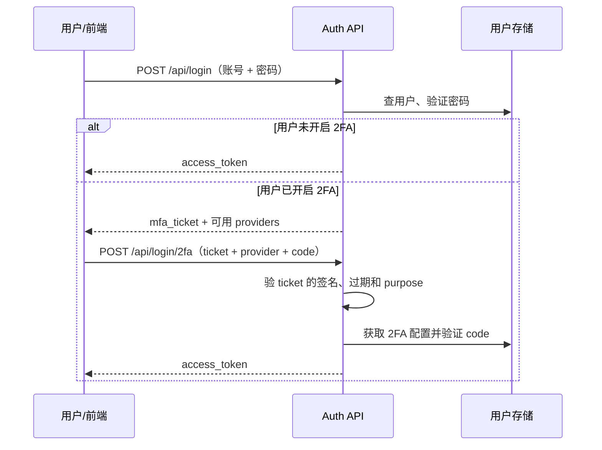

# DOTNET 鉴权系列- 自建 JWT 二次认证的两段式登录

前面我们聊认证时，登录通常是这样的：账号密码对了，服务端签一个 JWT，前端保存起来，后续请求带上它。这个流程简单，也够用。

但只要碰到后台管理、财务、用户中心这类稍微敏感一点的系统，就会有一个绕不过去的问题：**密码如果泄露了怎么办？**

攻击者拿到密码之后，按原来的流程登录，服务端也会非常诚实地给他签发 `access_token`。从系统的角度看，他和本人没有区别。

这就是二次认证（2FA）要解决的事情：第一步证明“你知道密码”，第二步再证明“你确实持有某个东西”，例如手机里的 Authenticator、短信或者邮箱。两步都通过，才算真正登录完成。

本文不依赖 ASP.NET Core Identity，基于 `Custom2FA_Demo` 这个自建用户表 + JWT 的项目，讲一下二次认证是怎么从零串起来的。重点不在于背 API，而是想清楚一个核心问题：

> **密码已经验证通过，但二次认证还没通过时，服务端应该把用户放在什么状态？**

---

## 1. 认证和二次认证，别混成两件事

二次认证不是授权，也不是“登录成功以后额外弹一个框”。

它仍然属于认证流程，只是把“确认你是谁”拆成了两段：

```text
第一因素：账号密码正确
第二因素：Authenticator / 短信 / 邮箱验证码正确
两者都通过：签发正式 access_token
```

所以二次认证没完成之前，用户还没有真正登录，更不能访问标了 `[Authorize]` 的业务接口。

这里顺便把几个状态分清楚：

| 状态 | 是否已经验证密码 | 是否已经验证第二因素 | 是否能访问业务接口 |
|---|---:|---:|---:|
| 未登录 | 否 | 否 | 否 |
| 等待 2FA | 是 | 否 | **否** |
| 登录完成 | 是 | 是（或用户未启用 2FA） | 是 |

很多实现出问题，就是把第二行“等待 2FA”当成“已经登录，只是前端还没弹窗”。这两个状态安全等级完全不一样。

---

## 2. 先说痛点：密码对了以后到底返回什么

假设原来的登录代码是这样：

```csharp
public async Task<AuthResult> PasswordSignInAsync(string userName, string password)
{
    var user = await users.FindByNameAsync(userName);
    if (user is null || !passwordHasher.Verify(password, user.PasswordHash))
        return new AuthResult(false, Error: "用户名或密码错误");

    return new AuthResult(
        true,
        AccessToken: accessTokens.CreateAccessToken(
            claimsFactory.Create(user, "Bearer")));
}
```

现在加 2FA，很多人第一反应是在前端判断一下：接口照样返回 token，前端发现用户开了 2FA 再跳转到验证码页面。

这个方案看起来改动最小，实际上 2FA 已经失效了。

### 场景一：先发正式 token，再让前端验证

如果密码验证通过就已经发了 `access_token`，攻击者根本不需要理会你的验证码页面。他拿到响应里的 token，直接请求任意受保护接口即可。

前端弹窗只是交互，不是安全边界。**安全边界必须在服务端。**

### 场景二：什么都不返回

那我密码验证通过后，什么都不发，只告诉前端“请输入验证码”行不行？

前端第二次提交验证码时，服务端又会问：这个验证码属于谁？总不能再带一遍用户名密码吧。

这不但体验差，也会让密码进行第二次传输和校验。更重要的是，两步请求之间的关联关系完全靠前端自己拼，后面加恢复码、短信、邮箱等方式时会越来越乱。

### 场景三：拿 userId 让前端自己传

还有一种常见写法：

```json
POST /api/login/2fa
{
  "userId": "xxx",
  "code": "123456"
}
```

这同样不行。`userId` 是公开可猜测或可获取的数据，不能证明这个用户刚刚通过了密码校验。否则攻击者只要知道一个用户 ID，就可以跳过第一步，直接暴力尝试第二因素。

所以真正要解决的是：

> 第一步通过后，需要有一个可信的、短生命周期的“待完成 2FA 状态”；它能关联用户，但绝不能拥有正式登录权限。

---

## 3. 解决方案：mfa_ticket，登录的“半成品凭证”

这个项目的方案是：密码正确且需要 2FA 时，**不签发 `access_token`，而是签发一个短命 JWT：`mfa_ticket`。**

它只有两个责任：

1. 证明“这个用户刚刚通过了密码验证”；
2. 让第二步接口知道应该校验哪个用户的 2FA 信息。

它不是业务访问令牌，不能被 `JwtBearer` 当作已登录身份接受。

```text
密码验证成功
      ↓
需要 2FA？
 ├─ 否：签发 access_token
 └─ 是：签发 mfa_ticket（5 分钟）
                  ↓
          校验第二因素
           ├─ 失败：仍然没有 access_token
           └─ 成功：签发 access_token
```

这和 Identity 的思路是相同的。Identity 默认会使用 `IdentityConstants.TwoFactorUserIdScheme` 签发一个临时 2FA Cookie，第二步成功后再签发应用登录 Cookie。

需要纠正一个容易说错的点：**Identity 的临时 Cookie 并不等于依赖服务端 Session。** Cookie 本身通常是受 Data Protection 保护的票据，服务端可以无状态地解开它。这里的 JWT `mfa_ticket` 只是更适合纯 API、前后端分离和移动端的等价实现。

---

## 4. mfa_ticket 里面应该放什么

本项目中的实现很克制，只放用户 ID 和用途：

```csharp
public string CreateTicket(Guid userId)
{
    var claims = new[]
    {
        new Claim(ClaimTypes.NameIdentifier, userId.ToString()),
        new Claim(PurposeClaim, MfaPurpose) // purpose=mfa
    };

    return CreateToken(claims, TimeSpan.FromMinutes(options.MfaTicketMinutes));
}
```

对应的 token 大致长这样：

```text
sub / nameidentifier = 用户 ID
purpose = mfa
exp = 当前时间 + 5 分钟
```

为什么一定要有 `purpose=mfa`？

因为 `mfa_ticket` 和 `access_token` 都是 JWT，都可能使用同一套 issuer、audience 和签名密钥。如果只看签名和过期时间，认证中间件无法天然区分它们的用途。

所以 `purpose` 不是装饰字段，而是**用途隔离标记**。校验临时票据时必须检查它：

```csharp
public Guid? ValidateTicket(string ticket)
{
    try
    {
        var principal = Validate(ticket);

        if (principal.FindFirst(PurposeClaim)?.Value != MfaPurpose)
            return null;

        var id = principal.FindFirst(ClaimTypes.NameIdentifier)?.Value;
        return Guid.TryParse(id, out var userId) ? userId : null;
    }
    catch
    {
        return null;
    }
}
```

这里不要把“临时票据不带角色或权限”当作访问控制手段。真正的保护必须是：**业务接口的 JWT Bearer 认证明确拒绝 `purpose=mfa` 的 token。**

```csharp
.AddJwtBearer(options =>
{
    options.TokenValidationParameters = mfaTicketService.ValidationParameters();
    options.Events = new JwtBearerEvents
    {
        OnTokenValidated = context =>
        {
            var purpose = context.Principal?
                .FindFirst(MfaTicketService.PurposeClaim)?.Value;

            if (purpose == MfaTicketService.MfaPurpose)
                context.Fail("mfa_ticket 不能当作 access_token 使用");

            return Task.CompletedTask;
        }
    };
});
```

这样一来，即使有人把 `mfa_ticket` 当成 Bearer Token 带去请求 `[Authorize]` 接口，认证仍然失败，拿到的是 401，而不是“半登录状态也能访问”。

---

## 5. 两段式登录怎么跑

第一段是用户名密码登录：

```csharp
public async Task<AuthResult> PasswordSignInAsync(string userName, string password)
{
    var user = await users.FindByNameAsync(userName);
    if (user is null || !passwordHasher.Verify(password, user.PasswordHash))
        return new AuthResult(false, Error: "用户名或密码错误");

    var providers = GetAvailableProviders(user);

    if (user.TwoFactorEnabled && providers.Count > 0)
    {
        return new AuthResult(
            true,
            RequiresTwoFactor: true,
            MfaTicket: mfaTickets.CreateTicket(user.Id),
            Providers: providers.ToArray(),
            TwoFactorMethods: (int)user.TwoFactorMethods);
    }

    var principal = claimsFactory.Create(user, "Bearer", [new Claim("amr", "pwd")]);
    return new AuthResult(true, AccessToken: accessTokens.CreateAccessToken(principal));
}
```

密码正确且已开启 2FA 时，响应类似：

```json
{
  "succeeded": true,
  "requiresTwoFactor": true,
  "mfaTicket": "eyJ...",
  "providers": ["Authenticator", "Email"]
}
```

注意这里没有 `accessToken`。前端应该把 `mfa_ticket` 放在短生命周期的内存或 `sessionStorage` 中，跳到第二步页面；不要把它当成正常登录态保存到 `localStorage`。

第二段提交验证方式和验证码：

```csharp
public async Task<AuthResult> TwoFactorSignInAsync(
    string mfaTicket, string provider, string code)
{
    var userId = mfaTickets.ValidateTicket(mfaTicket);
    if (userId is null)
        return new AuthResult(false, Error: "mfa_ticket 无效或已过期");

    var user = await users.FindByIdAsync(userId.Value);
    if (user is null)
        return new AuthResult(false, Error: "用户不存在");

    var available = GetAvailableProviders(user);
    if (!available.Contains(provider, StringComparer.OrdinalIgnoreCase))
        return new AuthResult(false, Error: $"当前不可使用提供程序 {provider}");

    // 根据 provider 校验 TOTP、短信码或邮箱码
    // 校验成功后才签发正式 access_token
}
```

整个请求链路可以这样理解：



正式 token 上额外写入了两条有价值的 Claim：

```csharp
new Claim("amr", "mfa"),
new Claim("mfa_provider", provider)
```

`amr`（Authentication Methods References）表示本次认证使用了什么方式，`mfa_provider` 表示第二因素具体来自哪里。当前 Demo 主要用于观察流程；后续如果“转账”“修改密码”等敏感接口要求必须完成 MFA，就可以根据这些 Claim 做更细的授权判断。

---

## 6. Authenticator 的 6 位码从哪儿来

本项目选的是 TOTP（Time-based One-Time Password，RFC 6238），也就是 Google Authenticator / Microsoft Authenticator 里每约 30 秒刷新的 6 位数字。

它不是“服务器给 App 发验证码”，服务器和 App 之间也不需要实时通信。绑定时，双方保存同一把随机密钥；之后各自拿“密钥 + 当前时间窗”运行同一套算法，得到相同的数字。

```text
共享密钥 + 当前 30 秒时间窗
             ↓
      同一套 TOTP 算法
             ↓
        同一个 6 位数字
```

服务器生成密钥和 `otpauth` URI：

```csharp
public string GenerateKey()
{
    var key = KeyGeneration.GenerateRandomKey(20);
    return Base32Encoding.ToString(key);
}

public string BuildOtpAuthUri(string issuer, string accountName, string key)
    => $"otpauth://totp/{Uri.EscapeDataString(issuer)}:{Uri.EscapeDataString(accountName)}" +
       $"?secret={key}&issuer={Uri.EscapeDataString(issuer)}&digits=6";
```

`otpauth://...` 不是 URL 页面，也不是回调地址。它只是 Authenticator App 认识的一种“导入配置格式”，前端把它转成二维码；App 扫描二维码后，把 `secret`、账户名和发行方导入本地。

绑定不能只做到“生成二维码”。用户扫码之后还要提交一次当前 6 位码，服务端验证通过，才把 `TwoFactorEnabled` 打开。否则二维码生成失败、扫错码或者用户根本没导入密钥，系统却认为 2FA 已启用，下一次登录就会把用户锁在门外。

```csharp
if (!totp.Validate(user.AuthenticatorKey, code))
    return new AuthResult(false, Error: "验证码无效，无法启用 2FA");

user.TwoFactorEnabled = true;
user.TwoFactorMethods |= TwoFactorMethods.Authenticator;
```

校验中允许前后各两个 30 秒时间窗：

```csharp
return totp.VerifyTotp(
    code,
    out _,
    new VerificationWindow(previous: 2, future: 2));
```

这相当于给手机和服务器的时间偏差留一点容差。窗口越大，用户体验越好，但可接受验证码的时间范围也越大；生产环境应结合时间同步情况、风险等级和限流策略评估，不应该不加思考地无限放宽。

---

## 7. 多种 2FA 方式，为什么用位标志

一个用户可能同时启用 Authenticator、短信和邮箱。要保存这种“多选关系”，项目使用了 Flags 枚举：

```csharp
[Flags]
public enum TwoFactorMethods
{
    None = 0,
    Authenticator = 1,
    Sms = 2,
    Email = 4
}
```

这样：

```text
Authenticator = 1
Sms           = 2
Email         = 4
Authenticator + Email = 1 | 4 = 5
全部启用 = 7
```

这只是“用户选择启用哪些方式”，不等于每一种当前都真的能用。

例如用户勾选了短信，但手机号还没确认；或者勾选了 Authenticator，但还没有完成绑定。登录时真正返回给前端的 `providers`，必须是：

> **已勾选的方式 ∩ 当前已经满足前提的方式**

```csharp
if (user.TwoFactorMethods.HasFlag(TwoFactorMethods.Authenticator)
    && !string.IsNullOrEmpty(user.AuthenticatorKey))
    list.Add(TwoFactorMethodNames.Authenticator);

if (user.TwoFactorMethods.HasFlag(TwoFactorMethods.Sms)
    && user.PhoneConfirmed
    && !string.IsNullOrWhiteSpace(user.PhoneNumber))
    list.Add(TwoFactorMethodNames.Sms);
```

这里也踩过一个很实际的坑：保存配置时，如果直接把“不满足前提”的位过滤掉，用户勾选了三项，刷新页面只剩一项，很像数据没有入库。

现在的处理是：

1. 用户勾选的合法位原样保存到 `TwoFactorMethods`；
2. 登录时再根据密钥、邮箱确认状态、手机确认状态计算 `providers`；
3. 前端可以明确提示用户“已选择短信，但手机号尚未确认”，而不是悄悄把勾选清掉。

配置状态和运行时可用状态是两个概念，分开保存和计算，后续排查问题会轻松很多。

---

## 8. 恢复码和数据存储

Authenticator 最大的现实问题不是算法，而是用户手机会丢、会换、App 会卸载。没有后路的 2FA，最后往往会变成人工客服找回账号。

所以启用 Authenticator 成功后，项目会生成一批恢复码：

```csharp
var recovery = Enumerable.Range(0, 5)
    .Select(_ => Convert.ToHexString(RandomNumberGenerator.GetBytes(4)))
    .ToArray();
```

恢复码登录成功后会从集合中删除，因此它是一次性的。真实项目里应该只在生成时向用户展示一次，并且不能记录到普通日志中。

密钥和恢复码没有直接塞进 `Users` 表，而是放到仿照 Identity `AspNetUserTokens` 的 `UserTokens` 表：

```sql
CREATE TABLE UserTokens (
    UserId TEXT NOT NULL,
    LoginProvider TEXT NOT NULL,
    Name TEXT NOT NULL,
    Value TEXT NULL,
    PRIMARY KEY (UserId, LoginProvider, Name)
);
```

`AuthenticatorKey` 和 `RecoveryCodes` 各是一行。好处是后续无论要增加 WebAuthn 凭据、外部登录 token 还是新的认证器密钥，都不必不断修改用户主表。

当然，表拆开不等于敏感数据自动安全。生产上还需要考虑：数据库静态加密、密钥保护、最小权限、脱敏日志和密钥轮换。

---

## 9. 这套 Demo 还缺什么，生产上怎么继续扩展

Demo 的目标是把两段式认证状态和 TOTP 主链路讲清楚，不等于可以直接上线。至少还需要补下面几块：

### 9.1 mfa_ticket 严格一次性

当前 `mfa_ticket` 是短命 JWT，默认有效 5 分钟；在过期前，成功校验后它本身不会自动失效。

这意味着同一张 ticket 理论上可以被重放，用同一个有效 TOTP 再次换取 token。要实现严格一次性，可以在 ticket 里加入 `jti`，在 Redis 保存“已使用的 jti”，第二步成功时原子核销：

```text
验证 ticket → 检查 jti 未使用 → 校验第二因素
     → 原子标记 jti 已使用 → 签发 access_token
```

注意核销应当放在成功路径并保证并发安全，否则两个并发请求仍可能同时成功。

### 9.2 短信、邮箱验证码的真实实现

当前 Demo 的短信和邮箱 provider 只用于演示流程选择，验证码长度够就视为通过，不能用于生产。

真正的链路至少应包含：

```text
生成随机验证码
  → 只保存哈希值到 Redis（带过期）
  → 发送短信/邮件
  → 校验次数限制
  → 成功后原子删除
```

还要加入按用户、IP、设备维度的频率限制，避免短信轰炸、邮箱轰炸和验证码暴力猜测。

### 9.3 绑定、重置和关闭 2FA 的再认证

“关闭 2FA”“更换手机号”“重置 Authenticator”都是高风险操作，不能只要当前 `access_token` 有效就允许做。

常见做法是要求用户再次输入密码，或者要求一次现有 2FA 验证；高风险系统还会要求两个因素都重新确认。这和登录本身是同一个原则：敏感动作需要更高的身份置信度。

### 9.4 从 TOTP 走向 WebAuthn

TOTP 比单密码安全，但仍可能被钓鱼网站实时转发验证码。更高安全等级可以考虑 WebAuthn / Passkey：验证会绑定具体站点域名，抗钓鱼能力更强。

这不影响本文的两段式状态设计。第二因素从 TOTP 换成 WebAuthn 后，`mfa_ticket → 第二步挑战 → 正式 access_token` 的骨架仍然成立，只是“第二步如何校验”换成了另一种 provider。

---

## 10. 总结

自建 JWT 的二次认证，最容易写错的地方不是 TOTP 算法，而是**两步之间的身份状态边界**：

- 密码通过，不等于登录完成；
- 不能先发正式 `access_token` 再让前端做二次认证；
- 需要一个短命、受用途约束的 `mfa_ticket` 来表达“已过密码、待完成 MFA”；
- 临时票据必须被业务认证链路明确拒绝；
- 第二因素通过以后，才可以签发真正的 `access_token`。

至于二维码、位标志、恢复码、短信和邮箱，本质上都是围绕这个骨架添加的不同 provider 和兜底能力。

认证负责把身份置信度建立起来；授权则可以继续利用 `amr=mfa`、`mfa_provider=Authenticator` 这类 Claim，在敏感接口上要求“必须是完成过 MFA 的会话”。这样认证和授权才真正接得上：前者确认你有多可信，后者决定这个可信程度够不够执行某个操作。
